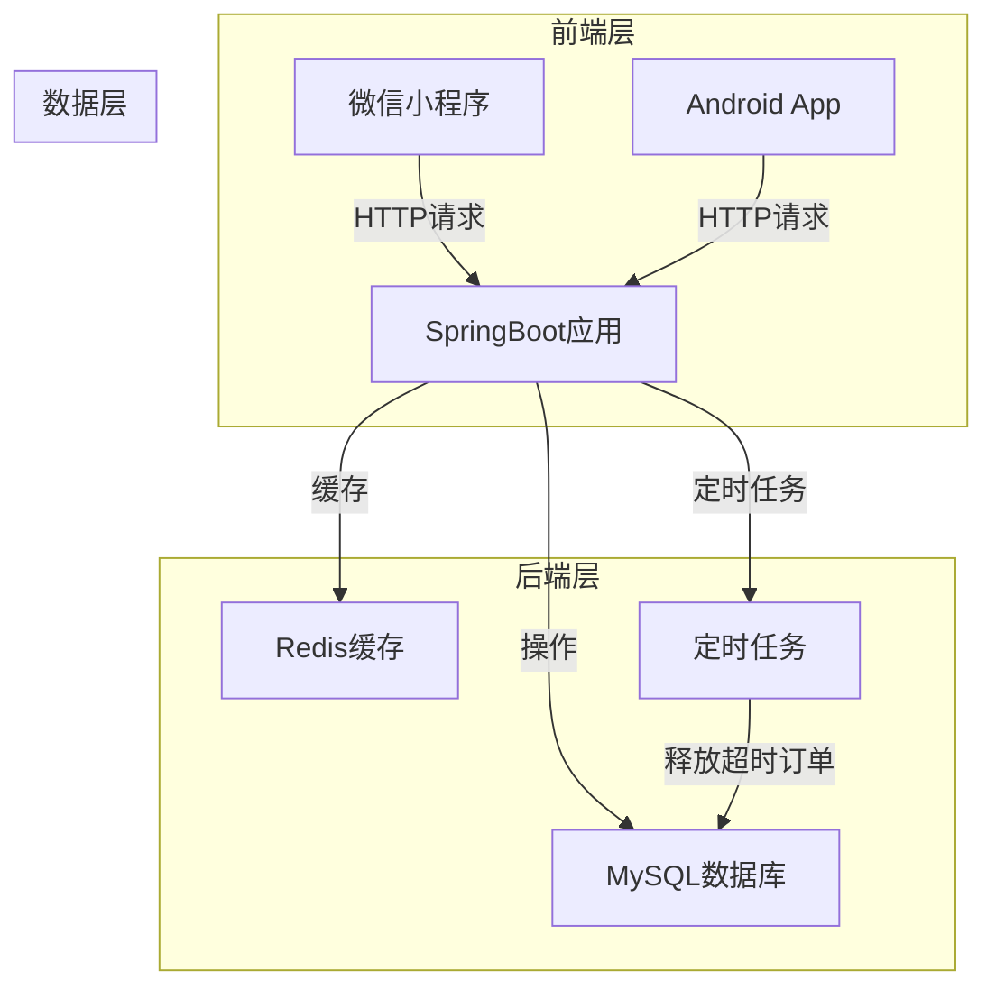
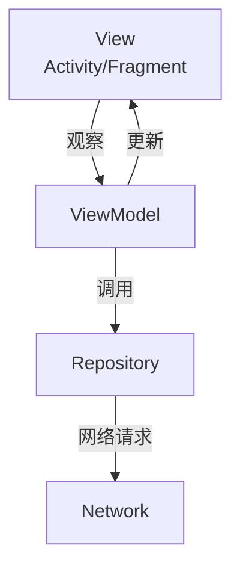

# iStudySpot 系统架构设计

## 1. 整体架构

iStudySpot 是一个面向付费自习室的在线预订系统，采用前后端分离的架构设计。系统由三个主要部分组成：微信小程序用户端、Android 用户端和后端服务。

### 1.1 系统架构图



## 2. 前端架构

### 2.1 微信小程序架构

#### 技术栈
- 微信原生框架
- Vant Weapp（UI组件）
- ECharts（数据可视化）
- Canvas（座位图绘制）

#### 主要功能模块
- 用户登录/注册
- 自习室浏览
- 座位查看与预订
- 订单管理
- 签到/签退
- 个人中心

### 2.2 Android 应用架构

#### 技术栈
- Kotlin（主开发语言）
- Jetpack（ViewModel/LiveData）
- Retrofit（网络请求）
- OkHttp（HTTP通信）
- Glide（图片加载）
- MPAndroidChart（数据可视化）
- Custom View（座位图绘制）

#### 架构模式
采用 MVVM 架构模式：



#### 项目目录结构

```
app/src/main/java/com/example/scylier/istudyspot/
├── fragment/
│   ├── HomeFragment.kt       # 首页
│   ├── MoreFragment.kt       # 更多页面
│   ├── ProfileFragment.kt    # 个人中心
│   └── RulesFragment.kt      # 规则页面
│
├── viewmodel/
│   ├── HomeViewModel.kt      # 首页数据管理
│   ├── MoreViewModel.kt      # 更多页面数据管理
│   ├── ProfileViewModel.kt   # 个人中心数据管理
│   └── RulesViewModel.kt     # 规则页面数据管理
│
├── MainActivity.kt           # 主活动
```

## 3. 后端架构

### 3.1 技术栈
- SpringBoot（应用框架）
- SpringMVC（Web框架）
- MyBatis（ORM框架）
- JWT（登录鉴权）
- WebSocket（实时状态推送）
- Spring Task（定时任务）

### 3.2 核心功能模块
- 用户认证与授权
- 自习室管理
- 座位状态管理
- 订单管理
- 支付处理
- 签到/签退管理
- 数据统计

### 3.3 关键技术点
- **分布式锁**：使用 Redis 实现分布式锁，解决高峰期热门座位并发抢座问题
- **实时状态**：使用 WebSocket 推送座位状态变化
- **定时任务**：自动释放超时未签到订单，提升座位利用率
- **缓存策略**：使用 Redis 缓存座位状态，减少数据库压力

## 4. 数据库架构

### 4.1 数据存储
- **MySQL**：存储业务数据，如用户信息、自习室信息、座位信息、订单信息等
- **Redis**：缓存座位状态、分布式锁、计数器等

### 4.2 主要数据表
- `users`：用户信息
- `study_rooms`：自习室信息
- `seats`：座位信息
- `orders`：订单信息
- `booking_records`：预订记录
- `payment_records`：支付记录

## 5. 系统流程

### 5.1 座位预订流程
1. 用户浏览自习室列表
2. 选择自习室查看座位图
3. 选择可用座位和使用时间
4. 系统计算费用
5. 用户确认预订并支付
6. 系统生成订单并锁定座位
7. 用户到店扫码签到
8. 系统开始计时
9. 用户离开时签退
10. 系统结算费用并释放座位

### 5.2 并发处理流程
1. 多个用户同时预订同一座位
2. 系统使用 Redis 分布式锁确保只有一个用户能成功预订
3. 预订成功后，更新座位状态并通知其他用户
4. 超时未签到的订单由定时任务自动释放

## 6. 技术亮点

1. **3D座位图可视化**：通过 Canvas 绘制，直观展示座位布局和状态
2. **实时状态推送**：使用 WebSocket 实现座位状态的实时更新
3. **分布式锁**：解决高峰期并发抢座问题，确保数据一致性
4. **智能计费**：根据使用时间和价格策略自动计算费用
5. **多端适配**：支持微信小程序和 Android 应用，满足不同用户需求

## 7. 扩展性考虑

1. **微服务架构**：后续可将后端服务拆分为多个微服务，如用户服务、订单服务、支付服务等
2. **容器化部署**：使用 Docker 容器化部署，提高系统可维护性和扩展性
3. **多语言支持**：可考虑添加多语言支持，服务国际化用户
4. **第三方集成**：可集成更多支付方式、地图服务等第三方服务

## 8. 安全性考虑

1. **JWT 认证**：使用 JWT 进行用户身份认证，确保 API 访问安全
2. **HTTPS 传输**：所有网络通信采用 HTTPS 加密，保护数据传输安全
3. **输入验证**：对所有用户输入进行严格验证，防止恶意输入
4. **权限控制**：实现细粒度的权限控制，确保用户只能访问授权资源
5. **数据加密**：敏感数据如密码等进行加密存储

---

通过以上架构设计，iStudySpot 系统实现了自习室预订的核心功能，同时具备良好的扩展性和安全性。系统采用现代化的技术栈和架构模式，为用户提供流畅、便捷的预订体验，为自习室管理者提供高效、智能的管理工具。