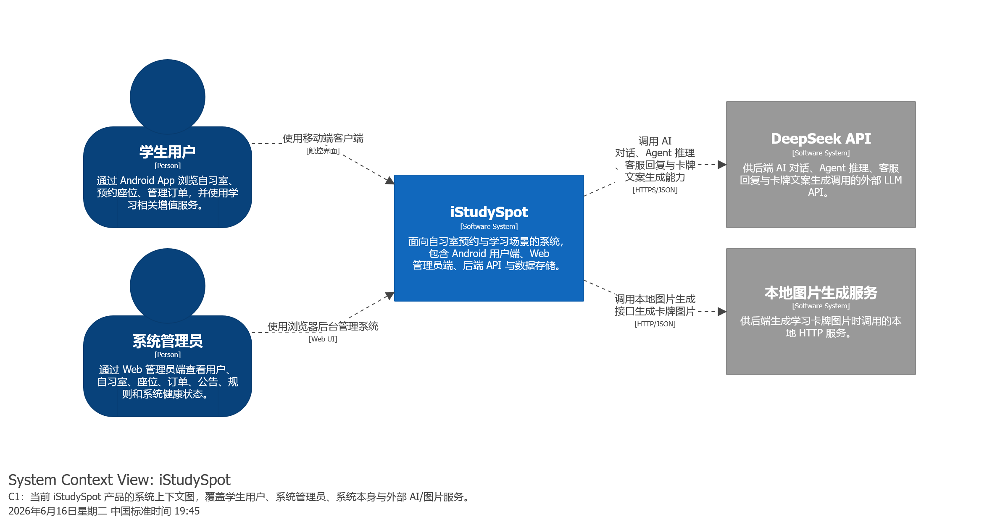
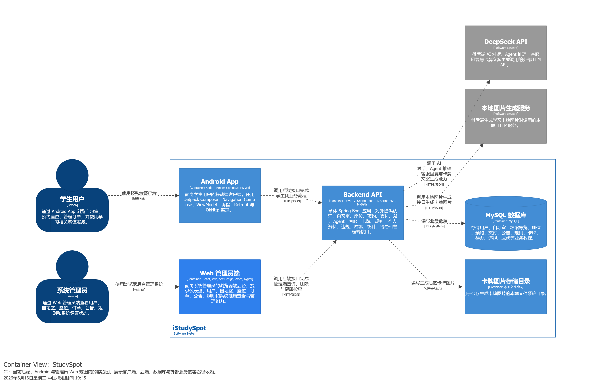
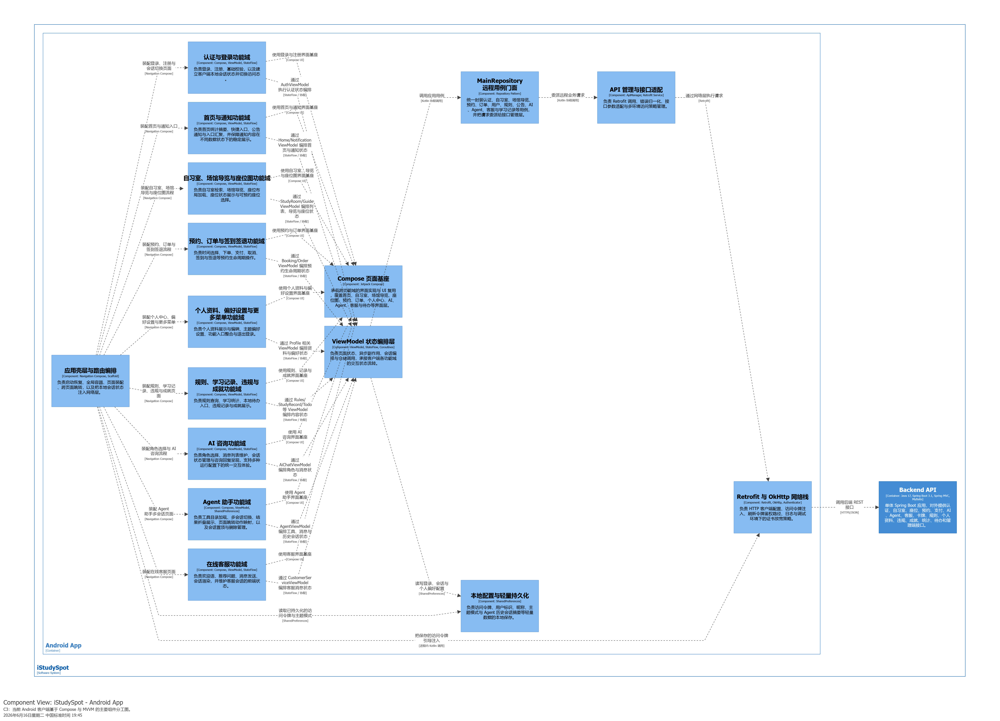
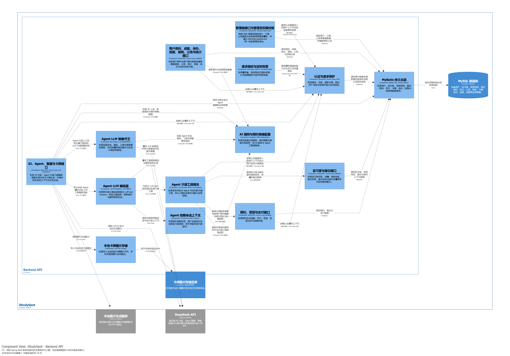
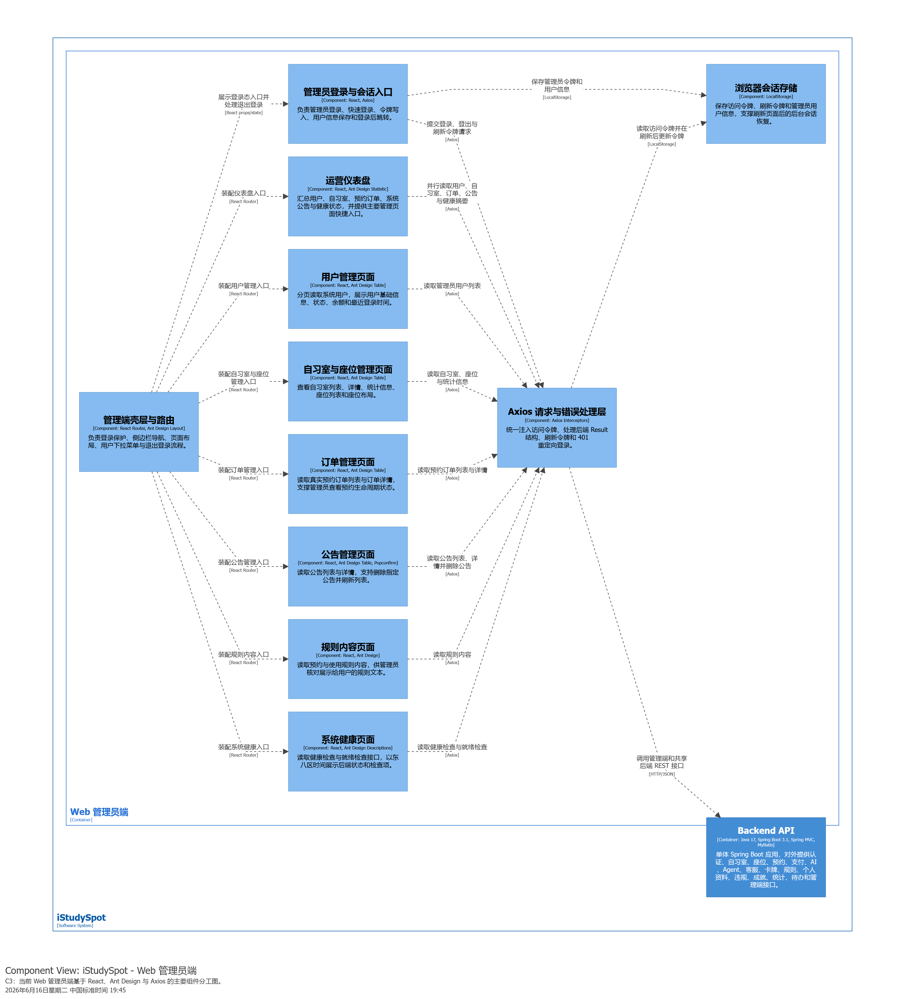
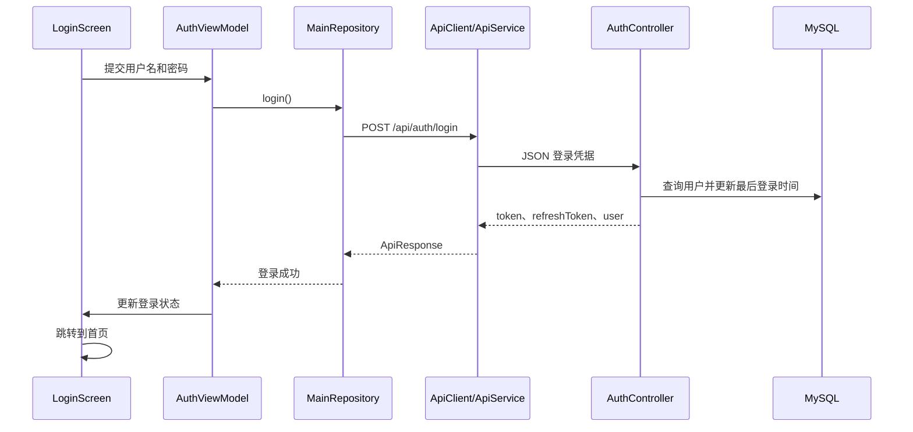
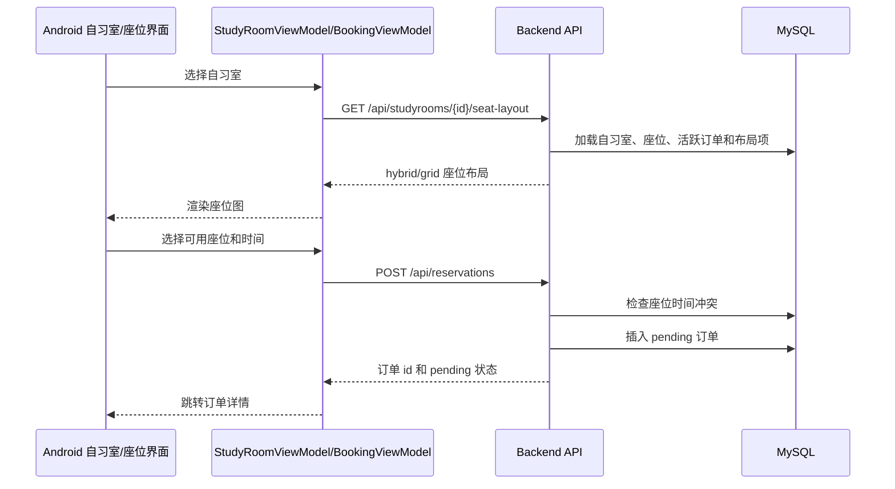
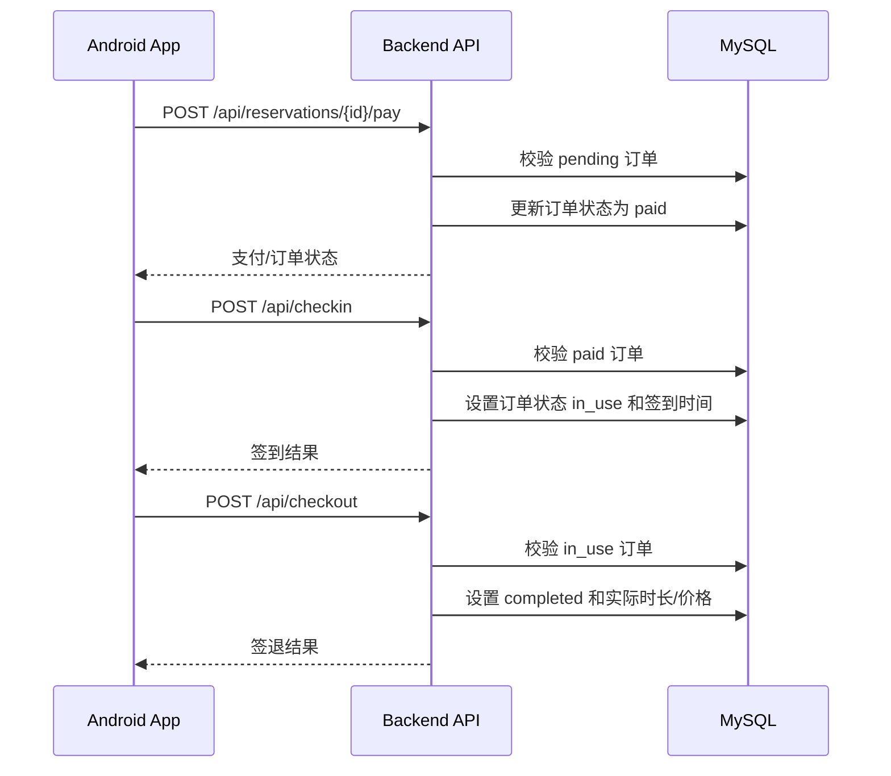
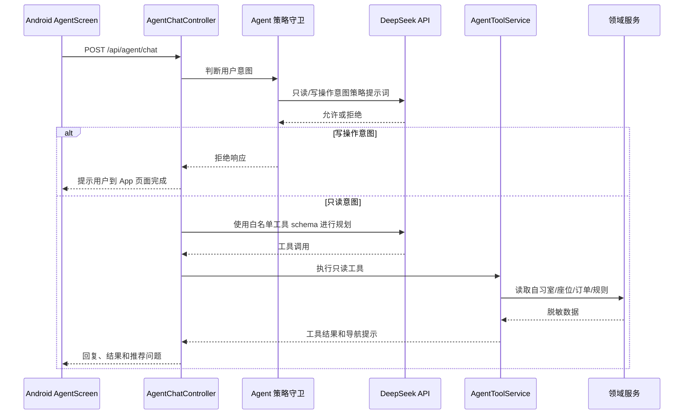
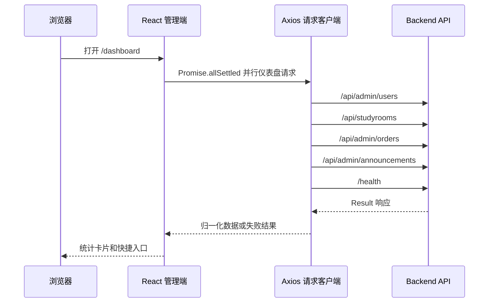

# iStudySpot 架构文档

本文基于 arc42 组织 iStudySpot 的架构说明，整合当前仓库中的 Android App、Backend API、Web 管理员端，以及 `docs/design/structurizr-backend-android.dsl` 中的 Structurizr/C4 模型。

最后更新日期：2026-06-17

## 1. 引言与目标

### 1.1 需求概览

iStudySpot 是面向自习室预约与学习场景的系统，本文覆盖三个主要端：

- Android App：面向学生用户，提供自习室浏览、座位图、预约、订单、签到签退、规则、公告、AI 咨询、Agent 助手、客服、卡牌、成就、违规记录、待办等功能。
- Backend API：Spring Boot 单体后端，对外提供认证、自习室、座位、预约、支付、用户、公告、规则、统计、AI、Agent、客服、卡牌、成就、违规、待办和管理员接口。
- Web 管理员端：面向系统管理员，提供仪表盘、用户、自习室、座位、订单、公告、规则内容和健康检查等后台页面。

系统还包含微信小程序目录和 `/api/wx/*` 后端接口，但本文按本次架构范围聚焦 Android、Backend、管理员 Web 三端；小程序仅作为后端已暴露接口的一部分在边界中说明。

### 1.2 质量目标

| 优先级 | 质量目标 | 在本系统中的含义 |
| --- | --- | --- |
| 1 | 正确性 | 预约、支付、签到、签退和座位状态必须以服务端数据为准，避免基于过期状态完成错误操作。 |
| 2 | 可维护性 | 三端均采用清晰分层：Android 的 Compose/MVVM，后端的 Controller/Service/Mapper，管理员端的 Route/Page/API client。 |
| 3 | 易用性 | Android 和管理员端均围绕常用任务组织入口，并在异步操作中提供加载、错误和空状态反馈。 |
| 4 | 安全性 | 后端通过 JWT 拦截器保护 `/api/**` 的受限接口；管理员端使用登录态保护路由；Agent 助手限制为只读工具。 |
| 5 | 可观测性 | 后端通过 MetricsInterceptor 和健康检查接口收集基本运行指标，管理员端提供健康检查页面。 |
| 6 | 可扩展性 | AI、Agent、客服、卡牌、场馆导览等功能作为独立业务域接入同一个后端单体，便于逐步拆分。 |

### 1.3 干系人

| 干系人 | 关注点 |
| --- | --- |
| 学生用户 | 在移动端快速查找自习室、选择座位、完成预约和查看学习相关信息。 |
| 系统管理员 | 通过 Web 后台查看用户、场馆、座位、订单、公告、规则和系统健康状态。 |
| 后端开发者 | 维护统一业务 API、认证、数据一致性、AI/Agent 集成和数据库结构。 |
| Android 开发者 | 维护 Compose 页面、ViewModel 状态流、Repository 和网络访问。 |
| 管理端开发者 | 维护 React/Ant Design 后台页面、Axios 请求封装和路由保护。 |
| 运维/部署人员 | 关注 Docker Compose、MySQL、Redis、后端服务、管理员 Nginx 和外部 AI 依赖。 |

## 2. 约束条件

### 2.1 技术约束

| 领域 | 约束 |
| --- | --- |
| Android | Kotlin、Jetpack Compose、Material 3、Navigation Compose、ViewModel、StateFlow、Coroutines、Retrofit、OkHttp。 |
| Backend | Java 17、Spring Boot 3.1.2、Spring MVC、MyBatis、MySQL Connector、JWT、Flyway 迁移文件、Sentry 依赖。 |
| Admin Web | React 18、Vite 6、Ant Design 5、React Router 6、Axios、dayjs、Nginx 静态托管与反向代理。 |
| 数据库 | 顶层 Docker Compose 使用 MySQL 8.4，业务表结构位于 `src/main/resources/db/migration`。 |
| 缓存/基础设施 | Redis 7 是部署编排的一部分，但当前核心预约代码主要使用数据库读取与事务，而不是 Redis 锁。 |
| AI | DeepSeek API 通过环境变量和 `application.yml` 配置；AI 会话当前保存在内存中。 |
| 部署 | 顶层 `docker-compose.yml` 运行 MySQL、Redis、backend 和 admin 容器。后端暴露为 `18080:8080`，管理员端暴露为 `3001:80`。 |

### 2.2 组织约束

- 仓库是多应用工作区，而不是一个统一构建系统。
- Backend 是模块化单体，不是一组可以独立部署的微服务。
- Structurizr 作为架构模型来源，主要文件是 `docs/design/structurizr-backend-android.dsl`。
- 部分历史文档和 README 在当前 shell 输出中存在编码损坏，因此本文优先依据源码和当前 Structurizr DSL，而不是旧的散落说明文本。

## 3. 上下文与范围

### 3.1 系统上下文

### 3.2 外部系统

| 外部系统 | 使用方 | 用途 |
| --- | --- | --- |
| DeepSeek API | 后端 AI、Agent、客服、卡牌文本生成 | 提供对话补全、工具编排、流式对话和学习卡牌内容生成。 |
| 本地图像生成服务 | 后端卡牌流程 | 通过 HTTP 生成学习卡牌图片。 |
| MySQL | 后端持久化 | 存储用户、自习室、区域、座位、订单、支付、规则、公告、卡牌、待办等业务数据。 |
| 本地文件系统 | 后端卡牌图片存储 | 在 `uploads/cards` 下保存生成后的卡牌图片。 |
| Redis | 部署编排 | 当前作为可用基础设施组件存在；在已检查的预约/座位服务中尚不是核心依赖。 |

## 4. 解决方案策略

整体架构采用务实的模块化单体策略：

- 将业务权威放在后端。Android 和管理员 Web 都通过 REST JSON API 调用后端，并以后端数据作为事实来源。
- 客户端采用各自适合的 UI 架构。Android 使用单 Activity + Compose Navigation + MVVM；管理员 Web 使用 React Router + Ant Design 页面。
- 后端用包边界表达业务域。Controller 暴露 API 区域，Service 实现业务规则，Mapper 隔离 SQL 访问。
- 使用 JWT 作为共享认证机制。Android 和管理员 Web 在本地保存 token，并在请求中附加 `Authorization: Bearer ...`。
- 控制 AI/Agent 能力边界。普通 AI 对话可以调用 DeepSeek；Agent 工具被显式建模为只读，并由后端白名单工具支撑。
- 使用 C4/Structurizr 建模，再用 arc42 文档化。Structurizr 覆盖 C1/C2/C3 视图；本文补充质量目标、风险、运行时流程和部署说明。

## 5. 构建块视图

### 5.1 容器视图

### 5.2 Android App

源码根目录：`frontend/Android`

关键构建块：

| 构建块 | 源码位置 | 职责 |
| --- | --- | --- |
| 应用壳层 | `MainActivity.kt`、`navigation/AppNavigation.kt`、`navigation/NavRoutes.kt` | 单 Activity、主题启动、底部导航、路由图、页面转场动画和全局 Snackbar 容器。 |
| Compose 页面 | `ui/screen/*` | 首页、登录/注册、自习室、座位图、预约、订单列表/详情、个人中心、规则、导览、AI 聊天、Agent、客服、卡牌、待办等界面。 |
| ViewModel | `viewmodel/*ViewModel.kt` | 基于 StateFlow 的 UI 状态、协程编排、校验和 Repository 调用。 |
| Repository | `repository/MainRepository.kt` | 面向客户端用例的统一门面，封装 API 操作。 |
| API 层 | `infra/network/ApiService.kt`、`ApiManager.kt`、`ApiClient.kt`、`ErrorHandler.kt` | Retrofit 端点、响应归一化、OkHttp 拦截器、JWT 注入和刷新 token 尝试。 |
| 本地状态 | `utils/ConfigManager.kt`、`repository/AgentConversationStore.kt`、`LocalTodoStore.kt` | 通过 SharedPreferences 保存 token、用户标识、昵称、主题模式、Agent 会话和本地待办支持。 |
| 主题 | `ui/theme/*` | Material 3 主题、自定义语义色、亮色/暗色处理。 |

Android 主要 API 区域：

- 认证：`/api/auth/login`、`/api/auth/register`、`/api/auth/refresh`、`/api/auth/logout`
- 自习室与座位：`/api/studyrooms`、`/api/studyrooms/{id}`、`/api/studyrooms/{id}/seats`、`/api/studyrooms/{id}/seat-layout`、`/api/seats/{id}`
- 预约与签到：`/api/reservations`、`/api/reservations/my`、`/api/reservations/{id}`、`/api/checkin`、`/api/checkout`
- 用户内容：`/api/users/me`、`/api/announcements`、`/api/rules`、`/api/todos`、`/api/achievements`、`/api/violations`
- AI 与助手：`/api/characters`、`/api/chat`、`/api/agent/chat`、`/api/agent/tools/catalog`、`/api/customer-service/*

### 5.3 Backend API

源码根目录：`backend/istudyspot-backend`

后端是一个 Spring Boot 模块化单体。可部署单元是一个进程，但职责通过包和控制器领域拆分。

| 层次 | 源码位置 | 职责 |
| --- | --- | --- |
| Controller | `controller/*Controller.java` | 暴露认证、用户、自习室、座位、预约、支付、AI、Agent、客服、卡牌、管理员、健康检查和 wx API。 |
| Service | `service/*`、`service/impl/*` | 业务逻辑、校验、状态流转、AI 编排和管理员访问检查。 |
| 持久化 | `mapper/*`、`resources/mapper/*.xml` | 通过 MyBatis 访问关系型数据。 |
| 实体与 DTO | `entity/*`、`dto/*` | 客户端返回数据、请求数据和数据库映射对象。 |
| 横切能力 | `config/*`、`interceptor/*`、`utils/JwtUtils.java` | CORS、静态资源、JWT 认证、指标、Jackson、DeepSeek/Wx 配置。 |
| AI/Agent | `ai/*`、`agent/chat/*`、`agent/tool/*`、`resources/ai-rules.json` | AI 规则、DeepSeek 集成、只读 Agent 策略守卫、工具目录和工具执行。 |

主要后端领域：

| 领域 | 代表 Controller/Service | 说明 |
| --- | --- | --- |
| 认证 | `AuthController`、`AuthServiceImpl`、`JwtInterceptor`、`JwtUtils` | 登录、注册、刷新 token、登出；JWT 拦截器把 `userId` 写入请求属性。 |
| 自习室与座位 | `StudyRoomController`、`SeatController`、`StudyRoomServiceImpl`、`SeatServiceImpl` | 读取自习室列表/详情、座位列表、座位详情和混合座位布局。座位状态由座位表状态和活跃订单共同推导。 |
| 预约与支付 | `OrderController`、`CheckInController`、`PaymentController`、`OrderServiceImpl`、`PaymentServiceImpl` | 创建订单、检查时间冲突、支付、取消、签到、签退、续约。 |
| 管理员 | `AdminUserController`、`AdminOrderController`、`AdminAnnouncementController`、`AdminAccessServiceImpl` | 管理端列表、详情、删除等能力。当前管理员检查基于用户名 `admin`。 |
| 用户内容 | `AnnouncementController`、`RulesController`、`TodoController`、`AchievementController`、`ViolationRecordController`、`StatisticsController` | 暴露支撑内容和用户侧记录。部分区域仍以静态/配置或占位实现为主。 |
| AI 与 Agent | `AIController`、`AgentChatController`、`AgentToolController`、`CustomerServiceController`、`CardController` | DeepSeek 聊天、流式端点、Agent 只读工具、客服聊天和卡牌生成。 |
| 微信小程序 API | `Wx*Controller` | `/api/wx/*` 端点存在，但不属于本文三端重点范围。 |

### 5.4 Web 管理员端

源码根目录：`admin`

关键构建块：

| 构建块 | 源码位置 | 职责 |
| --- | --- | --- |
| 应用路由 | `src/App.jsx` | 登录路由、私有管理布局、仪表盘、用户、自习室、座位、订单、公告、规则和健康检查页面。 |
| 布局壳层 | `src/layouts/AdminLayout.jsx` | Ant Design Layout/Sider/Header、菜单选中、登出和用户信息展示。 |
| 页面 | `src/pages/**` | 数据表格、详情、搜索过滤、统计和健康检查面板。 |
| API 模块 | `src/api/*.js` | 对后端端点的函数级封装。 |
| 请求客户端 | `src/api/request.js` | Axios 实例、token 注入、后端 `Result` 处理、刷新 token 重试和 401 登录跳转。 |
| 会话存储 | `src/utils/auth.js` | LocalStorage 中的 `admin_token`、`admin_refresh_token` 和 `admin_user`。 |
| 部署代理 | `nginx.conf`、`docker-entrypoint.sh`、`Dockerfile` | 静态托管，并将 `/api` 和 `/health` 反向代理到后端；对 SSE 端点设置特殊 buffering 配置。 |

当前已接入路由的管理端功能：

- 仪表盘摘要：用户、自习室、订单、公告和健康状态。
- 用户管理：分页用户表格，支持搜索和状态过滤。
- 自习室管理：自习室列表、详情/统计、座位列表。
- 订单管理：管理员预约列表和订单详情。
- 公告管理：列表、详情、删除。
- 规则内容：列表和本地创建弹窗 UI。
- 系统健康：`/health` 和 `/health/ready`。

源码中存在但当前未在 `App.jsx` 挂载的页面：

- `pages/ai/AIChatMonitor.jsx`
- `pages/ai/AgentConsole.jsx`
- `pages/studyrooms/StudyRoomGuideList.jsx`

## 6. 运行时视图

### 6.1 Android 登录与认证请求

### 6.2 座位布局与预约

### 6.3 支付、签到与签退

### 6.4 Agent 只读助手

### 6.5 管理员仪表盘

## 7. 部署视图

顶层 `docker-compose.yml` 部署主要运行时：

| 服务 | 容器 | 端口 | 说明 |
| --- | --- | --- | --- |
| MySQL | `istudyspot-mysql` | `3306:3306` | MySQL 8.4，通过 `init-db.sql` 初始化 `iseatspace`。 |
| Redis | `istudyspot-redis` | `6379:6379` | Redis 7 Alpine，使用持久化 volume。 |
| Backend | `istudyspot-backend` | `18080:8080` | 从 `backend/istudyspot-backend/Dockerfile` 构建；依赖健康的 MySQL/Redis。 |
| Admin | `istudyspot-admin` | `3001:80` | 从 `admin/Dockerfile` 构建；Nginx 托管 SPA 并代理 `/api` 与 `/health`。 |

后端运行时配置：

- `SPRING_DATASOURCE_URL`、`SPRING_DATASOURCE_USERNAME`、`SPRING_DATASOURCE_PASSWORD`
- `SPRING_DATA_REDIS_HOST`、`SPRING_DATA_REDIS_PORT`
- `DEEPSEEK_API_KEY`、`DEEPSEEK_API_URL`、`DEEPSEEK_API_MODEL`
- `SENTRY_DSN`、`SENTRY_ENABLED`
- `WX_MINIPROGRAM_APP_ID`、`WX_MINIPROGRAM_APP_SECRET`

管理员端运行时配置：

- `ADMIN_BACKEND_TARGET`：用于 Nginx 反向代理。
- `VITE_BACKEND_TARGET`：用于本地 Vite 开发代理。

## 8. 横切关注点

### 8.1 认证与授权

- JWT token 由后端 `JwtUtils` 生成，并从 `/api/auth/login` 返回。
- 后端 `JwtInterceptor` 保护 `/api/**`，但会排除认证、自习室只读接口、公告、规则、部分 wx API 和卡牌图片路径等公开接口。
- Android 通过 `ConfigManager` 将 token 相关数据保存在 SharedPreferences。
- 管理员 Web 将 token 和用户信息保存在 LocalStorage，并通过 `PrivateRoute` 保护私有路由。
- 后端管理员权限由 `AdminAccessServiceImpl` 检查，目前判断方式是认证用户的用户名是否为 `admin`。

### 8.2 错误处理

- 后端返回统一的 `Result` 风格结构，包含 `code`、`message` 和 `data`。
- Android 将网络和业务错误映射为 `ApiResponse.Success` 或 `ApiResponse.Error`，再通过 ViewModel 状态和 Snackbar 暴露给 UI。
- 管理员 Web 的 Axios 客户端会拒绝后端非 200/201 的业务状态码，并在 401 时跳转登录页。
- `/api/agent/*` 的未授权响应使用更严格的结构化 payload。

### 8.3 持久化

核心表和迁移包括：

- 空间模型：`study_room`、`area`、`seat`、`seat_layout_item`、`study_room_guide`
- 预约模型：`order`、`order_detail`、`seat_status_log`
- 支付模型：`payment`、`payment_log`
- 用户与治理：`user`、`blacklist`、`violation_record`，其中部分表体现在 mapper/entity 中
- 内容与成长：`announcement`、`rule`、`card`、`todo`、成就相关表/实体

Flyway 迁移文件存在于 `src/main/resources/db/migration`，但 `application.yml` 中当前配置为 `spring.flyway.enabled=false`。顶层 Docker Compose 也会通过 `init-db.sql` 初始化数据库。

### 8.4 可观测性与健康检查

- `MetricsInterceptor` 记录请求数、成功/失败数、总响应时间和端点访问次数。
- `HealthController` 暴露健康检查和就绪检查端点，供 Docker healthcheck 和管理员健康页面使用。
- Sentry 依赖和配置已经存在，默认关闭，需通过环境变量启用。
- `AlertConfig` 和 `AlertService` 提供错误率、响应时间和连续服务失败次数等阈值概念。

### 8.5 AI 与 Agent 安全

- AI 角色行为和客服事实从 classpath JSON/rules 中加载。
- `AIServiceImpl` 和 `AgentChatServiceImpl` 维护内存会话状态。
- Agent 执行被设计为只读：
  - 策略守卫识别写操作意图；
  - 工具 schema 来自后端白名单；
  - `AgentToolServiceImpl` 只暴露自习室列表/详情、座位列表、当前用户预约和预约规则；
  - 返回的预约数据会脱敏，并隐藏敏感字段。

### 8.6 UI 状态与客户端存储

- Android 使用 ViewModel 中的 StateFlow，并在 Compose 页面中收集状态。
- Android 使用 SharedPreferences 保存轻量数据；已检查代码中没有本地 SQL 数据库。
- 管理员 Web 使用 LocalStorage 保存登录状态，并用页面级 React state 管理表格、筛选器和加载状态。

## 9. 架构决策

### AD-001：后端采用模块化单体

状态：已接受

背景：后端暴露多个 API 领域，但所有 Controller、Service、Mapper 和 AI 组件都运行在同一个 Spring Boot 进程中。

决策：将后端建模和运行为一个模块化单体，通过包结构和 Service 接口维持内部模块边界。

影响：

- 部署比微服务简单。
- 内部调用是 Java 方法调用，而不是网络调用。
- AI 会话和 Agent 上下文当前可以保存在内存中。
- 如果未来需要横向扩展或独立部署，需要抽取模块并外部化状态。

### AD-002：使用 C4/Structurizr 作为架构模型

状态：已接受

背景：仓库中包含详细的 Structurizr DSL，覆盖 C1、C2 和 C3 视图。

决策：保持 `docs/design/structurizr-backend-android.dsl` 作为架构模型来源，并通过本文的 arc42 结构进行说明。

影响：

- 图可以通过 Structurizr 本地工具验证和查看。
- Markdown 文档在不打开 viewer 的情况下仍可阅读。
- 当代码结构变化时，需要同步维护 C4 模型和 arc42 文档。

### AD-003：Android 使用 MVVM 和 Compose

状态：已接受

背景：Android 代码是一个基于 Compose 的单应用，并通过 ViewModel 管理状态、通过 Retrofit 访问网络。

决策：UI 渲染放在 Compose 页面中，交互和状态编排放在 ViewModel 中，远程调用通过 `MainRepository` 封装。

影响：

- UI 是状态驱动的，便于在 ViewModel/Repository 边界测试。
- Repository 和 API 层集中管理端点访问。
- 当前没有 DI，一些 ViewModel 会直接实例化 Repository，后续大规模替换会更困难。

### AD-004：Web 管理员端使用 React/Ant Design

状态：已接受

背景：管理员页面主要是运营表格、详情和健康检查视图。

决策：使用 React Router 组织页面结构，使用 Ant Design 构建密集型后台 UI，使用 Axios 调用后端。

影响：

- 表格、筛选、标签、弹窗等管理流程可以快速实现。
- API wrapper 简单，调用链容易追踪。
- 更强的角色模型和表单级校验是后续改进方向。

### AD-005：Agent 限制为只读工具

状态：已接受

背景：Agent 助手可以访问与用户预约、自习室、座位状态相关的数据。

决策：只暴露白名单只读工具，并拒绝预约、取消、支付、签到、签退等写操作。

影响：

- 降低 LLM 工具误用风险。
- 状态变更操作仍由用户在常规 App 页面中完成。
- 工具目录保持小而可审计。

## 10. 质量需求

| 场景 | 质量属性 | 当前机制 |
| --- | --- | --- |
| 防止预约已被占用的座位 | 正确性 | `OrderServiceImpl.createOrder` 在事务中插入前检查时间冲突。 |
| 展示当前座位状态 | 正确性 | `SeatServiceImpl` 根据座位表状态和活跃订单推导座位状态。 |
| 恢复过期 token | 易用性/安全性 | 管理端 Axios 客户端会在 401 时刷新 token；Android 有 authenticator 支持，但 refresh token 持久化不完整。 |
| 保护管理员数据 | 安全性 | JWT 加 `AdminAccessServiceImpl`；当前使用基于用户名的管理员检查。 |
| 避免 Agent 写入业务数据 | 安全性 | LLM 策略守卫加硬编码只读工具白名单。 |
| 理解运行时健康状态 | 可观测性 | `/health`、`/health/ready`、MetricsInterceptor 和管理员健康页面。 |
| 渲染复杂座位图 | 易用性 | 后端返回包含 seats 和 layout items 的 `SeatLayoutResponse`；Android 在布局加载失败时回退到网格。 |

## 11. 风险与技术债

| 编号 | 风险或技术债 | 影响 | 建议方向 |
| --- | --- | --- | --- |
| R1 | 管理员授权通过用户名 `admin` 判断，而不是角色/权限模型。 | 用户规模扩大后授权边界较弱。 | 增加角色/权限字段，并在 `AdminAccessService` 中校验管理员角色。 |
| R2 | `AuthServiceImpl` 使用 MD5 处理密码。 | 密码保护强度不足。 | 迁移到 BCrypt/Argon2，并设计兼容旧密码的迁移策略。 |
| R3 | Flyway 迁移文件存在，但 Flyway 当前关闭。 | schema 事实来源可能与 `init-db.sql` 漂移。 | 明确选择一种迁移路径，并在环境中启用校验。 |
| R4 | AI、Agent、客服会话保存在内存中。 | 服务重启会丢失会话，且不利于多实例扩展。 | 如需多实例部署，将会话外部化到 Redis 或数据库。 |
| R5 | Redis 已部署，但已检查的核心预约流程未使用它。 | 架构意图和实现可能背离，特别是并发控制预期。 | 明确实现 Redis 锁/缓存，或从核心能力描述中移除 Redis 声明。 |
| R6 | Android refresh token 未通过 `ConfigManager` 持久化。 | App 重启后 token 刷新可能失败。 | 持久化 refresh token，并同步维护 ApiClient 的 token 状态。 |
| R7 | 管理员端 AI/Agent 调试页面存在，但未挂载路由。 | 代码存在感可能误导维护者。 | 接入受控管理员路由，或移动到开发专用工具。 |
| R8 | 旧文档和部分 shell 输出存在编码损坏。 | 文档和 UI 文案难以审阅。 | 将仓库文本统一为 UTF-8，并在 CI 中增加编码检查。 |
| R9 | 支付实现会在本地直接标记成功。 | 可能不代表真实外部支付提供商集成。 | 区分 mock/local payment 与生产支付渠道集成。 |

## 12. 术语表

| 术语 | 含义 |
| --- | --- |
| arc42 | 用于组织本文的架构文档模板。 |
| C4 | Context、Container、Component、Code 架构建模方法，当前通过 Structurizr 使用。 |
| Structurizr | 架构建模工具，项目中的 DSL 文件为 `docs/design/structurizr-backend-android.dsl`。 |
| 模块化单体 | 一个可部署后端进程，内部按模块划分职责。 |
| MVVM | Model-View-ViewModel，Android 客户端采用的架构模式。 |
| Compose | Android 使用的 Jetpack Compose 声明式 UI 工具包。 |
| StateFlow | Kotlin 状态流，用于 Android ViewModel 暴露 UI 状态。 |
| MyBatis | 后端用于持久化访问的 SQL mapper 框架。 |
| JWT | 用于认证 API 请求的 token 格式。 |
| SSE | Server-Sent Events，用于后端 AI/客服流式端点，并由管理员端 Nginx 代理。 |
| Agent tool | 后端白名单中的只读函数，可由 Agent 助手调用。 |
