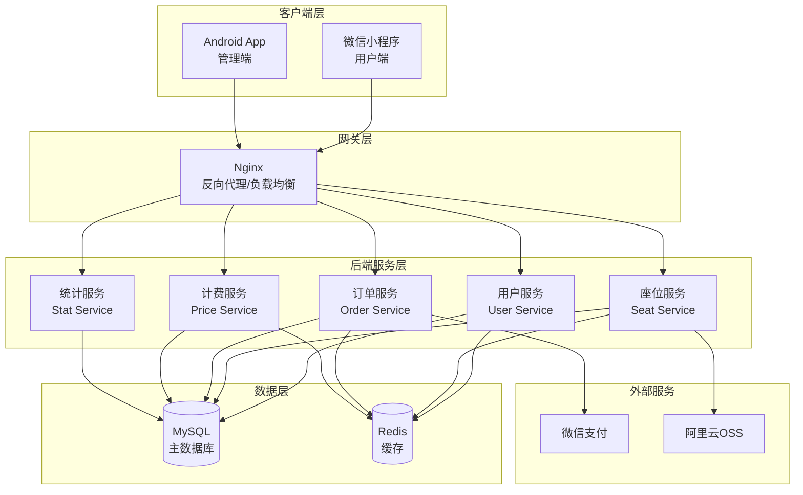
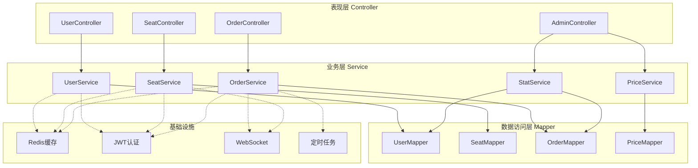
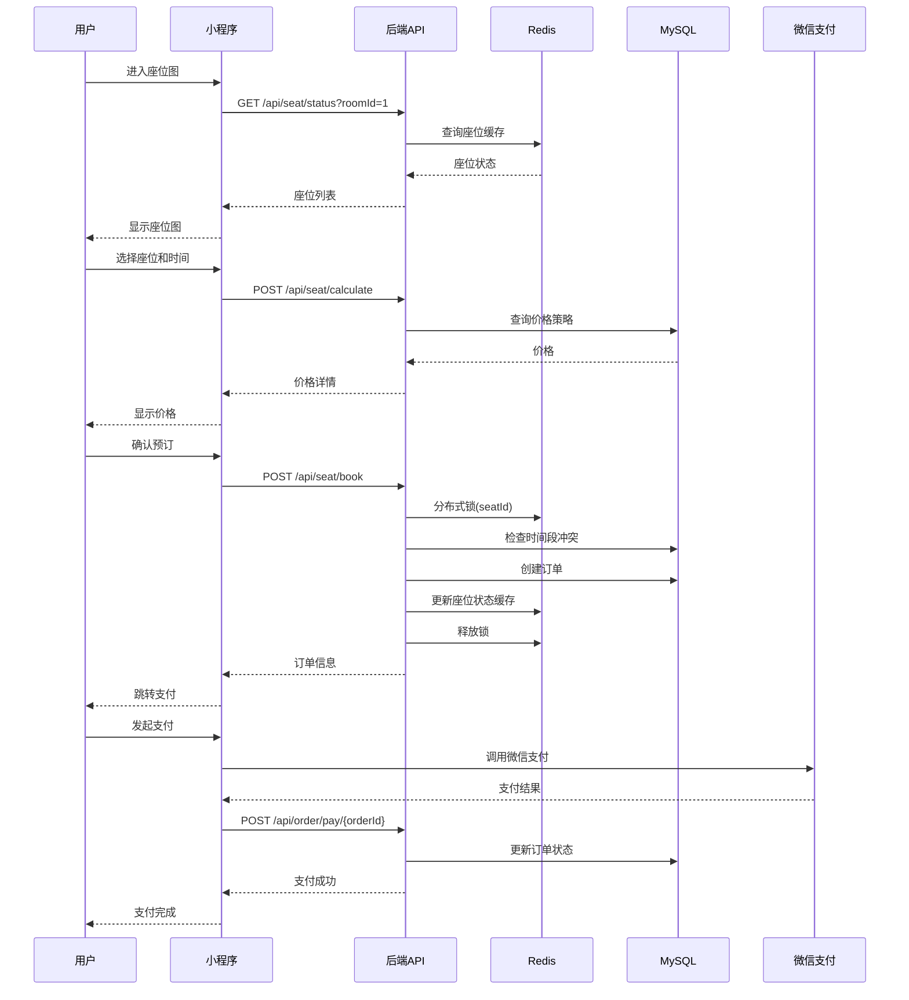
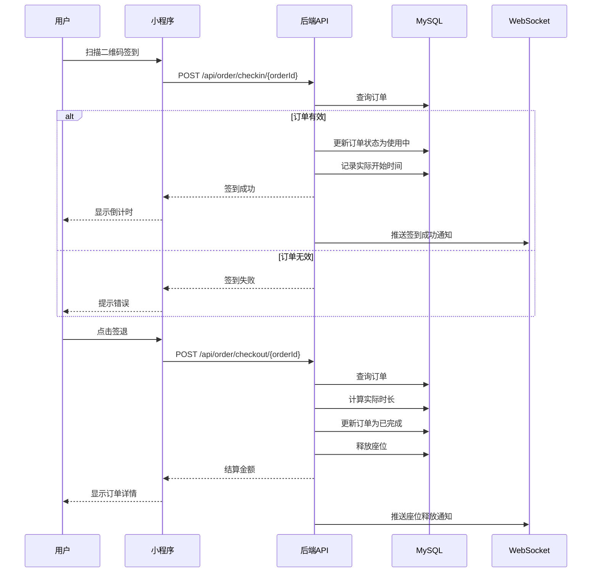
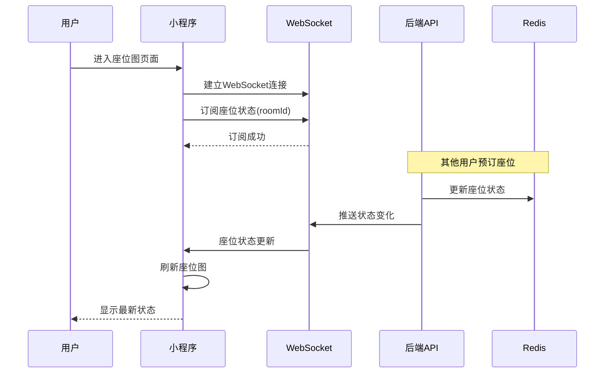

## iStudySpot 系统架构设计文档

---

## 整体系统架构图



---

## 后端架构

### 后端分层架构



### 服务模块划分

| 模块         | 包路径                 | 核心职责                 | 主要接口              |
| ------------ | ---------------------- | ------------------------ | --------------------- |
| **用户服务** | `service.UserService`  | 微信登录、用户信息、余额 | `/api/user/*`         |
| **座位服务** | `service.SeatService`  | 座位状态、预订、时段查询 | `/api/seat/*`         |
| **订单服务** | `service.OrderService` | 订单创建、支付、签到签退 | `/api/order/*`        |
| **计费服务** | `service.PriceService` | 价格计算、策略管理       | `/api/seat/calculate` |
| **统计服务** | `service.StatService`  | 上座率、营收统计         | `/api/admin/stat/*`   |
| **管理服务** | `service.AdminService` | 座位配置、价格策略       | `/api/admin/*`        |

### 后端目录结构

```
backend/src/main/java/com/ycyu/istudyspotbackend/
│
├── controller/                    # 接口层
│   ├── UserController.java
│   ├── SeatController.java
│   ├── OrderController.java
│   └── AdminController.java
│
├── service/                       # 业务层
│   ├── UserService.java
│   ├── SeatService.java
│   ├── OrderService.java
│   ├── PriceService.java
│   ├── StatService.java
│   ├── AdminService.java
│   └── impl/
│       ├── UserServiceImpl.java
│       ├── SeatServiceImpl.java
│       ├── OrderServiceImpl.java
│       ├── PriceServiceImpl.java
│       ├── StatServiceImpl.java
│       └── AdminServiceImpl.java
│
├── mapper/                        # 数据访问层
│   ├── UserMapper.java
│   ├── SeatMapper.java
│   ├── OrderMapper.java
│   └── PriceMapper.java
│
├── entity/                        # 实体类
│   ├── User.java
│   ├── Seat.java
│   ├── Order.java
│   └── Result.java
│
├── dto/                           # 数据传输对象
│   ├── LoginDTO.java
│   ├── BookDTO.java
│   └── PriceDTO.java
│
├── config/                        # 配置类
│   ├── WebConfig.java
│   ├── RedisConfig.java
│   └── WebSocketConfig.java
│
├── interceptor/                   # 拦截器
│   └── JwtInterceptor.java
│
├── utils/                         # 工具类
│   ├── JwtUtils.java
│   └── RedisCache.java
│
├── task/                          # 定时任务
│   └── OrderTask.java
│
└── exception/                     # 异常处理
    └── GlobalExceptionHandler.java
```

---

## 数据库设计（ER图）


### 核心表说明

| 表名           | 说明       | 核心字段                                             |
| -------------- | ---------- | ---------------------------------------------------- |
| `user`         | 用户表     | id, openid, nickname, balance                        |
| `study_room`   | 自习室表   | id, name, address, open_time, close_time             |
| `area`         | 区域表     | id, room_id, name                                    |
| `seat`         | 座位表     | id, seat_number, room_id, has_power                  |
| `order`        | 订单表     | id, order_no, user_id, seat_id, status, total_amount |
| `order_detail` | 订单明细表 | id, order_id, start_time, end_time, amount           |
| `payment_log`  | 支付流水表 | id, order_id, pay_no, amount, status                 |

---

## 系统交互流程

### 用户预订完整流程



###  签到签退流程



### 实时座位状态推送流程



