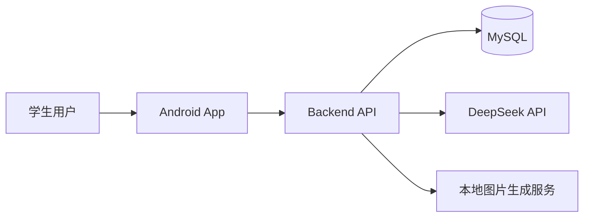
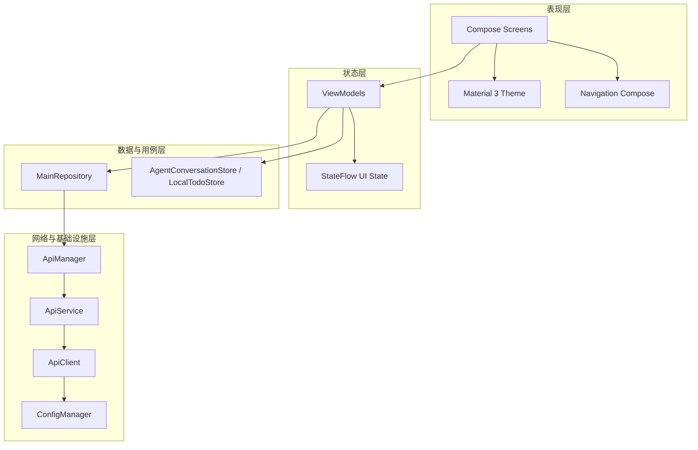
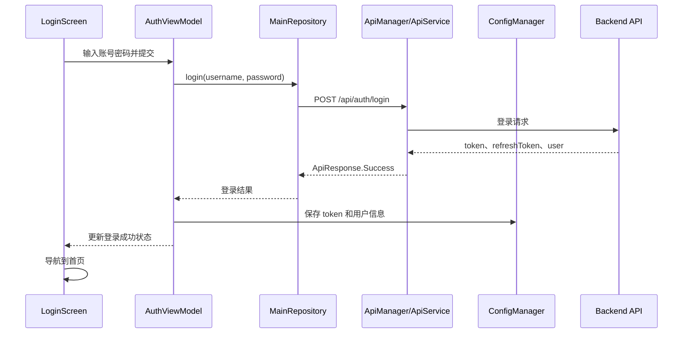
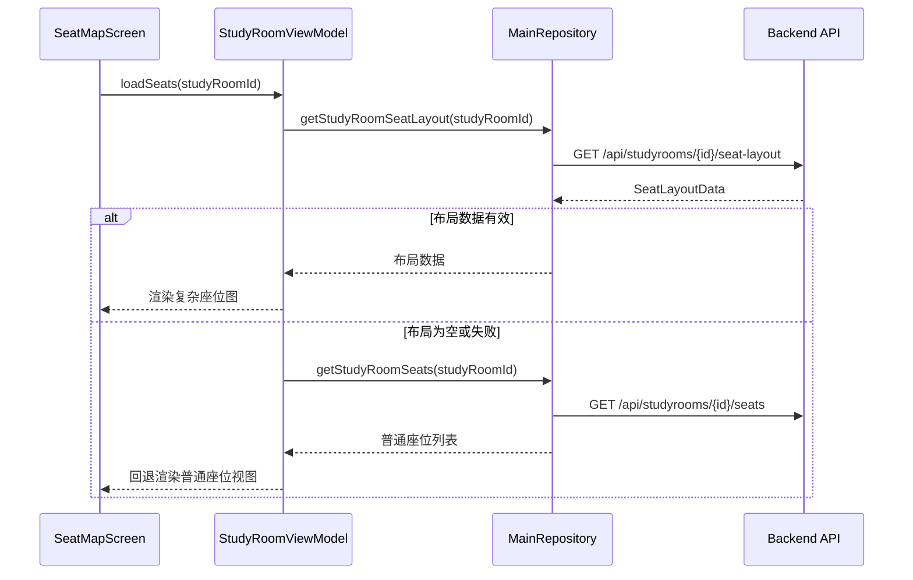
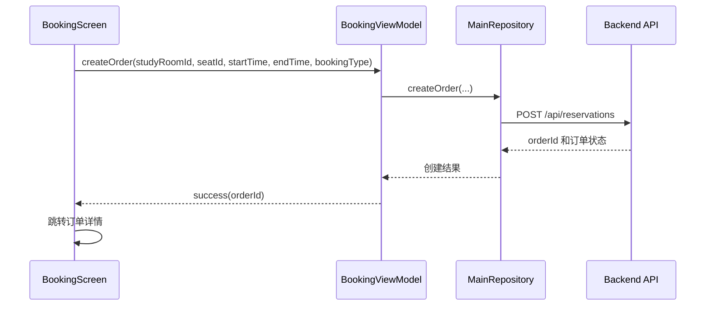
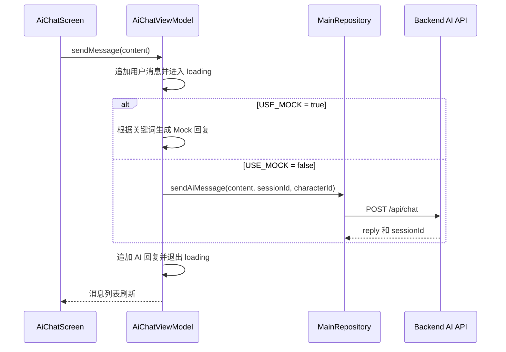
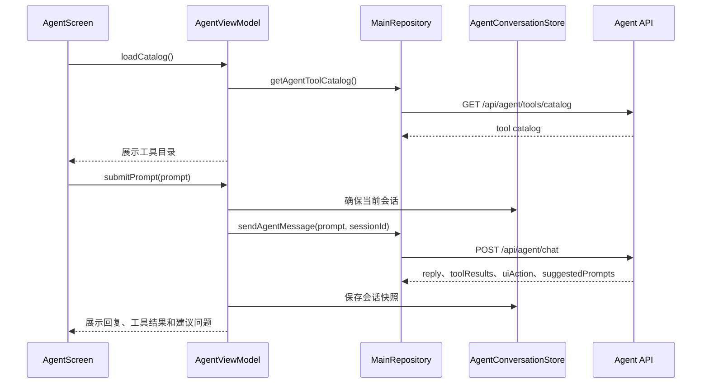

# iStudySpot Android 用户端架构文档

> 本文按 arc42 架构文档结构整理 Android 用户端当前实现，仅描述已经完成的内容与当前设计事实。  
> 作者：黄益政  
> 学号：2312190331

## 1. 引言与目标

作者：黄益政

### 1.1 需求概览

作者：黄益政

Android 用户端面向学生用户，提供自习室预约与学习辅助相关能力。当前已完成的主要功能包括：

- 用户登录与注册
- 首页信息展示与功能入口
- 自习室列表、详情和场馆导览
- 座位图展示、座位状态查看和座位选择
- 预约下单、订单列表、订单详情、取消订单、签到和签退
- 个人中心、资料编辑、主题偏好和退出登录
- 规则、公告、通知、学习记录、违规记录、成就和本地待办
- AI 咨询、Agent 助手、在线客服和学习卡片收藏入口

### 1.2 质量目标

作者：黄益政

| 优先级 | 质量目标 | 当前实现中的体现 |
|--------|----------|------------------|
| P1 | 操作正确性 | 预约、订单、签到签退等关键操作通过后端接口完成，客户端以后端返回结果作为状态依据。 |
| P2 | 状态清晰 | 各页面通过 ViewModel 暴露 loading、success、error、empty 等状态，Compose 页面按状态渲染。 |
| P3 | 可维护性 | 采用 MVVM 分层，UI、ViewModel、Repository、API 层职责清晰。 |
| P4 | 交互可用性 | 异步操作有加载态，错误通过 Snackbar 或页面状态提示，危险操作使用确认对话框。 |
| P5 | 可测试性 | ViewModel、Repository、ApiManager、ConfigManager、Agent 会话、本地待办和 Compose 页面均有测试覆盖。 |

### 1.3 干系人

作者：黄益政

| 干系人 | 关注点 |
|--------|--------|
| 学生用户 | 快速浏览自习室、选择座位、完成预约、查看订单和学习相关信息。 |
| Android 开发者 | 维护 Compose 页面、ViewModel 状态、Repository 门面和网络接口。 |
| 后端服务 | 提供认证、自习室、座位、预约、用户内容、AI、Agent、客服和卡片接口。 |
| 测试维护者 | 验证 ViewModel 状态流转、网络 Mock、Repository 封装和 UI 核心交互。 |

## 2. 约束条件

作者：黄益政

### 2.1 平台与构建约束

作者：黄益政

| 项目 | 当前配置 |
|------|----------|
| 开发语言 | Kotlin |
| 最低支持版本 | Android 7.0，API 24 |
| 编译 SDK | 36 |
| 目标 SDK | 34 |
| 构建工具 | Gradle 8.13，Kotlin 2.0.21 |
| 应用包名 | `com.example.scyiler.istudyspot` |
| 源码命名空间 | `com.example.scylier.istudyspot` |

### 2.2 技术栈约束

作者：黄益政

| 技术 | 用途 |
|------|------|
| Jetpack Compose | 声明式 UI 页面实现 |
| Material 3 | UI 组件、颜色体系和主题 |
| Navigation Compose | 单 Activity 页面导航 |
| ViewModel | 页面状态和交互编排 |
| StateFlow | 向 Compose 页面暴露状态流 |
| Kotlin Coroutines | 异步请求与状态更新 |
| Retrofit | REST API 接口定义和调用 |
| OkHttp | HTTP 客户端、请求头、日志和认证器 |
| Gson / kotlinx-serialization | JSON 数据序列化与反序列化 |
| SharedPreferences | token、用户信息、主题偏好、轻量本地状态保存 |

### 2.3 架构约束

作者：黄益政

Android 端采用单 Activity + Compose Navigation + MVVM 架构。当前主要调用链为：

```text
Compose Screen
    ↓
ViewModel
    ↓
MainRepository
    ↓
ApiManager
    ↓
ApiService / ApiClient
    ↓
Backend API
```

## 3. 上下文与范围

作者：黄益政

### 3.1 系统上下文

作者：黄益政

Android App 是 iStudySpot 系统的学生用户移动端入口。它不直接调用外部 AI 服务或数据库，而是通过后端 REST API 获取和提交业务数据。



### 3.2 Android 端外部依赖

作者：黄益政

| 外部依赖 | 交互方式 | 当前用途 |
|----------|----------|----------|
| Backend API | HTTPS/JSON | 认证、自习室、座位、预约、订单、用户、规则、公告、AI、Agent、客服、卡片等业务能力。 |
| Android 本地存储 | SharedPreferences | 保存 token、用户标识、昵称、主题模式、Agent 会话摘要和本地待办。 |
| Android 系统网络能力 | OkHttp | 发起 HTTP 请求、注入访问令牌、处理刷新令牌路径和调试日志。 |

## 4. 解决方案策略

作者：黄益政

当前 Android 端采用以下实现策略：

1. **声明式 UI**：使用 Jetpack Compose，让页面由状态驱动。
2. **单向数据流**：用户操作进入 ViewModel，ViewModel 调用 Repository，Repository 返回结果后更新 StateFlow，UI 重新渲染。
3. **统一业务门面**：通过 `MainRepository` 暴露客户端用例，使页面不直接依赖网络层。
4. **统一网络适配**：通过 `ApiManager` 做请求执行、Mock 分支、错误归一化和数据结构适配。
5. **轻量本地状态**：通过 SharedPreferences 保存登录态、主题、Agent 会话和待办，不引入本地 SQL 数据库。
6. **Mock 与真实接口并行**：通过 `BuildConfig.USE_MOCK` 控制 Mock 数据和真实 API，支持独立开发和联调。
7. **Material 3 体验一致性**：通过统一主题、扩展语义色、Snackbar、AlertDialog 和加载态保持交互一致。

## 5. 构建块视图

作者：黄益政

### 5.1 顶层分层

作者：黄益政



### 5.2 应用壳层与导航

作者：黄益政

| 构建块 | 源码位置 | 当前职责 |
|--------|----------|----------|
| `MainActivity.kt` | `app/src/main/java/.../MainActivity.kt` | 应用入口、主题初始化、Compose 根节点装配。 |
| `AppNavigation.kt` | `navigation/AppNavigation.kt` | 页面导航图、页面参数传递、ViewModel 装配。 |
| `NavRoutes.kt` | `navigation/NavRoutes.kt` | 路由定义，集中管理页面路径。 |

### 5.3 Compose 页面

作者：黄益政

| 页面 | 源码文件 | 当前功能 |
|------|----------|----------|
| 首页 | `HomeScreen.kt` | 首页摘要、快捷入口、AI 咨询入口。 |
| 登录 / 注册 | `LoginScreen.kt`、`RegisterScreen.kt` | 用户登录、注册、表单校验和加载态。 |
| 自习室 | `StudyRoomScreen.kt`、`GuideScreen.kt` | 自习室列表、详情、导览信息。 |
| 座位图 | `SeatMapScreen.kt` | 座位布局展示、座位状态区分、座位选择。 |
| 预约 | `BookingScreen.kt` | 选择座位和时间，提交预约。 |
| 订单 | `OrderListScreen.kt`、`OrderDetailScreen.kt` | 订单列表、订单详情、取消、签到签退等入口。 |
| 个人中心 | `ProfileScreen.kt`、`ProfileEditScreen.kt` | 用户资料、编辑、主题偏好、退出登录。 |
| 更多功能 | `MoreScreen.kt`、`PreferenceScreens.kt`、`SimpleScreens.kt` | 规则、公告、通知、学习记录、违规、成就等入口和展示。 |
| AI 咨询 | `CharacterSelectScreen.kt`、`AiChatScreen.kt` | AI 角色选择、聊天消息展示、发送问题。 |
| Agent 助手 | `AgentScreen.kt` | 工具目录、对话、多会话、建议问题、工具结果展示。 |
| 在线客服 | `CustomerServiceScreen.kt` | 欢迎语、推荐问题、客服聊天。 |
| 卡片收藏 | `CardCollectionScreen.kt` | 学习卡片列表展示。 |
| 待办 | `TodoListScreen.kt` | 本地待办展示和操作。 |

### 5.4 ViewModel 状态层

作者：黄益政

| ViewModel | 当前职责 |
|-----------|----------|
| `AuthViewModel` | 登录、注册、认证状态和输入校验。 |
| `HomeViewModel` | 首页数据状态。 |
| `StudyRoomViewModel` | 自习室列表、详情、座位布局和座位回退加载。 |
| `GuideViewModel` | 场馆导览列表与详情。 |
| `BookingViewModel` | 创建预约订单。 |
| `OrderViewModel` | 订单列表、详情、取消、支付、签到签退。 |
| `ProfileViewModel` / `ProfileEditViewModel` | 用户资料展示和编辑。 |
| `MoreViewModel` | 更多页面入口状态。 |
| `RulesViewModel` | 规则内容加载。 |
| `NotificationViewModel` | 通知公告状态。 |
| `StudyRecordViewModel` | 学习记录状态。 |
| `ViolationViewModel` | 违规记录状态。 |
| `AchievementViewModel` | 成就状态。 |
| `TodoViewModel` | 本地待办状态。 |
| `AiChatViewModel` | AI 角色、消息列表、会话 ID、Mock / API 回复和错误兜底。 |
| `AgentViewModel` | Agent 工具目录、多会话、工具执行、建议问题和工具结果。 |
| `CustomerServiceViewModel` | 客服欢迎语、推荐问题和聊天回复。 |
| `CardViewModel` | 学习卡片列表状态。 |

### 5.5 数据、网络与本地存储

作者：黄益政

| 构建块 | 源码位置 | 当前职责 |
|--------|----------|----------|
| `MainRepository` | `repository/MainRepository.kt` | 统一封装客户端业务用例。 |
| `ApiService` | `infra/network/ApiService.kt` | Retrofit 端点定义。 |
| `ApiManager` | `infra/network/ApiManager.kt` | 请求执行、Mock 数据、错误归一化、接口参数适配。 |
| `ApiClient` | `infra/network/ApiClient.kt` | Retrofit / OkHttp 初始化、token 注入、日志、refresh token authenticator。 |
| `ErrorHandler` | `infra/network/ErrorHandler.kt` | 网络错误和业务错误处理辅助。 |
| `ConfigManager` | `utils/ConfigManager.kt` | SharedPreferences 读写 token、用户信息和主题偏好。 |
| `AgentConversationStore` | `repository/AgentConversationStore.kt` | Agent 本地会话快照、置顶、删除和摘要管理。 |
| `LocalTodoStore` | `repository/LocalTodoStore.kt` | 本地待办存储。 |

## 6. 运行时视图

作者：黄益政

### 6.1 登录流程

作者：黄益政



### 6.2 自习室座位图加载

作者：黄益政



### 6.3 预约与订单

作者：黄益政



### 6.4 AI 咨询

作者：黄益政



### 6.5 Agent 助手

作者：黄益政



## 7. 部署视图

作者：黄益政

Android 用户端以 APK 形式安装运行。当前工程支持 Debug 和 Release 构建：

| 构建类型 | 当前配置 |
|----------|----------|
| debug | `BASE_URL = "https://frp-six.com:37379/"`，`USE_MOCK = false` |
| release | `BASE_URL = "https://frp-six.com:37379/"`，`USE_MOCK = false` |

运行方式：

```bash
cd frontend/Android

# 构建 Debug APK
./gradlew assembleDebug

# 构建 Release APK
./gradlew assembleRelease
```

## 8. 横切关注点

作者：黄益政

### 8.1 认证与会话

作者：黄益政

- 登录成功后保存访问令牌、用户 ID、用户名和昵称。
- `ApiClient` 在请求中注入访问令牌。
- `ApiClient` 包含 refresh token authenticator 路径。
- `ConfigManager` 负责 SharedPreferences 中的会话数据读写。

### 8.2 错误处理

作者：黄益政

- 网络层将响应转换为 `ApiResponse.Success` 或 `ApiResponse.Error`。
- ViewModel 根据成功或失败更新页面状态。
- UI 通过 Snackbar、错误文案或空状态展示反馈。
- AI、Agent、客服功能都包含错误兜底文案，避免用户看到空白结果。

### 8.3 本地存储

作者：黄益政

Android 端当前使用轻量本地存储：

- `ConfigManager` 保存 token、用户信息和主题模式。
- `AgentConversationStore` 保存 Agent 会话快照和会话摘要。
- `LocalTodoStore` 保存本地待办。

当前 Android 端没有引入 Room 或 SQLite 业务数据库。

### 8.4 主题与 UI 一致性

作者：黄益政

- 使用 Material 3 主题。
- 扩展 success、warning、info、gradient 等业务语义色。
- 支持亮色和暗色模式。
- 使用 Snackbar 替代 Toast 作为主要反馈方式。
- 使用 AlertDialog 保护取消订单、退出登录等关键操作。

### 8.5 测试与质量反馈

作者：黄益政

- 单元测试覆盖 ViewModel、Repository、ApiManager、ConfigManager、本地 store 和工具类。
- Compose UI 测试覆盖首页、登录、注册、自习室、预约、订单、个人中心、更多功能和 AI 聊天。
- 使用 JaCoCo 生成覆盖率报告。
- 使用 Codecov 展示 Android 覆盖率。
- Android CI 会运行测试、生成覆盖率和构建 APK。

## 9. 架构决策

作者：黄益政

### AD-001：使用 Jetpack Compose

作者：黄益政

状态：已采用

背景：Android 用户端页面数量多，状态变化频繁，包含列表、表单、聊天、座位图和个人中心等不同界面。

决策：使用 Jetpack Compose 实现 UI，并配合 Material 3 构建统一视觉体系。

当前效果：

- UI 以状态为输入进行声明式渲染。
- 页面可以直接订阅 ViewModel 暴露的 StateFlow。
- 主题、颜色和组件风格集中维护。

### AD-002：使用 MVVM 分层

作者：黄益政

状态：已采用

背景：Android 端需要同时处理 UI 状态、网络请求、登录会话、Mock 数据和复杂业务流程。

决策：使用 Compose Screen、ViewModel、MainRepository、ApiManager、ApiService / ApiClient 的分层结构。

当前效果：

- UI 层只负责渲染和触发事件。
- ViewModel 负责编排状态和异步任务。
- Repository 作为业务用例门面。
- 网络请求和错误归一化集中在 ApiManager。

### AD-003：使用 StateFlow 暴露页面状态

作者：黄益政

状态：已采用

背景：Compose 页面需要稳定、可观察的状态来源。

决策：ViewModel 使用 StateFlow 暴露消息列表、加载态、列表数据、错误信息和选中项。

当前效果：

- 页面可以响应状态变化自动重组。
- 单元测试可以验证状态更新。
- AI、Agent、客服、订单、自习室等页面使用一致的状态模式。

### AD-004：通过 MainRepository 统一客户端用例

作者：黄益政

状态：已采用

背景：Android 页面数量多，如果每个 ViewModel 直接调用 Retrofit，会造成接口细节扩散。

决策：所有主要业务请求通过 `MainRepository` 暴露。

当前效果：

- ViewModel 对网络实现细节依赖更少。
- API 结构调整时可以优先在 Repository / ApiManager 适配。
- AI、Agent、客服、卡片等新功能可以纳入统一门面。

### AD-005：保留 Mock 与真实接口切换

作者：黄益政

状态：已采用

背景：Android 页面开发和后端接口联调并行推进。

决策：通过 `BuildConfig.USE_MOCK` 和 `ApiManager` 中的 Mock 分支支持离线调试。

当前效果：

- 关键页面可以在后端不可用时继续开发和演示。
- 测试可以验证 Mock 分支和真实调用路径的适配逻辑。

## 10. 质量需求

作者：黄益政

| 场景 | 质量属性 | 当前机制 |
|------|----------|----------|
| 登录注册 | 可用性 | 表单校验、加载态、错误提示和 token 保存。 |
| 座位图加载 | 正确性 / 可用性 | 优先加载 seat-layout，失败时回退普通座位列表。 |
| 预约下单 | 正确性 | 通过后端接口提交订单，客户端以后端返回结果为准。 |
| 异步操作 | 可靠性 | 请求期间展示 loading 并限制重复触发。 |
| AI 咨询 | 稳定性 | Mock / API 双路径，异常时返回可读兜底回复。 |
| Agent 助手 | 可理解性 | 工具名称中文化、结果摘要、建议问题和多会话管理。 |
| UI 风格 | 一致性 | Material 3 主题、扩展语义色、亮暗模式适配。 |
| 测试反馈 | 可维护性 | 单元测试、UI 测试、JaCoCo 和 Codecov。 |

## 11. 风险与技术债

作者：黄益政

本章按 arc42 保留风险与技术债位置，记录 Android 端当前已经采用的约束处理机制。

| 关注点 | 当前处理机制 |
|--------|--------------|
| 后端接口联调不稳定 | `ApiManager` 保留 Mock 分支，通过 `BuildConfig.USE_MOCK` 支持 Mock 与真实 API 切换。 |
| 页面状态复杂 | ViewModel 使用 StateFlow 暴露状态，Compose 页面只负责按状态渲染。 |
| 轻量本地状态保存 | 使用 SharedPreferences 保存 token、用户信息、主题模式、Agent 会话摘要和本地待办。 |
| 网络错误影响体验 | 网络层统一转换为 `ApiResponse.Success` / `ApiResponse.Error`，ViewModel 负责错误兜底。 |
| AI / Agent 结果结构多样 | 分别建立 AI、Agent、客服和卡片模型，再通过 Repository 统一对外暴露用例。 |
| 回归风险 | 使用 ViewModel 单元测试、Mock API 测试、Compose UI 测试和 JaCoCo 覆盖率反馈。 |

## 12. 术语表

作者：黄益政

| 术语 | 含义 |
|------|------|
| Compose | Jetpack Compose，Android 声明式 UI 框架。 |
| Material 3 | Google 的 Material Design 3 组件和主题体系。 |
| MVVM | Model-View-ViewModel 架构模式。 |
| ViewModel | Android Jetpack 中用于管理 UI 状态的组件。 |
| StateFlow | Kotlin 协程中的状态流。 |
| Repository | 封装业务用例和数据访问的门面层。 |
| Retrofit | Android 常用 REST API 客户端框架。 |
| OkHttp | HTTP 客户端库。 |
| SharedPreferences | Android 轻量键值存储。 |
| Snackbar | Material 风格底部反馈提示条。 |
| Agent | 后端提供工具调用能力的智能助手功能。 |
