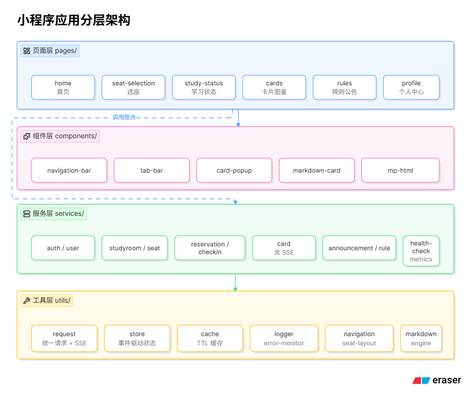
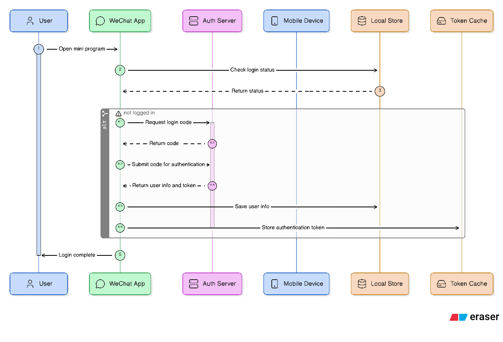
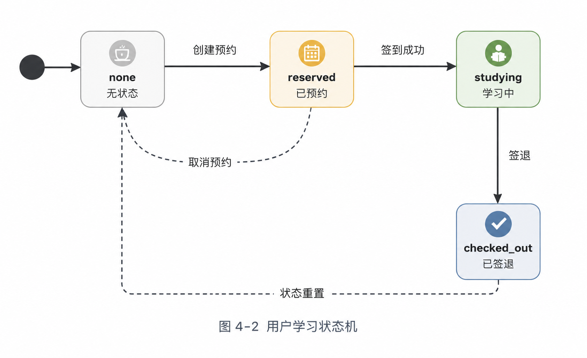

# iStudySpot小程序前端实验报告

> 说明：
>
> 本报告仅描述 iStudySpot 小程序用户端（`miniprogram/mp-user/`）实际已实现的前端功能与技术实现，不涉及未完成或未部署的功能。
>
> 报告编写过程中使用了人工智能工具辅助整理文档结构、优化技术描述及生成部分示意内容，所有内容均经本人结合项目源码逐项核对、补充与修改后形成。文档中涉及的业务流程、系统架构、接口调用、数据结构及功能实现均与实际代码保持一致。
>
> 文中引用的第三方库、框架及开源组件均在对应章节注明名称、版本及来源信息。

---

## 一、概述 [贺祥宇]

### 1.1. 板块定位

iStudySpot是一套面向自习室的预约系统。小程序前端设计了「预约—签到—激励」闭环，承担用户侧的全部交互入口，对接后端Restful+SSE接口，完成「选座—预约—签到—学习—获得卡片」的主流程，并提供规则公告、个人中心、卡片图鉴等辅助功能。

### 1.2. 技术选型

| 维度     | 选型                            | 说明                                                         |
| -------- | ------------------------------- | ------------------------------------------------------------ |
| 平台     | 微信小程序                      | 用户基数大，扫码签到天然适配                                 |
| 语言     | TypeScript                      | 全量TS，禁用`any`                                            |
| 视图     | WXML+WXSS                       | 原生组件，无第三方UI库                                       |
| 渲染引擎 | Skyline+glass-easel             | `app.json` 中 `renderer: skyline`，组件框架 `glass-easel`，启用 `lazyCodeLoading` |
| 测试     | Jest29+ts-jest                  | 单元测试与手工测试。                                         |
| 类型声明 | miniprogram-api-typings 2.8.3-1 | 微信小程序全局对象，来源[miniprogram-api-typings--npm](https://www.npmjs.com/package/miniprogram-api-typings) |

第三方库标注：`markdown-it`（本地化定制版，置于 `utils/markdown-it.js`）。

### 1.3. 兼容性约束

真机环境对部分 ES6+ 语法支持不全，项目规则强制禁用可选链 `?.`、空值合并 `??`、类字段直接初始化，统一以 `&&`、`||`、构造函数初始化替代。该约束在 `CLAUDE.md` 中固化为开发规则。

----

## 二、系统架构设计 [贺祥宇]

### 2.1. 分层架构

小程序采用「页面—服务—工具—缓存」四层结构，层间单向依赖，禁止页面直接调用 `wx.request`。



>图 2-1 小程序分层架构

### 2.2. 目录结构

```
mp-user/
├── miniprogram/          # 源码
│   ├── pages/            # 7 个业务页面
│   ├── components/       # 5 个可复用组件
│   ├── services/         # 11 个 API/系统服务模块
│   ├── utils/            # 12 个工具模块
│   ├── typings/          # API 类型定义
│   ├── assets/           # 静态资源（tabbar/home/profile）
│   ├── app.ts            # 入口：日志/监控/登录/健康检查
│   └── app.json          # Skyline 配置 + 自定义 tabBar
├── tests/                # 单元测试，按源码结构镜像
└── demo/                 # 原型验证（非生产代码）
```

### 2.3. 应用入口生命周期

`app.ts` 在 `onLaunch` 中按序完成五件事：初始化日志 → 初始化错误监控 → 加载历史指标 → 自动微信登录（若未登录）→ 异步运行健康检查。`onError` 与 `onUnhandledRejection` 全部接入错误监控，避免异常静默丢失。

主流程涉及「首页—选座页—学习状态页」三个页面的跳转与返回栈管理，由`utils/navigation.ts`中的`NavigationManager`统一收口。

----

## 三、基础设施层实现 [贺祥宇]

### 3.1. 统一请求层 `utils/request.ts`

封装 `wx.request` 为 `Request` 类，提供 `get/post/put/delete` 四个语义方法，统一处理鉴权注入、链路追踪、统一响应与失败兜底。

- **鉴权注入**：登录成功后由 `services/auth.ts` 将后端下发的 token 写入 `cache`，后续每次请求由 `request.ts` 自动读取并附加 `Authorization: Bearer <token>` 头。需要说明的是，此处 token 为后端自定义的会话凭证，并非标准 JWT；前端只负责透传，不解析其内容。
- **链路追踪**：每次请求经 `metrics.startRequest` 生成 `traceId`，结束时记录耗时、状态码、错误信息，与日志系统联动输出 `[traceId] METHOD url` 格式日志。
- **统一响应**：约定后端返回 `{code, message, data, timestamp}` 结构，业务码 2xx 视为成功。
- **失败兜底**：网络失败统一 `wx.showToast` 提示并 `reject`，避免业务层重复处理。

#### 3.1.1. SSE 流式传输

AI 卡片生成是 SSE 的主要消费场景。后端 `/api/wx/card/generate/stream` 接口将整张卡片的生成过程视为一条 SSE 流，从初始化、文本逐字到最终完整卡片，全部通过事件流下发，前端逐事件消费、逐块渲染，实现「打字机」式实时展示。该接口超时时间 120 秒，且已加入白名单无需鉴权。

由于微信小程序原生不提供 `EventSource`，`request.ts` 中单独实现 `requestSSE` 方法，基于 `wx.request` 的 `enableChunked` 能力自行解析 SSE 协议流。

**事件协议**：前端在 `typings/api.ts` 中将后端 4 类事件定义为强类型，由 `services/card.ts` 的 `generateCardStream` 分发到 `StreamCallbacks` 回调：

| SSE 事件   | data.type | 用途                                                         | 前端回调           |
| ---------- | --------- | ------------------------------------------------------------ | ------------------ |
| `data`     | `init`    | 携带 rarity、themeCategory、borderTheme、cardTheme，初始化卡片框架 | `onInit`           |
| `data`     | `text`    | 携带 `content` 文本片段（单字符或短文本），逐字累加          | `onText(content)`  |
| `complete` | —         | 携带完整 `card` 对象（含 markdown、imageURL 等全部字段），标志生成结束 | `onComplete(card)` |
| `error`    | —         | 携带 `message`，标志生成失败                                 | `onError(message)` |

**文本流式**：`text` 事件是真正的流式增量，后端将 AI 生成的 Markdown 文本拆分为字符/片段逐块下发，前端 `onText` 每次回调将片段追加到展示缓冲区，由 `card-popup` 组件的 `streamingHtml` observer 实时刷新视图，形成逐字显现效果。

**图片处理**：卡片配图不走流式通道。`complete` 事件携带的完整 `card` 对象中包含 `imageURL` 字段（图片相对路径），前端将其原样交给 `<image src>` 渲染；实际图片二进制由独立的 `/api/wx/card/image/{path}` 接口返回（`Content-Type: image/png`）。也就是说，文本是边生成边显示，图片是在文本流结束后随完整卡片一次性就位。

**分块解析**：用 `onChunkReceived` 监听 ArrayBuffer，自行 `decodeArrayBuffer` 解码（兼容 UTF-8 中文），以 `\n\n` 作为事件分隔符切分缓冲区，逐事件解析 `event:` / `data:` 字段并 `JSON.parse`：

```typescript
// 简化伪代码：SSE 分块解析核心
requestTask.onChunkReceived(res => {
  sseBuffer += decodeArrayBuffer(res.data)
  while (sseBuffer.indexOf('\n\n') !== -1) {
    const idx = sseBuffer.indexOf('\n\n')
    const eventStr = sseBuffer.slice(0, idx)
    sseBuffer = sseBuffer.slice(idx + 2)
    const parsed = parseSSEEvent(eventStr)
    if (parsed) config.onEvent(parsed.eventName, JSON.parse(parsed.eventData))
  }
})
```

**取消机制**：`requestSSE` 返回 `RequestTask` 供调用方 `abort()` 取消生成，`generateCardStream` 据此返回一个取消函数，供页面在用户关闭弹窗时中断请求，避免后端继续消耗 AI 生成额度。

#### 3.1.2 实现评价

当前卡片生成功能采用后端提供的 SSE 协议实现。前端通过 `onText` 事件实时渲染生成文本，通过 `complete` 事件接收完整卡片数据，并完成本地存储与界面展示。

需要说明的是，当前协议将文本内容与图片信息统一封装在同一 SSE 流中返回。前端已按协议完成流式解析、增量渲染、取消生成及卡片入库等功能。

在实际运行中仍存在一定局限性：`complete` 事件仅表示流式传输结束，不一定能够保证图片资源已经完全生成并可访问，因此在弱网或图片生成耗时较长时，可能出现图片加载延迟或失败的情况。由于协议未提供独立的图片就绪状态通知，前端只能依赖图片组件进行加载。

总体而言，文本流式渲染、卡片展示与数据管理功能均已按设计实现；图片资源的就绪性与容错机制仍有进一步优化空间，后续可通过协议扩展或异步图片回调机制进行改进。

与后端沟通的文档中明确建议了即梦生图使用异步任务，个人过程文档均有记录。实际按照后端给出的协议进行实现。

### 3.2. 状态管理 `utils/store.ts` 与缓存 `utils/cache.ts`

`Store` 类持有用户、自习室、座位、预约、签到、公告、规则、卡片等 11 类全局状态，采用「内存状态 + 缓存持久化 + 事件广播」三段式：写操作同步更新内存 → 写入 `cache` → `emit` 对应 `StoreEvent`；页面在 `onLoad` 通过 `on(event, cb)` 订阅、`onUnload` 取消，避免内存泄漏。共定义 6 类事件枚举（`USER_CHANGED` / `STUDY_ROOMS_CHANGED` / `RESERVATIONS_CHANGED` / `CHECKIN_CHANGED` / `ANNOUNCEMENTS_CHANGED` / `CARDS_CHANGED`），首页据此实时刷新用户状态卡片。

`cache.ts` 基于 `wx.setStorageSync` 封装 `CacheService`，所有键统一前缀 `istudyspot_`，存储结构为 `{data, expireAt, updatedAt}`，按业务差异化设定 TTL：用户信息 24 h、自习室列表 30 min、座位列表 5 min、当前签到 1 min、规则 1 h、token 7 d。提供 `clearUserData`（登出）与 `clearAll`（全量清理）两个语义方法。

### 3.3. 可观测性四件套

小程序运行环境缺乏浏览器 DevTools 的网络面板与持久化日志能力，真机调试时问题难以复现。为此在 `utils/` 下构建了「日志—错误监控—性能指标—健康检查」四件套，全部在 `app.ts` 启动时串联初始化。

#### 3.3.1. 分级日志 `utils/logger.ts`

`Logger` 类提供 `debug/info/warn/error` 四级日志，每条日志结构化为 `{level, module, message, data, timestamp}`。核心设计：

- **分级过滤**：通过 `LOG_LEVEL_PRIORITY` 映射表实现级别比较，低于 `minLevel` 的日志直接丢弃，可在生产环境调高阈值减少噪音；
- **环形缓冲**：内存中保留最近 200 条日志（`MAX_LOG_ENTRIES`），超出后滑动窗口截断，避免内存无限增长；
- **持久化**：每次写日志同步序列化到 `wx.setStorageSync('istudyspot_logs')`，下次启动 `init()` 时反序列化恢复，保证跨会话可追溯；
- **格式化输出**：控制台统一 `[LEVEL][MODULE] HH:mm:ss.SSS message` 前缀，便于真机调试时快速定位；
- **查询接口**：提供 `getEntries(level)`、`getRecentEntries(count)`、`getErrorEntries()`、`getLogSummary()` 等方法，供个人中心页展示日志摘要。

#### 3.3.2. 全局错误监控 `utils/error-monitor.ts`

`ErrorMonitor` 接入 `App.onError` 与 `App.onUnhandledRejection` 两个生命周期，捕获 JS 异常与 Promise 未处理拒绝两类错误，另提供 `handleRuntimeError(context, error)` 供业务 try-catch 主动上报。每条错误记录 `{type, message, stack, timestamp, pagePath, count}`，其中 `pagePath` 通过 `getCurrentPages()` 自动获取当前页面路由，便于定位出错位置。

**同类聚合**是关键设计：`findSimilarError` 按 `type + message` 去重，命中则 `count++` 并更新时间戳，避免重复错误刷爆存储。最多保留 50 条（`MAX_ERROR_RECORDS`），持久化到 `wx.setStorageSync('istudyspot_errors')`。`getErrorSummary()` 输出 `{total, js, promise, runtime, uniqueCount}` 汇总，供健康检查引用。

#### 3.3.3. 性能指标 `services/metrics.ts`

`MetricsService` 采集两类指标：

- **请求指标** `RequestMetric`：`url/method/startTime/endTime/duration/success/statusCode/errorMessage`，由 `request.ts` 在每次请求起止时调用 `startRequest/endRequest` 自动埋点，生成 `traceId` 串联日志；
- **页面加载指标** `PageLoadMetric`：`pagePath/startTime/endTime/duration`，记录页面切换耗时。

两类指标分别保留 100 条与 50 条（滑动窗口），持久化到 `wx.setStorageSync('istudyspot_metrics')`。`getSummary()` 输出请求总数、成功率、平均/最大/最小耗时、页面加载平均耗时等汇总数据，可在个人中心查看。

#### 3.3.4. 启动健康检查 `services/health-check.ts`

`HealthCheckService` 在 `app.onLaunch` 中异步执行 `runAllChecks()`，依次运行 4 项检查并输出 `HealthReport`：

| 检查项       | 方法                     | 判定逻辑                                                     |
| ------------ | ------------------------ | ------------------------------------------------------------ |
| 网络         | `wx.getNetworkType`      | `none` → unhealthy，其余 → healthy                           |
| 登录态       | `store.isLoggedIn()`     | 已登录 → healthy，未登录 → degraded                          |
| 本地存储     | `wx.getStorageInfoSync`  | 占用 >90% → unhealthy，>70% → degraded                       |
| 服务器可达性 | `request.get('/health')` | code 200 → healthy，异常响应 → degraded，连接失败 → unhealthy |

总体状态按「存在 unhealthy → unhealthy；存在 degraded → degraded；全 healthy → healthy」聚合。每项检查记录 `duration`，便于发现慢检查。报告写入 `lastReport` 供后续查询，异常项同步输出 warn 日志。该机制使小程序在启动时即可感知环境异常（如后端宕机、存储将满），为后续降级处理提供依据。

---

## 四、业务功能实现 [贺祥宇]

### 4.1. 用户认证

`services/auth.ts` 提供 `wxLogin`（code 换 token）与 `loginWithWx`（封装 `wx.login`）两个方法。流程：



> 图 4-1 微信自动登录流程

登录成功后 token 写入缓存，后续所有请求由 `request.ts` 自动注入 `Authorization` 头。

### 4.2. 选座与预约

#### 4.2.1. 座位布局算法 `utils/seat-layout.ts`

`SeatLayoutUtil` 提供静态方法集：

- `createSeatLayout`：按 `row/col` 二维坐标构建行列矩阵；
- `createDefaultGroupConfig`：列数 >6 时自动分为 left/right 两组（模拟过道）；
- `splitIntoGroups`：按分组配置切分座位；
- `calculateSeatStats`：统计 total/available/occupied/reserved/maintenance；
- `isSeatSelectable`：仅 `available` 状态可选。

#### 4.2.2. 选座页交互 `pages/seat-selection/`

页面承载日期选择（今起 7 天）、起止时间选择（8:00–22:00，5 分钟粒度）、座位点击选择、预约规则校验、确认预约六项交互。关键校验：

- 起止时间必须递增；
- 时长不超过 `reservationRules.maxDurationHours`；
- 开始时间不早于当前分钟；
- 座位状态非 `available` 时按状态给出中文提示。

预约成功后，若开始时间距当前 ≤5 分钟（`isImmediateStart`）或处于 `immediate` 模式，弹窗询问「是否立即进入学习」，确认则联动调用 `checkInApi.checkIn` 完成签到并跳转学习状态页。

### 4.3. 签到与学习状态

#### 4.3.1. 多入口签到

首页 `home.ts` 根据用户状态（`none/reserved/studying/checked_out`）动态切换按钮文案与行为：

- **签到窗口**：开始时间前 30 分钟内可签到（`CHECKIN_BUFFER_MINUTES`）；
- **扫码签到**：`wx.scanCode` 解析二维码，支持三种格式——query 串、JSON、`studyRoomId/seatId` 路径；扫描座位与预约座位不一致时二次确认；
- **快速签到**：检测到 30 分钟内有临近预约时，弹窗「立即开始」直接签到。

#### 4.3.2. 状态机驱动首页



> 图 4-2 用户学习状态机

首页 `updateUserState` 优先读缓存（签到状态 → 已确认预约），缓存命中则不再请求服务端；未命中才回源，避免重复请求。

### 4.4. 卡片系统

卡片系统是学习激励闭环的最后一环：用户完成一次有效学习后，后端基于学习时长调用 AI 生成一张可收藏的卡片，前端负责生成触发、流式展示、入库管理与图鉴浏览。SSE 流式传输机制已在 3.1 节阐述，本节聚焦卡片系统的服务封装、组件展示与数据管理。

#### 4.4.1. 卡片服务封装 `services/card.ts`

`cardApi` 对外暴露四个方法，覆盖卡片的生成与查询全流程：

| 方法                 | 用途                   | 关键设计                                                     |
| -------------------- | ---------------------- | ------------------------------------------------------------ |
| `generateCard`       | 同步生成（一次性返回） | 走标准 `request.post`，成功后 `store.addCard` 入库           |
| `generateCardStream` | SSE 流式生成           | 消费 3.1 节的 `requestSSE`，按 4 类事件分发到 `StreamCallbacks`；成功时 `store.addCard` 入库，返回取消函数供页面 `abort` |
| `getCardList`        | 用户卡片列表           | 优先读 `store` 缓存，未命中或 `forceRefresh` 时回源；回源成功后 `store.setCards` 刷新缓存 |
| `getCardDetail`      | 单张卡片详情           | 优先 `store.getCardById` 命中即返回，避免重复请求            |

所有写操作（生成成功）均同步更新 `store` 与 `cache`，并 `emit` `CARDS_CHANGED` 事件，订阅该事件的页面（如卡片图鉴页）会自动刷新列表，无需手动触发。

#### 4.4.2. 卡片弹窗组件 `components/card-popup/`

`card-popup` 是卡片展示的核心组件，支持两种渲染模式，通过 `streaming` 属性切换：

- **流式模式**（`streaming=true`）：用于卡片生成过程实时展示。组件通过 `observers` 监听 `streamingHtml`、`streamingRarity`、`streamingThemeCategory` 三个属性，任一变化即 `setData` 刷新视图，文本逐字累加呈现打字机效果；此模式下图片区域留空，待 `complete` 事件触发后由页面切换到完整模式。
- **完整模式**（`card` 属性传入完整 Card 对象）：用于卡片详情或生成完成后的展示。组件调用 `renderMarkdown` 将 `card.markdown` 一次性渲染为 HTML，并展示 `imageURL` 图片、`createTime`、`studyDuration` 等元信息。

**稀有度与主题映射**是组件的视觉核心，以常量表形式固化：

```typescript
const RARITY_BORDER_COLOR: Record<CardRarity, string> = {
  'N': '#CCCCCC', 'R': '#4CAF50', 'SR': '#2196F3',
  'SSR': '#9C27B0', 'UR': '#FFD700', 'LR': '#F44336'
}
const THEME_LABEL: Record<string, string> = {
  'growth': '励志成长', 'history': '名人与历史',
  'philosophy': '哲思感悟', 'nature': '自然意象',
  'tech': '科技未来', 'companion': '温柔陪伴', 'hidden': '隐藏主题'
}
```

稀有度（N/R/SR/SSR/UR/LR）映射为边框色，主题类别（growth/history/philosophy/nature/tech/companion/hidden）映射为中文标签。组件在 `card` observer 中读取这两个字段，组合 `displayRarity` 与 `displayThemeLabel` 一并 `setData`，驱动 WXML 中的样式与文案。

**动画与交互**：组件通过 `visible` observer 控制 `animating` 状态，`visible=true` 时延迟 50ms 触发入场动画，关闭时先置 `animating=false` 再延迟 300ms `triggerEvent('close')`，保证退场动画播放完毕。`onMaskTap`、`onClose`、`onAction` 三个事件分别对应遮罩点击、关闭按钮、主操作按钮，`onAction` 会 `triggerEvent('action', {card})` 携带卡片数据供页面处理（如「收下卡片」后入库）。

#### 4.4.3. 卡片图鉴页 `pages/cards/`

卡片图鉴页以列表形式展示用户已获得的所有卡片，每张卡片展示图片、稀有度边框、主题标签与创建时间。页面在 `onShow` 时调用 `cardApi.getCardList` 拉取列表，订阅 `StoreEvent.CARDS_CHANGED` 实现新生成卡片后的自动刷新。点击列表项可唤起 `card-popup` 组件以完整模式查看卡片详情。

### 4.5. Markdown 渲染协议

采用「引擎—协议」两层设计，避免业务规则污染解析器：

- **Layer1 `markdown-engine.ts`**：薄封装 `markdown-it`，暴露 `render` 与 `getEngine`，配置 `html:false / linkify:true / breaks:true`；
- **Layer2 `markdown-contract.ts`**：定义项目协议——以 `---` 作为卡片分块符（非普通 hr），校验标题层级（建议仅 h1）、文本长度（80–500 字）、原始 HTML 检测，产出 `ProcessedBlock[]` 含 `html/index/warnings`。

该分层使引擎可独立替换，协议可独立演进。

---

## 五、页面与组件 [贺祥宇]

### 5.1. 页面清单

| 页面     | 路径                    | 核心职责                              |
| -------- | ----------------------- | ------------------------------------- |
| 首页     | `pages/home/`           | 用户状态总览、签到/预约入口、扫码签到 |
| 选座     | `pages/seat-selection/` | 日期时间选择、座位图、预约确认        |
| 学习状态 | `pages/study-status/`   | 学习计时、签退                        |
| 卡片图鉴 | `pages/cards/`          | 卡片列表、详情查看、生成入口          |
| 规则公告 | `pages/rules/`          | 公告列表、规则展示                    |
| 个人中心 | `pages/profile/`        | 用户信息、设置、退出                  |
| 入口     | `pages/index/`          | 启动路由分发                          |

### 5.2. 组件清单

| 组件             | 功能              | 复用场景                          |
| ---------------- | ----------------- | --------------------------------- |
| `navigation-bar` | 自定义导航栏      | 全局（`navigationStyle: custom`） |
| `tab-bar`        | 自定义底部标签栏  | 4 个 tab 页                       |
| `card-popup`     | 卡片展示弹窗      | 卡片生成、卡片详情                |
| `markdown-card`  | Markdown 卡片渲染 | 卡片图鉴、公告                    |
| `mp-html`        | 富文本 HTML 渲染  | 规则公告富文本                    |

### 5.3. 导航管理 `utils/navigation.ts`

`NavigationManager` 统一收口跳转逻辑：

- 区分 tab 页（`switchTab`）与普通页（`navigateTo`）；
- 提供 `navigateFromReservationToStudy`（`redirectTo` 避免回退到选座页）、`navigateFromReservationToHome`（`switchTab` 重置栈）等语义方法；
- `navigateTo` 失败自动降级为 `redirectTo`，提升容错。

### 5.4. 视觉素材与交互细节

在功能实现之外，前端投入了较多精力打磨视觉表现与交互细节，以提升真机使用体验。该部分不涉及业务逻辑，但贯穿全部页面与组件。

#### 5.4.1. 素材资源体系

`assets/` 目录按场景分三个子目录管理静态资源，全部为自行制作或定制：

| 目录       | 资源                                                         | 用途                                              |
| ---------- | ------------------------------------------------------------ | ------------------------------------------------- |
| `home/`    | `bg-texture.svg`、`leaf.png`、`lamp.png`、`plant-texture.jpg`、`calendar.svg`、`study.svg`、`qrcode.svg`、`icon-location/seat/time.svg`、`arrow-green/white.svg` | 首页背景纹理、Hero 装饰、功能卡片图标、信息行图标 |
| `profile/` | `tree.png`                                                   | 个人中心成长树插画                                |
| `tabbar/`  | 4 组 `*-filled.png` / `*-outline.png`                        | 自定义底部标签栏四态图标（首页/规则/卡片/我的）   |

图标统一采用 SVG 矢量格式（功能图标）或压缩 PNG（tabbar 两态图标），兼顾清晰度与包体积。背景纹理 `bg-texture.svg` 在 `app.wxss` 中通过 `background-image` 全局铺顶，配合 `#F6F7F8` 底色形成柔和的层次感。

#### 5.4.2. 全局视觉规范

`app.wxss` 统一定义全局视觉基线：

- **字体栈**：`-apple-system, BlinkMacSystemFont, 'Segoe UI', 'PingFang SC', 'Hiragino Sans GB', 'Microsoft YaHei', sans-serif`，覆盖 iOS/Android 双端中英文回退；
- **安全区适配**：`padding-top: env(safe-area-inset-top)`，适配刘海屏与状态栏；
- **色彩体系**：以 `#1D1D1F`（主文本）、`#86868B`（次文本）、`#F6F7F8`（背景）、`#60B27A`/`#6EA88A`（品牌绿）为核心色板，贯穿全部页面。

#### 5.4.3. 卡片稀有度视觉分级

`card-popup` 组件针对 6 级稀有度（N/R/SR/SSR/UR/LR）设计了差异化的视觉表现，是美化工作的重点：

| 稀有度 | 边框色    | 阴影     | 特效                                                         |
| ------ | --------- | -------- | ------------------------------------------------------------ |
| N      | `#b0b0b0` | 浅灰阴影 | 无                                                           |
| R      | `#4caf50` | 绿色阴影 | 无                                                           |
| SR     | `#42a5f5` | 蓝色阴影 | 无                                                           |
| SSR    | `#ab47bc` | 紫色阴影 | `ssr-popup-glow` 3s 呼吸发光                                 |
| UR     | `#c9a84c` | 金色阴影 | 深色底 + 金色渐变徽章 + 金色文字配色                         |
| LR     | `#e53935` | 红色阴影 | 深色底 + 红色渐变徽章 + `lr-card-breathe` 呼吸 + `lr-badge-pulse` 徽章脉冲 |

UR 与 LR 采用深色卡片底（`linear-gradient(160deg, ...)`）配合金色/红色文字配色，并通过 `!important` 覆盖 markdown 渲染的标题、正文、引用、列表颜色，保证稀有卡片的沉浸式视觉。SSR 与 LR 的呼吸动画通过 `@keyframes` 控制 `box-shadow` 强度循环变化，营造「发光」质感。

#### 5.4.4. 交互动效

| 场景         | 实现                                                         |
| ------------ | ------------------------------------------------------------ |
| 卡片弹窗入场 | `transform: scale(0.6) → scale(1)`，`cubic-bezier(0.34, 1.56, 0.64, 1)` 弹性曲线，0.35s |
| 遮罩渐显     | `background: rgba(0,0,0,0) → 0.7`，0.3s                      |
| 功能卡片按压 | `transform: scale(0.97)` + 阴影收缩，0.15s                   |
| 流式光标     | `cursor-blink` 1s `step-end` 闪烁，模拟打字机光标            |
| 状态徽章     | 4 种状态（none/reserved/studying/checked_out）对应 4 套背景/文字色 |

#### 5.4.5. 首页 Hero 与信息卡片

首页 Hero 区采用大字号标题（80rpx、font-weight 800）+ `text-shadow` 轻投影，右侧叠加 `leaf.png` 装饰（opacity 0.2）形成留白层次。主功能卡片使用绿色渐变背景 + 植物纹理 `plant-texture.jpg`（opacity 0.1，圆形裁切）作为底纹，呼应「学习成长」主题。信息卡片右上角叠加 `lamp.png` 台灯装饰（opacity 0.2），与自习室场景呼应。本周学习时长采用 52rpx 大字号 + 品牌绿高亮，形成视觉焦点。

---

## 六、测试与质量保障 [贺祥宇]

小程序测试按「手工 + 自动化」两条路线、四个维度组织，覆盖功能正确性、界面表现、数据健壮性与异常容错。测试分类如下：

| 测试类型 | 方式       | 说明                                                         |
| -------- | ---------- | ------------------------------------------------------------ |
| 功能测试 | 手工测试   | 对系统核心功能进行人工验证，检查输出是否符合预期             |
| 界面测试 | 手工测试   | 对小程序页面布局、交互、样式进行人工检查                     |
| 数据测试 | 自动化测试 | 通过 Jest 编写测试用例，验证数据验证、转换、持久化的正确性   |
| 异常测试 | 自动化测试 | 通过 Jest 编写测试用例，验证网络异常、空数据、并发操作等异常场景 |

### 6.1. 功能测试（手工）

功能测试以真机走查方式逐项验证核心业务闭环，覆盖以下主流程与分支：

| 测试项   | 验证内容                                                     |
| -------- | ------------------------------------------------------------ |
| 微信登录 | 首次登录自动注册、老用户登录、token 持久化与自动续登         |
| 选座预约 | 日期/时间选择、座位点击、预约规则校验、预约创建/取消         |
| 签到流程 | 按钮签到、扫码签到（三种二维码格式）、签到窗口校验、快速签到 |
| 学习状态 | 签到后跳转、学习计时、签退结束学习                           |
| 卡片生成 | 学习结束后触发 SSE 流式生成、文本逐字显示、卡片入库          |
| 卡片图鉴 | 列表展示、详情查看、稀有度/主题视觉                          |
| 规则公告 | 公告列表、规则展示、富文本渲染                               |

全部功能测试过程已录制为视频，存放于 `docs/contributions/08-testing/小程序手工测试视频.mp4`，可对照查看各项功能的真机表现。

### 6.2. 界面测试（手工）

界面测试关注视觉表现与交互细节，逐页检查布局、样式与交互反馈：

| 测试项       | 验证内容                                           |
| ------------ | -------------------------------------------------- |
| 页面布局     | 各页面在不同机型下的适配（刘海屏安全区、屏幕宽度） |
| 自定义导航栏 | `navigation-bar` 在各页面的高度与状态栏适配        |
| 自定义标签栏 | `tab-bar` 四态图标切换、当前页高亮                 |
| 卡片弹窗动画 | 入场弹性缩放、遮罩渐显、退场延迟                   |
| 稀有度视觉   | N/R/SR/SSR/UR/LR 六级边框色、阴影、呼吸/发光特效   |
| 按压反馈     | 功能卡片 `scale(0.97)` 按压回弹                    |
| 状态徽章     | none/reserved/studying/checked_out 四态色卡        |
| 流式光标     | 卡片生成时打字机光标闪烁                           |
| 背景纹理     | 全局 `bg-texture.svg` 铺顶、Hero 区装饰图透明度    |

界面测试同样在上述手工测试视频中体现，与功能测试同步进行。

### 6.3. 数据测试（自动化）

数据测试通过 Jest 编写用例，验证数据在各层之间的正确性，位于 `tests/unit/data/` 目录，共 3 个测试文件：

| 测试文件                   | 测试目标   | 关键用例                                                     |
| -------------------------- | ---------- | ------------------------------------------------------------ |
| `data-validation.test.ts`  | 数据验证   | 预约参数必填校验（studyRoomId/seatId/startTime/endTime）、签到参数校验、卡片生成参数校验、座位状态可选性校验、预约规则边界（最大时长/最小时长） |
| `data-transform.test.ts`   | 数据转换   | API 响应到 Store 的字段映射（reservation status、seat status/type）、座位布局算法（行列矩阵构建、分组切分、统计计算）、Markdown 协议处理（`---` 分块、长度校验、标题层级校验）、卡片稀有度/主题随机生成 |
| `data-persistence.test.ts` | 数据持久化 | Store 写入后 Cache 同步调用（setUser/setStudyRooms/setMyReservations 等 11 类）、Store 事件广播（`USER_CHANGED` 等 6 类事件触发）、clearAll 清空一致性、Cache 未命中时 Store 回退行为 |

测试通过 `jest.mock` 将 `request`、`store`、`cache`、`mock` 等依赖隔离，聚焦被测模块的纯逻辑。每个用例独立 `beforeEach(() => jest.clearAllMocks())`，保证用例间无状态污染。

### 6.4. 异常测试（自动化）

异常测试通过 Jest 模拟异常场景，验证前端在边界条件下的容错能力，位于 `tests/unit/exception/` 目录，共 3 个测试文件：

| 测试文件                 | 测试场景      | 关键用例                                                     |
| ------------------------ | ------------- | ------------------------------------------------------------ |
| `network-error.test.ts`  | 网络异常      | `request.post/get` reject 时各 service 是否正确传播错误、登录接口网络失败的降级响应、预约/签到接口失败时不污染 store、服务器返回非 200 业务码的处理 |
| `null-data.test.ts`      | 空数据/边界值 | store 无用户数据时 `getCurrentUser` 回源 API、预约列表为空时的渲染兜底、座位列表为空或格式错误时的提示、卡片列表为空时的占位、`getCardById` 未命中的返回值 |
| `concurrent-ops.test.ts` | 并发操作      | 快速连续调用 `createReservation` 两次的请求发出情况、签到与签退并发、并发生成卡片时 store 入库顺序、并发请求下 store 事件触发次数 |

异常测试通过 `mockRejectedValue` 模拟网络失败、`mockReturnValue(null)` 模拟空数据、`Promise.all` 模拟并发，覆盖了真机环境下可能遇到的主要异常场景。

### 6.5. 测试运行与覆盖率

自动化测试运行命令：

```bash
npm test            # 单次运行全部用例
npm run test:ci     # CI 环境：覆盖率统计 + 串行执行
npm run lint        # TypeScript 类型检查（tsc --noEmit）
```

`jest.config.js` 配置覆盖率门槛为 70%（branches/functions/lines/statements 四项），覆盖率统计范围聚焦 `utils/` 与 `services/` 业务代码，排除 `*.d.ts`、`mock.ts`、`mock-data.ts`、`request.ts`、`markdown-it.js` 等类型声明与第三方/工具文件。`tests/setup.ts` 提供全局 `wx` mock 与 `getCurrentPages` mock，`tests/wx-mock.ts` 提供可复用的微信 API mock 集合。

---------

## 七、总结 [贺祥宇]

### 7.1. 项目成果总结

小程序前端已完整实现 iStudySpot 用户侧全部功能，覆盖「登录—选座—预约—签到—学习—获卡」主流程闭环及规则公告、个人中心、卡片图鉴等辅助功能。共交付 7 个业务页面、5 个可复用组件、11 个服务模块、12 个工具模块，配套 6 个自动化测试文件与 1 份手工测试视频。代码与文档一致，所有描述功能均已实现并真机验证。

### 7.2. 技术实现总结

- **架构**：采用页面—服务—工具—缓存四层分层，单向依赖，禁止页面直连网络；
- **网络**：统一封装 `wx.request`，支持鉴权注入、链路追踪、SSE 分块解析与取消机制；
- **状态**：事件驱动 Store + TTL Cache 双层缓存，6 类事件广播驱动页面自动刷新；
- **可观测性**：日志、错误监控、性能指标、健康检查四件套，启动即就绪；
- **卡片系统**：消费后端 SSE 协议实现文本流式渲染与稀有度视觉分级；
- **质量**：TypeScript 全量类型 + Jest 自动化测试 + 70% 覆盖率门槛。

### 7.3. 不足与未来改进

- SSE 在弱网下分块解码偶有延迟，缺少心跳与断线重连；
- 卡片图片就绪性依赖后端 `complete` 事件，前端无法感知，需后端协议扩展；
- 座位布局仅支持左右两组，复杂自习室需扩展分组配置；
- 国际化未接入，文案硬编码中文；
- 组件测试采用手写 mock，未使用 `miniprogram-simulate` 官方方案，渲染层覆盖不足。

### 7.4. AI辅助说明

根据文档撰写要求，本节如实说明 AI 在本项目与本文档中的参与范围与程度。

#### 7.4.1. 代码实现中的 AI 辅助

小程序前端代码由本人主导设计与编写，AI（Trae IDE 内置助手）在以下环节提供辅助：

| 环节         | AI 参与程度 | 说明                                                         |
| ------------ | ----------- | ------------------------------------------------------------ |
| 架构设计     | 低          | 分层结构、目录划分、模块职责由本人独立设计                   |
| 业务逻辑实现 | 中          | 主流程代码由本人编写，AI 辅助补全部分样板代码与类型声明      |
| 工具模块     | 中          | `request.ts`、`store.ts`、`cache.ts` 等核心工具由本人设计，AI 辅助生成部分方法实现与注释 |
| 样式与素材   | 低          | 视觉规范、稀有度配色、动画曲线由本人独立设计                 |
| 测试用例     | 中          | 测试框架与 mock 方案由本人设计，AI 辅助生成部分用例代码      |
| Bug 修复     | 高          | 联调过程中的具体 Bug 定位与修复建议大量借助 AI               |

所有 AI 生成代码均经本人审核、修改与真机验证后入库，未出现未经验证直接采用的情况。

#### 7.4.2. 文档撰写中的 AI 辅助

本实验报告由 AI 辅助生成初稿，经本人逐节审核修改定稿。具体分工：

| 章节           | AI 参与     | 人工审核                                                     |
| -------------- | ----------- | ------------------------------------------------------------ |
| 一、概述       | AI 生成初稿 | 核对技术选型与兼容性约束，修正 miniprogram-simulate 实际未使用的描述 |
| 二、系统架构   | AI 生成初稿 | 核对目录结构与分层依赖，补充返回栈管理细节                   |
| 三、基础设施层 | AI 生成初稿 | 核对 request/store/cache/logger 实现，重写 SSE 流式传输部分以匹配后端实际协议，补充责任划分 |
| 四、业务功能   | AI 生成初稿 | 核对认证、选座、签到、卡片系统流程，重写卡片系统去除重复     |
| 五、页面与组件 | AI 生成初稿 | 核对页面清单与组件清单，补充视觉素材与交互细节章节           |
| 六、测试与质量 | AI 生成初稿 | 核对测试文件与用例，按四类测试分类重写                       |
| 七、总结       | AI 生成初稿 | 核对已实现功能与不足，确保与代码一致                         |

文档中所有代码引用、接口描述、数据结构均与 `miniprogram/mp-user/` 实际代码逐一核对，未描述未实现的功能。第三方库来源与版本均如实标注。

#### 7.4.3. 责任声明

本项目的业务设计、架构决策、视觉规范、真机验证、联调排查均由本人独立完成，AI 仅作为代码补全与文档撰写的辅助工具。文档内容均经人工审核修改，对其中事实性描述的准确性负责。

-----------------

> 说明:
>
> 本报告部分章节在编写过程中使用人工智能工具辅助生成初稿或优化技术表述，包括但不限于文档结构整理、流程描述优化及图表说明编写。所有内容均经过人工审核、修改与补充，并结合项目实际源码进行验证。
>
> 报告所述功能、接口、页面、组件及系统架构均来源于项目当前实现版本，不包含未实现功能或与代码不一致的内容。对于尚未完成或后续计划实现的内容，已在总结章节中单独说明。

