# iStudySpot 智能自习室预订系统 — 开发文档

---

## 目录

- [1. 软件架构](#1-软件架构)
- [2. API 设计](#2-api-设计)
- [3. AI 集成](#3-ai-集成)
- [4. 软件测试](#4-软件测试)
- [5. 软件开发安全实践](#5-软件开发安全实践)
- [6. 系统部署](#6-系统部署)
- [7. 云服务](#7-云服务)
- [8. 系统监控](#8-系统监控)

---

## 1. 软件架构

### 1.1 整体架构概述

iStudySpot 采用**模块化单体**架构，后端基于 Spring Boot 构建，是一个可以独立部署的 Java 进程。系统通过包结构划分业务域，以 Controller-Service-Mapper 三层架构组织代码，对外统一提供 RESTful JSON API 接口。

系统整体分为三端：面向学生用户的 Android App（Kotlin + Jetpack Compose）、面向管理员的 Web 后台（React + Ant Design），以及面向普通用户的微信小程序。三端共享同一套后端 API，通过路径前缀和接口隔离实现差异化服务。

### 1.2 系统上下文图

iStudySpot 系统与以下外部系统进行交互：

- **DeepSeek API**：提供大语言模型对话补全、工具编排和流式响应能力，是 AI 对话、Agent 助手和卡牌内容生成的核心依赖。
- **火山引擎即梦AI**：提供文生图能力，将 AI 生成的卡牌描述文本转化为配图，图片下载后存储到本地文件系统。
- **MySQL 8.4**：关系型数据库，存储用户、自习室、座位、订单、支付、规则、公告、卡牌、签到记录等全部业务数据。
- **Redis 7**：缓存和分布式锁的基础设施，用于热门数据缓存和座位预约的并发控制。
- **本地文件系统**：存储 AI 卡牌生成的配图图片，路径为 `uploads/cards/`。

此外，系统对外暴露以下接口端点：

- `:8080`（后端服务）：对内是 Spring Boot 的 Tomcat 容器端口，对外通过 Docker 映射为 `18080`。
- `:80`（管理端 Nginx）：对内是 Nginx 托管 SPA 静态资源并反向代理 `/api` 和 `/health` 到后端，对外映射为 `3001`。

### 1.3 容器视图（后端）

**负责人：余逸晨**

后端容器是一个 Spring Boot 3.1.2 应用，运行在 Java 17 环境中。其内部按职责划分为以下层次：

| 层次 | 职责 | 典型示例 |
| --- | --- | --- |
| Controller | 接收 HTTP 请求，参数校验，调用 Service，封装返回 Result | `OrderController`、`AuthController`、`SeatController` |
| Service | 核心业务逻辑、状态流转、事务编排、AI 调用编排 | `OrderServiceImpl`、`AIServiceImpl`、`CardServiceImpl` |
| Mapper | 数据库访问，通过 MyBatis XML 或注解定义 SQL | `OrderMapper`、`SeatMapper`、`UserMapper` |
| Entity / DTO | 数据对象定义，Entity 映射数据库表，DTO 定义接口传输格式 | `Order`、`Seat`、`LoginDTO`、`BookingDTO` |
| Config / Interceptor | 横切关注点：CORS 配置、JWT 拦截器、指标收集、AI 配置 | `JwtInterceptor`、`MetricsInterceptor`、`DeepSeekConfig` |

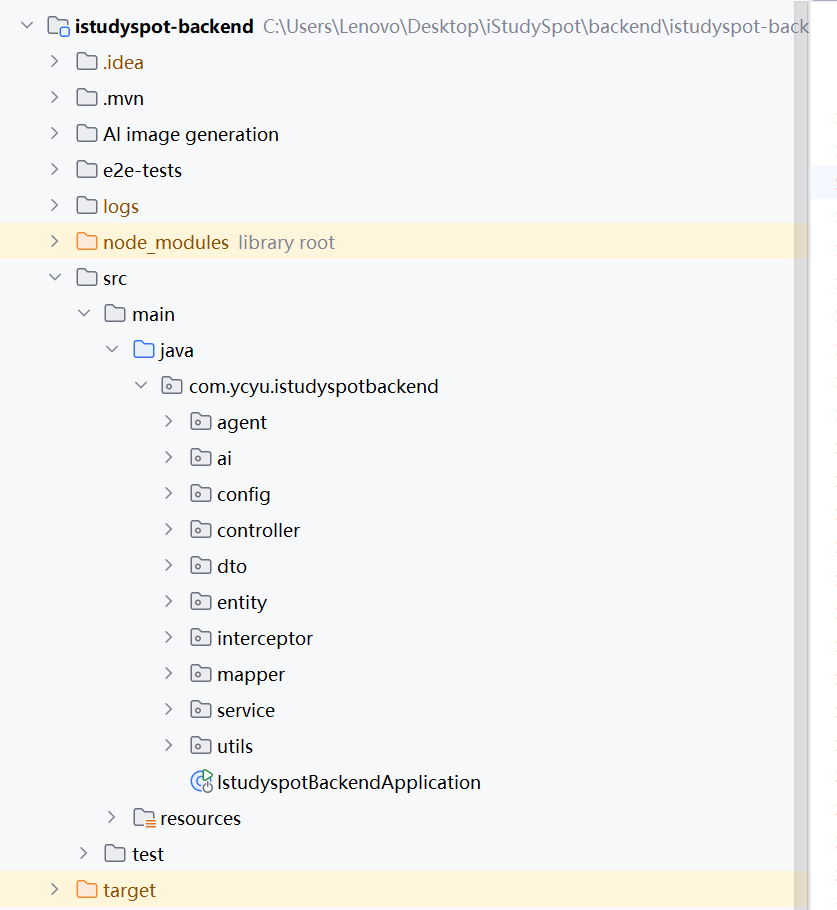

### 1.4 Android 客户端架构

**负责人：黄益政**

Android App 采用单 Activity + Jetpack Compose Navigation + MVVM 架构。入口 Activity 负责主题启动和全局 Snackbar 容器，路由图定义底部导航和页面跳转逻辑。页面层使用 Compose 声明式 UI 组件，ViewModel 层管理 StateFlow 状态流，ViewModel 通过 Repository 统一门面调用后端 API。

Repository 是对后端 API 的封装层，集中管理 Retrofit 端点访问。ApiManager 负责请求归一化，OkHttp 拦截器注入 JWT token，并在 401 时尝试刷新 token。轻量级持久化通过 SharedPreferences 保存 token 和用户偏好，通过 AgentConversationStore 和 LocalTodoStore 维护 Agent 会话和待办事项的本地缓存。

### 1.5 管理端 Web 架构

**负责人：黄益政**

管理端 Web 基于 React 18 + Vite 6 + Ant Design 5 构建。页面路由通过 React Router 6 管理，私有路由通过 `PrivateRoute` 组件保护。Axios 请求客户端封装了 token 注入、业务状态码处理、刷新 token 重试和 401 自动跳转登录页的逻辑。

管理端通过 Nginx 静态托管，并将 `/api` 和 `/health` 请求反向代理到后端容器，避免跨域问题。对 SSE 流式端点设置了特殊的 `proxy_buffering off` 配置。

### 1.6 微信小程序架构

**负责人：贺祥宇**

微信小程序采用原生框架开发，使用 Vant Weapp 组件库构建 UI 界面。Canvas API 用于自习室座位图的可视化绘制，ECharts 用于数据图表的展示。小程序通过 `/api/wx/` 前缀调用后端专用接口，与 Android 端共享后端服务但使用独立的 Controller 和 DTO 实现接口隔离。

---

## 2. API 设计

**负责人：余逸晨、黄益政、贺祥宇**

### 2.1 设计原则

iStudySpot 后端 API 遵循 RESTful 设计风格，所有接口统一返回 `Result` 结构体，包含 `code`（状态码）、`message`（提示信息）和 `data`（业务数据）。API 设计遵循以下原则：

- **统一响应格式**：无论成功或失败，客户端始终收到一致的结构，便于前端统一处理。
- **资源导向的 URL 设计**：URL 使用名词复数表示资源集合，如 `/api/studyrooms`、`/api/reservations`。
- **状态码语义化**：200 表示成功，400 表示参数错误，401 表示未认证，500 表示服务端异常。
- **接口隔离**：微信小程序使用独立 Controller（`Wx*Controller`），路径前缀为 `/api/wx/`，与 Android 管理端接口互不影响。

### 2.2 接口模块总览

后端共包含 **80 个 REST API 接口**，分布在 27 个 Controller 中。

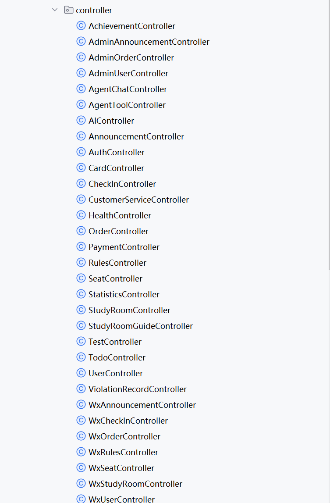

| 模块 | Controller | 接口数量 | 说明 |
| --- | --- | --- | --- |
| 认证 | AuthController | 5 | 登录、注册、刷新 token、登出 |
| 用户 | UserController | 3 | 个人信息查询与修改、头像上传 |
| 自习室 | StudyRoomController | 2 | 自习室列表、详情 |
| 座位 | SeatController | 3 | 座位列表、详情、座位布局 |
| 预约/订单 | OrderController | 8 | 创建、列表、详情、取消、签到、签退、续时、支付 |
| 支付 | PaymentController | 3 | 支付记录列表、详情、支付回调 |
| 公告 | AnnouncementController | 2 | 公告列表、详情 |
| 规则 | RulesController | 2 | 规则列表、详情 |
| 签到 | CheckInController | 4 | 签到、签退、签到记录、状态查询 |
| 成就 | AchievementController | 1 | 用户成就列表 |
| 违规 | ViolationRecordController | 2 | 违规记录列表、申诉 |
| 待办 | TodoController | 5 | 增删改查 + 状态切换 |
| AI 对话 | AIController | 3 | 角色列表、普通对话、流式对话 |
| Agent | AgentChatController + AgentToolController | 4 | Agent 聊天、工具目录、工具调用 |
| 客服 | CustomerServiceController | 4 | 欢迎信息、普通对话、流式对话、历史记录 |
| 卡牌 | CardController | 7 | 生成、流式生成、详情、列表、图片访问 |
| 统计 | StatisticsController | 1 | 自习室统计数据 |
| 管理端 | AdminUser/Order/Announcement Controller | 5 | 用户列表、订单列表、公告管理 |
| 健康检查 | HealthController | 2 | 健康检查、就绪检查 |
| 测试 | TestController | 1 | 基础连通性测试 |
| 微信小程序 | 7 个 Wx*Controller | 23 | 小程序专用接口 |

### 2.3 核心业务流程 API 设计

#### 2.3.1 预约下单流程

预约下单涉及座位校验、时间冲突检查、价格计算等多个步骤，所有操作在数据库事务中完成，确保数据一致性。

**请求示例**：`POST /api/reservations`

请求体包含自习室 ID、座位 ID、开始时间、结束时间和预约类型。服务端处理流程如下：

1. 根据座位 ID 查询座位是否存在，不存在则返回错误。
2. 检查该座位在指定时间段内是否存在冲突订单（status 不为 cancelled），存在则拒绝。
3. 计算预约时长（最少 1 小时），乘以座位时价得到总金额。
4. 生成唯一订单号（格式：ORD + 时间戳 + 用户 ID）。
5. 插入订单记录，状态为 `pending`（待支付）。

#### 2.3.2 订单状态流转

订单状态从创建到完成遵循固定的状态机流转：

```
pending（待支付）→ paid（已支付）→ in_use（使用中）→ completed（已完成）
                                                      ↘ cancelled（已取消）
```

- `pending` 状态的订单可以取消，也可以支付。
- `paid` 状态的订单可以签到，也可以取消。
- `in_use` 状态的订单可以签退，也可以续时。
- `completed` 和 `cancelled` 是终态，不可再变更。

每个状态变更操作都会校验当前状态是否符合前置条件，例如签到操作要求订单状态为 `paid`，签退操作要求状态为 `in_use`。

### 2.4 微信小程序接口隔离

微信小程序使用独立的 `/api/wx/` 路径前缀，拥有 7 个专用 Controller 和 23 个 API 接口。这种设计的好处是：

- 小程序和 Android 端可以独立演进，互不影响。
- 小程序接口可以返回更适合移动端的数据结构（使用独立的 DTO 类）。
- 权限控制可以按端差异化配置。

### 2.5 数据库设计

**负责人：余逸晨**

系统使用 MySQL 8.4 数据库，通过 Flyway 进行数据库版本迁移管理。共创建 **19 张数据表**和 **2 个视图**，累计 **29 个迁移文件**（V1 到 V36）。

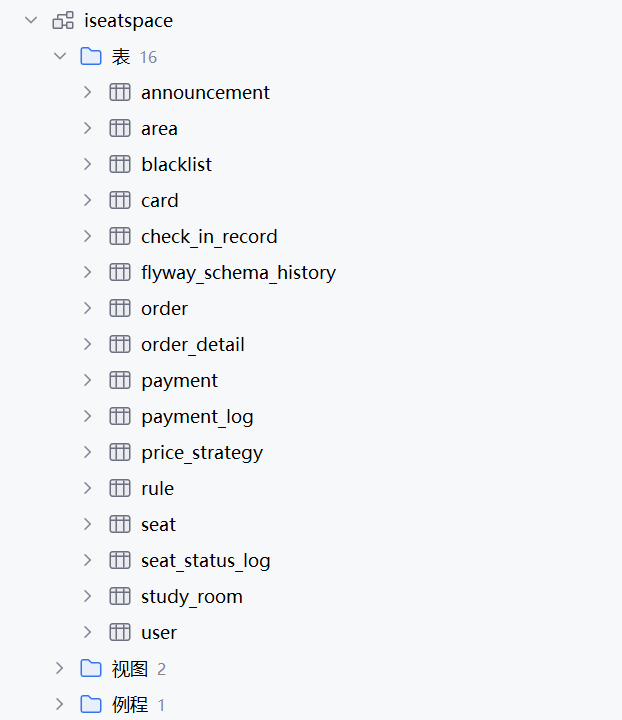

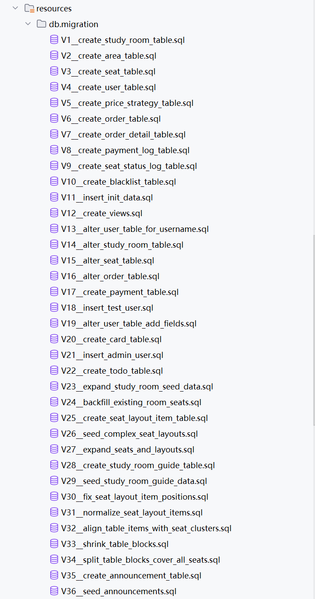

核心业务表如下：

| 表名 | 用途 | 关键字段 |
| --- | --- | --- |
| user | 用户信息 | id, username, password, nickname, avatar_url, wx_openid, credit_score |
| study_room | 自习室 | id, name, address, description, open_time, close_time, status |
| area | 区域 | id, room_id, name, type |
| seat | 座位 | id, room_id, area_id, seat_number, row_num, col_num, price_per_hour, status |
| seat_layout_item | 座位布局元素 | id, room_id, type, x, y, width, height, label, seat_id |
| order | 订单 | id, order_no, user_id, seat_id, room_id, start_time, end_time, total_price, status, checkin_time, checkout_time |
| order_detail | 订单明细 | id, order_id, item_type, amount |
| payment | 支付记录 | id, order_id, user_id, amount, payment_method, status |
| payment_log | 支付流水 | id, payment_id, action, detail |
| price_strategy | 价格策略 | id, room_id, time_range, price_per_hour |
| seat_status_log | 座位状态日志 | id, seat_id, old_status, new_status, change_time |
| announcement | 公告 | id, title, content, type, priority, publish_time |
| rule | 规则 | id, title, content, category, priority |
| card | AI 学习卡片 | id, user_id, title, content, rarity, theme, image_path, study_duration |
| achievement | 成就定义 | id, name, description, icon, condition_type, threshold |
| user_achievement | 用户成就 | id, user_id, achievement_id, progress, unlocked_at |
| violation_record | 违规记录 | id, user_id, type, description, status, appeal_reason |
| blacklist | 黑名单 | id, user_id, reason, start_time, end_time |
| todo | 待办事项 | id, user_id, title, description, completed, due_date |

两个视图分别是：

- `v_seat_current_status`：座位的实时状态视图，综合座位表状态和活跃订单推导当前座位是否可用。
- `v_room_occupancy`：自习室上座率统计视图，用于经营数据分析。

---

## 3. AI 集成

**负责人：余逸晨、黄益政**

### 3.1 总体架构

iStudySpot 的 AI 能力围绕三个核心场景展开：**AI 角色对话**、**AI Agent 智能助手**和**AI 学习卡片生成**。三项能力均通过 DeepSeek API 驱动，辅以火山引擎即梦AI 的文生图能力实现卡片配图。

AI 模块在代码层面位于 `ai/` 和 `agent/` 包中，包括规则定义（`AiRules`）、规则注册表（`AiRulesRegistry`）、工具目录（`AgentToolService`）和策略守卫（`AgentChatServiceImpl`）。AI 配置通过 `DeepSeekConfig` 类从环境变量读取 API Key 和 API URL。

### 3.2 AI 角色对话

AI 角色对话支持用户与多个预设角色进行自然语言交互。角色配置从 `ai-rules.json` 文件加载，包含角色名称、性格设定、说话风格、擅长领域和行为规则。例如系统预设了客服助手、历史人物、学习伙伴等角色。

对话流程如下：

1. 客户端请求角色列表，获取可用角色。
2. 用户选择角色后发起对话，系统为该会话创建或获取 Session 对象，Session 维护在内存的 `ConcurrentHashMap` 中。
3. 发送消息时，系统构建 System Prompt（包含角色设定、全局规则、回答要求），拼接历史消息（默认保留最近若干轮），调用 DeepSeek API 获取回复。
4. 支持普通对话和 SSE 流式对话两种模式。流式模式下，服务端使用 `SseEmitter` 逐块推送 delta 内容，客户端逐字渲染，实现打字机效果。

流式对话的实现使用了线程池异步处理，避免阻塞主线程。每收到 DeepSeek 的一个 chunk，立即通过 `emitter.send()` 推送给客户端。流式传输超时设置为 5 分钟（300000 毫秒），超时后自动断开连接。

### 3.3 AI Agent 智能助手

AI Agent 是在角色对话基础上扩展的智能助手，具备**工具调用**能力。Agent 可以理解用户的自然语言查询意图，自动调用后端工具来获取自习室、座位、预约等实时数据，并以自然语言形式回复用户。

Agent 的安全性设计是其核心特点：

- **只读工具白名单**：Agent 只能调用预定义的白名单工具，包括自习室列表查询、自习室详情、座位列表、当前用户预约、预约规则。任何写操作（创建预约、取消、支付、签到、签退）都不在工具白名单中。
- **策略守卫**：每次对话前，策略守卫通过 LLM 判断用户的意图是只读还是写操作。如果检测到写操作意图，直接拒绝并提示用户到 App 相应页面完成操作。
- **数据脱敏**：工具返回的预约数据会经过脱敏处理，隐藏敏感字段（如精确价格、支付信息等），仅保留必要信息。

Agent 工具调用的流程为：

1. 用户发起对话，Agent 接收消息。
2. 策略守卫通过 LLM 判断意图类型（只读/写操作）。
3. 如果是只读意图，Agent 将消息和工具 Schema 发送给 LLM 进行规划。
4. LLM 返回工具调用指令，Agent 执行对应工具，获取结构化数据。
5. Agent 将工具结果格式化后发给 LLM 生成最终回复。
6. 最终回复附带推荐问题，引导用户继续对话或跳转到对应功能页面。

### 3.4 AI 学习卡片生成

**负责人：贺祥宇**

AI 学习卡片是系统的特色功能，用户完成学习后，根据学习时长自动生成一张可收藏的 AI 卡片。卡片包含文本内容和配图。

**稀有度体系**：卡片分为 6 个稀有度等级，系统根据学习时长和随机概率决定稀有度：

| 稀有度 | 概率 | 颜色标识 |
| --- | --- | --- |
| N（普通） | 40% | 灰色 |
| R（稀有） | 30% | 绿色 |
| SR（超级稀有） | 20% | 蓝色 |
| SSR（特级稀有） | 8% | 金色 |
| UR（极稀有） | 1.5% | 红色 |
| LR（传说） | 0.5% | 紫色 |

**主题类别**：卡片涵盖励志成长、名人与历史、哲思感悟、自然意象、科学技术、温柔陪伴等六大主题，每次生成随机选择主题，确保内容多样性。

**生成流程**：

1. 用户签退完成学习后，系统根据学习时长（分钟数）计算稀有度概率，随机确定稀有度等级。
2. 从主题池中随机选择一个主题。
3. 调用 DeepSeek API，发送包含主题、稀有度等信息的提示词，请求生成卡片标题和一段富有文采的正文内容。此步骤使用 SSE 流式传输，让用户实时看到文字生成过程。
4. 将生成的标题和内容摘要发送给火山引擎即梦AI 文生图 3.0 接口，生成一张与卡片内容匹配的配图。
5. 下载生成的图片到本地 `uploads/cards/` 目录，以 UUID 重命名。
6. 将卡片记录（标题、内容、稀有度、主题、图片路径、学习时长等）入库。

卡片的文本生成和图片生成可以异步进行，用户无需等待图片生成完成即可看到卡片文字内容。

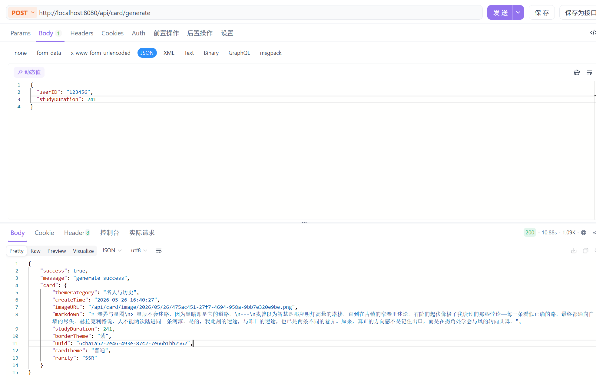

---

## 4. 软件测试

### 4.1 测试策略概述

iStudySpot 项目采用多层次的测试策略。后端基于 JUnit 5 + Mockito 进行单元测试，覆盖 Controller 层和 Service 层；Android 端基于 JUnit 5 + Mockito 进行 ViewModel 和 Repository 的单元测试；微信小程序端使用 Jest 进行组件和逻辑测试。三端均接入 JaCoCo 代码覆盖率统计，并通过 Codecov 平台追踪覆盖率变化趋势。

### 4.2 后端测试

**负责人：余逸晨**

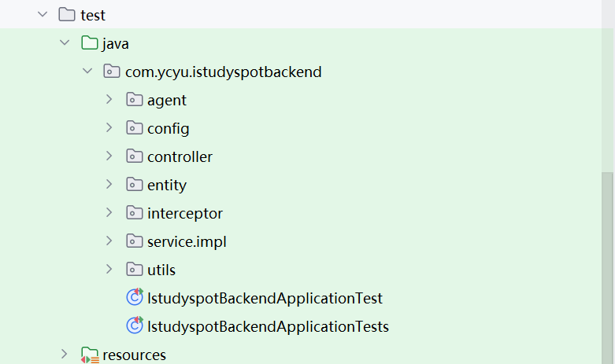

后端测试共 **40+ 个测试类**，覆盖主要的 Controller 和 Service。测试采用 AAA（Arrange-Act-Assert）模式，使用 Mockito 模拟 Mapper 层和外部依赖，确保测试独立于数据库和外部 API。

**Controller 层测试**：使用 Spring MockMvc 模拟 HTTP 请求，验证接口的请求参数校验、响应状态码和返回数据结构。例如 `AnnouncementControllerTest` 测试公告列表接口的返回格式，`OrderControllerTest` 测试订单创建和取消的各种边界条件。

**Service 层测试**：使用 Mockito 模拟 Mapper 依赖，重点测试业务逻辑的正确性。例如 `OrderServiceImplTest` 测试了时间冲突检测、状态流转校验、价格计算精度等场景。`AIServiceImplTest` 测试了角色切换、会话管理、Prompt 构建等逻辑。

### 4.3 Android 端测试

**负责人：黄益政**

Android 端测试共 **15+ 个测试类**，重点覆盖 ViewModel 和 Repository 层。测试使用 JUnit 5 和 Mockito，通过 mock 网络层和 Repository 来隔离外部依赖。

- `AuthViewModelTest`：测试登录、注册、token 刷新等认证流程。
- `BookingViewModelTest`：测试预约创建、时间校验、价格计算。
- `StudyRoomViewModelTest`：测试自习室列表加载、座位状态推导。
- `TodoViewModelTest`：测试待办事项的增删改查和状态切换。
- `ViolationViewModelTest`：测试违规记录和申诉功能。
- `AgentViewModelTest`：测试 Agent 对话和工具调用流程。
- `ApiManagerMockCoverageTest`：测试网络层请求封装和错误处理。

还有针对本地存储的测试，如 `LocalTodoStoreTest` 和 `AgentConversationStoreTest`。

### 4.4 微信小程序端测试

**负责人：贺祥宇**

微信小程序端使用 Jest 测试框架，通过 `npm run test:ci` 命令在 CI 中运行。测试覆盖主要业务逻辑和工具函数，测试报告通过 Codecov 追踪。

### 4.5 CI/CD 中的自动化测试

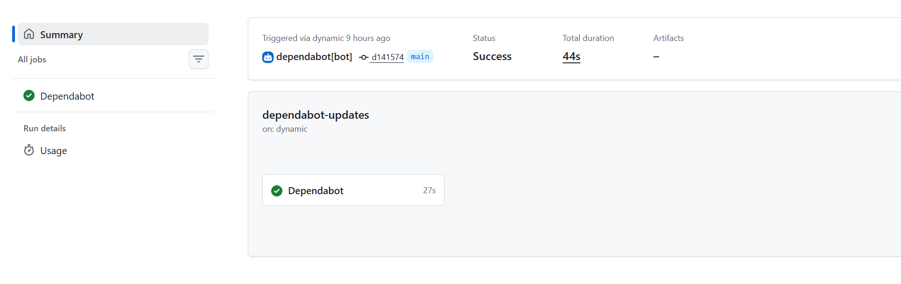

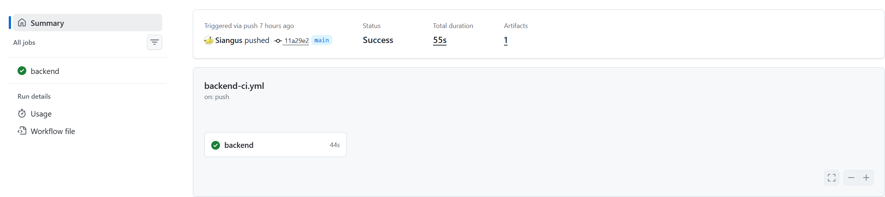

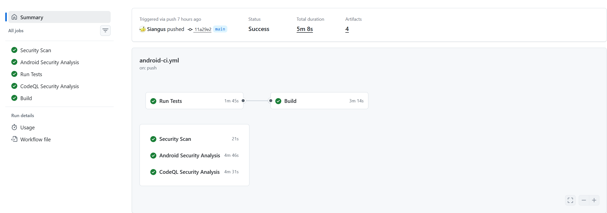

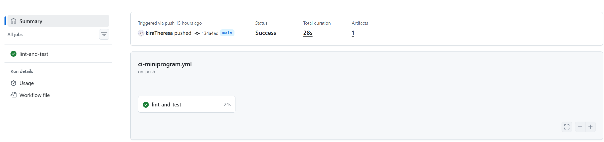


所有测试在 GitHub Actions 中自动运行：

- **后端 CI**：触发条件为 `backend/**` 路径变更。执行 `mvn clean test jacoco:report`，生成覆盖率报告并上传到 Codecov。
- **Android CI**：触发条件为 `frontend/Android/**` 路径变更。执行 `./gradlew jacocoTestReport`，生成覆盖率报告并上传到 Codecov。
- **小程序 CI**：触发条件为 `miniprogram/mp-user/**` 路径变更。执行 `npm ci && npm run lint && npm run test:ci`。

三端均将测试结果作为 Artifact 上传，便于失败时排查。

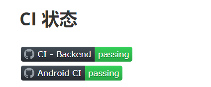

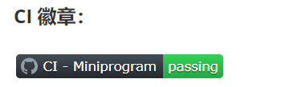

### 4.6 测试覆盖率

后端测试覆盖率约为 **61%**，覆盖了核心业务逻辑（订单、座位、认证、AI 对话）的大部分分支。Android 端和小程序端也在 Codecov 中持续追踪覆盖率变化。覆盖率不是目标而是手段，重点在于确保关键路径和时间敏感的业务逻辑得到充分验证。

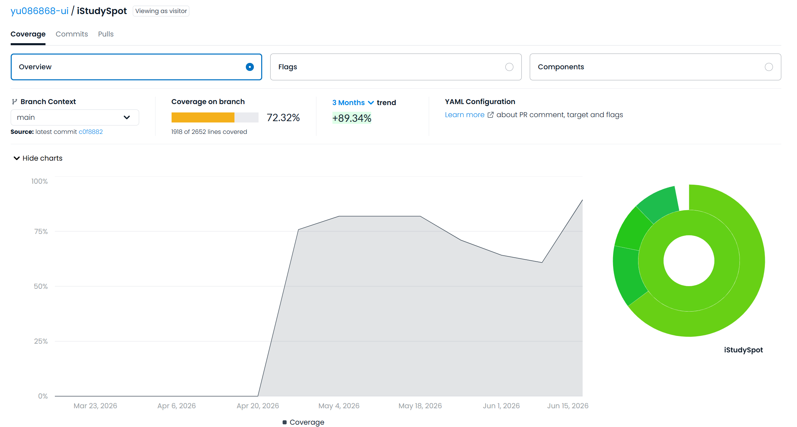

微信小程序覆盖率：

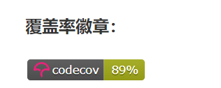

安卓前端覆盖率：


后端覆盖率：

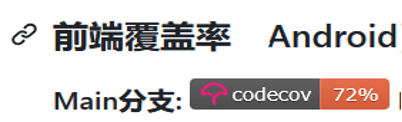

---

## 5. 软件开发安全实践

**负责人：余逸晨**

### 5.1 认证与授权

**JWT 无状态认证**：系统使用 JSON Web Token 实现无状态认证。用户登录后，后端生成包含用户 ID 的 JWT token，返回给客户端。客户端在后续请求中通过 `Authorization: Bearer <token>` 请求头携带 token。后端 `JwtInterceptor` 拦截所有 `/api/**` 请求，验证 token 有效性并将用户 ID 写入请求属性。

**来源说明**：JWT 实现基于 `io.jsonwebtoken:jjwt-api:0.11.5` 库。

**白名单机制**：部分接口无需认证即可访问，包括认证接口本身（登录、注册、刷新 token）、自习室列表、公告和规则只读接口、部分微信小程序接口和卡牌图片路径。白名单在 `WebConfig` 中配置。

**管理员权限控制**：管理端专用接口（如用户列表、订单管理）通过 `AdminAccessService` 进行权限校验，只有管理员用户才能访问。当前实现基于用户名判断，将在后续版本中升级为基于角色的权限模型（RBAC）。

### 5.2 输入校验与防护

**SQL 注入防护**：系统使用 MyBatis 的参数化查询（`#{}` 语法），通过预编译语句（PreparedStatement）防止 SQL 注入。所有动态 SQL 参数均通过占位符绑定，而非字符串拼接。

**参数校验**：Controller 层对请求参数进行校验，包括非空检查、格式校验（如日期格式）、数值范围校验。前端和后端均进行校验，避免绕过前端直接调用 API 的恶意请求。

**文件上传安全**：头像和卡牌图片上传限制文件大小为 10MB，上传后以 UUID 重命名存储，防止路径遍历和文件名冲突攻击。

### 5.3 敏感信息保护

**密钥管理**：所有敏感配置（数据库密码、DeepSeek API Key、Sentry DSN、微信小程序 AppID 和 Secret）均通过环境变量注入，不硬编码在代码或配置文件中。Docker Compose 中使用 `${ENV_VAR}` 语法引用环境变量，`application.yml` 中使用 `@...@` 占位符。

**密码存储**：当前版本使用 MD5 对密码进行哈希，这是一个已知的技术债。密码是不可逆的哈希存储，不保存明文，但 MD5 算法强度不足，计划迁移到 BCrypt。

**Token 安全**：JWT token 设置 7 天有效期，超时需重新登录。支持 refresh token 机制，客户端可在 token 过期前刷新。Token 不包含敏感信息，仅包含用户 ID。

**负责人：黄益政**

### 5.4 安全扫描

**Android CI 安全扫描**：Android 端 CI 流水线包含多层安全扫描：

- **Gitleaks**：扫描代码仓库中是否泄露了密钥、密码、API Key 等敏感信息。
- **Trivy**：对 Android 代码进行文件系统级别的安全漏洞扫描，重点关注 CRITICAL 和 HIGH 级别漏洞。
- **Semgrep**：基于规则的安全审计，覆盖通用安全审计、密钥泄露检测和 OWASP Mobile Top 10 检查。
- **MobSF**：对 Android APK 进行静态和动态安全分析，检测常见移动端安全漏洞。
- **CodeQL**：GitHub 的语义化代码分析引擎，检测 Java/Kotlin 代码中的安全漏洞模式。

### 5.5 Agent 安全设计

AI Agent 的安全设计已在 3.3 节详细说明，核心要点包括：只读工具白名单、策略守卫拦截写操作意图、工具返回数据脱敏。这些措施确保 AI Agent 不会对业务数据产生不可控的修改。

---

## 6. 系统部署

### 6.1 容器化策略

系统采用 Docker 容器化部署，所有服务均通过 `docker-compose.yml` 编排。部署架构包含四个容器：

| 服务 | 基础镜像 | 暴露端口 | 构建方式 |
| --- | --- | --- | --- |
| MySQL | mysql:8.4 | 3306:3306 | 官方镜像，通过 `init-db.sql` 初始化数据库 |
| Redis | redis:7-alpine | 6379:6379 | 官方镜像，使用数据卷持久化 |
| Backend | 自定义（多阶段构建） | 18080:8080 | 从 `backend/istudyspot-backend/Dockerfile` 构建 |
| Admin | 自定义（Nginx） | 3001:80 | 从 `admin/Dockerfile` 构建，Nginx 托管 SPA |

### 6.2 后端 Dockerfile 多阶段构建

**负责人：余逸晨**

后端 Dockerfile 采用多阶段构建策略，将构建和运行分离：

- **第一阶段（builder）**：使用 `maven:3.9-eclipse-temurin-17` 镜像，包含 Maven 和 JDK。先复制 `pom.xml` 并下载依赖（利用 Docker 层缓存加速），再复制源码并执行 `mvn package -DskipTests`。最终产物是一个可执行的 JAR 包。
- **第二阶段（runtime）**：使用 `eclipse-temurin:17-jre` 镜像，仅包含 JRE 运行时，不包含 JDK 和 Maven。从第一阶段复制 JAR 包，通过 `java -jar app.jar` 启动。

这种策略的优点是：最终镜像体积从约 1GB 缩减到约 200MB，仅包含运行时必要的组件，减少攻击面。

### 6.3 管理端 Dockerfile

**负责人：黄益政**

管理端 Dockerfile 基于 Nginx 构建。构建阶段使用 Node.js 镜像执行 `npm run build` 生成静态文件，运行阶段使用 Nginx 镜像托管静态文件，并通过 Nginx 反向代理将 `/api` 和 `/health` 请求转发到后端容器。

Nginx 的核心配置包括：静态文件托管、API 反向代理（`proxy_pass http://backend:8080`）、SSE 流式传输特殊配置（`proxy_buffering off`、`proxy_cache off`、`chunked_transfer_encoding on`）以及 Gzip 压缩。

### 6.4 服务依赖与健康检查

`docker-compose.yml` 中通过 `depends_on` 和 `healthcheck` 控制服务启动顺序：

- MySQL 和 Redis 配置了健康检查，MySQL 使用 `mysqladmin ping` 命令，Redis 使用 `redis-cli ping` 命令。
- 后端容器依赖 MySQL 和 Redis 的健康状态（`condition: service_healthy`），确保数据库和缓存就绪后才启动。
- 后端自身也配置了健康检查，通过 `curl -f http://localhost:8080/api/test` 验证服务可用性，设置 90 秒的启动等待时间（`start_period`）。

### 6.5 数据持久化

MySQL 和 Redis 的数据通过 Docker Volume 持久化，确保容器重启后数据不丢失。MySQL 数据卷挂载到 `/var/lib/mysql`，Redis 数据卷挂载到 `/data`。数据库初始化通过 `init-db.sql` 脚本在容器首次启动时自动执行。

### 6.6 一键部署命令

在项目根目录下执行 `docker-compose up -d` 即可一键启动全部服务。启动后，后端 API 可通过 `http://localhost:18080` 访问，管理端 Web 可通过 `http://localhost:3001` 访问。

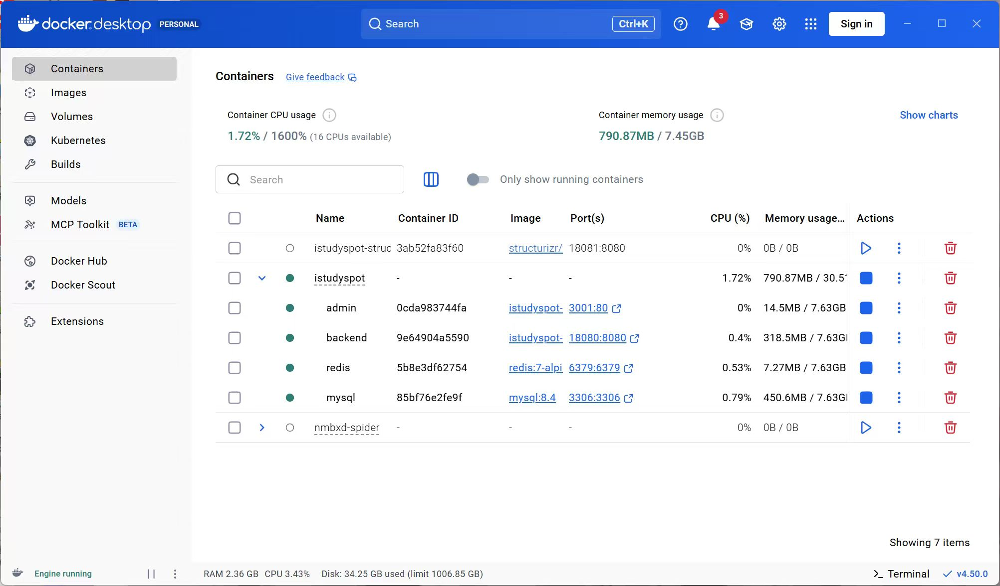

---

## 7. 云服务

**负责人：黄益政**

### 7.1 云服务器部署

iStudySpot 项目部署在阿里云弹性计算服务（ECS）上。云服务器实例规格为 **Ubuntu 24.04 64 位**，配置 **2 核 CPU** 和 **2 GiB 内存**，提供稳定的 Linux 运行环境。

#### 7.1.1 网络与安全组配置

ECS 实例部署在专有网络（VPC）中，通过安全组规则控制入站和出站流量。安全组入方向规则配置如下：

| 授权策略 | 优先级 | 协议类型 | 访问来源 | 端口范围 | 说明 |
| --- | --- | --- | --- | --- | --- |
| 允许 | 1 | 自定义 TCP | 0.0.0.0/0 | 8080/8080 | 后端 API 服务端口 |
| 允许 | 1 | 自定义 TCP | 0.0.0.0/0 | 3001/3001 | 管理端 Web 端口 |
| 允许 | 1 | 自定义 TCP | 0.0.0.0/0 | 3000/3000 | 开发调试端口 |
| 允许 | 100 | RDP 远程连接 | 0.0.0.0/0 | RDP(3389) | Windows 远程桌面（系统默认规则） |
| 允许 | 100 | 所有 ICMP-IPv4 | 0.0.0.0/0 | 全部(-1/-1) | ICMP 协议（系统默认规则） |
| 允许 | 100 | SSH 远程连接 | 0.0.0.0/0 | SSH(22) | Linux SSH 连接（系统默认规则） |

安全组 ID 为 `sg-tbp18taq8koqk4g7e`，通过专有 VPC 网络实现内网隔离。公网 IP 为 `8.136.135.189`，私网 IP 为 `172.22.228.96`。

#### 7.1.2 资源使用情况

根据 ECS 监控数据，服务器当前资源使用情况如下：

- **CPU 使用率**：1.18%，负载极低，说明当前用户量下计算资源充裕。
- **内存使用率**：68.557%，MySQL、Redis 和后端服务运行在容器中，内存占用合理。
- **云盘使用率**：32.92%，磁盘空间充足。
- **网络流量**：当前为 0，说明监控时刻无外部请求。

### 7.2 云服务与 AI 能力

除 ECS 云服务器外，项目还使用了以下云服务能力：

- **DeepSeek API**：提供大语言模型推理能力，是 AI 对话、Agent 和卡牌生成的核心能力。通过环境变量 `DEEPSEEK_API_KEY` 和 `DEEPSEEK_API_URL` 配置。
- **火山引擎即梦AI 文生图 3.0**：提供 AI 图片生成能力，用于学习卡片的配图生成。通过 HTTP API 调用，生成的图片下载到本地存储。
- **Sentry**：错误监控与告警平台，用于生产环境的实时错误追踪。通过 `SENTRY_DSN` 环境变量配置，默认关闭。

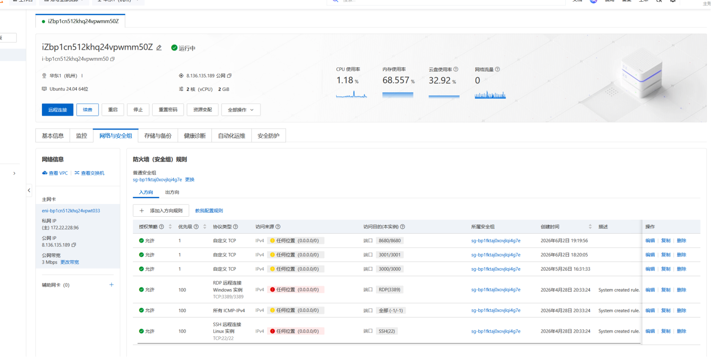

---

## 8. 系统监控

**负责人：余逸晨**

### 8.1 监控体系概述

iStudySpot 的监控体系围绕三个层面展开：**请求级指标收集**、**健康检查端点**和**错误告警**。三者配合，为运维人员提供从宏观请求趋势到微观错误定位的完整监控能力。

### 8.2 请求级指标收集

系统通过 `MetricsInterceptor` 实现请求级指标收集。这是一个 Spring MVC 拦截器，在每个 HTTP 请求的 `preHandle` 阶段记录起始时间，在 `afterCompletion` 阶段计算响应时间并更新统计计数器。

收集的指标包括：

| 指标 | 说明 | 数据结构 |
| --- | --- | --- |
| 总请求数 | 系统启动以来处理的请求总数 | AtomicLong |
| 成功请求数 | 状态码 2xx/3xx 的请求数 | AtomicLong |
| 失败请求数 | 状态码 ≥ 400 的请求数 | AtomicLong |
| 总响应时间 | 所有请求响应时间的累计值（毫秒） | AtomicLong |
| 端点请求计数 | 按请求 URI 分组的请求数 | ConcurrentHashMap |
| 错误率 | 失败请求数 / 总请求数 | 计算得出 |
| 平均响应时间 | 总响应时间 / 总请求数 | 计算得出 |

每 100 个请求输出一次指标汇总日志，包含错误率和平均响应时间。这些指标使用 `AtomicLong` 和 `ConcurrentHashMap` 保证线程安全。

### 8.3 健康检查端点

系统暴露两个健康检查端点：

- `GET /health`：返回服务基本状态，包括服务名称、版本号、运行环境、时间戳等。此端点无需认证，用于 Docker 健康检查和负载均衡器的存活探测。
- `GET /health/ready`：返回就绪状态，包括数据库连接、服务可用性和内存状态的检查结果。此端点用于就绪探测，判断服务是否准备好接收流量。

管理端 Web 提供健康检查页面，可视化展示后端服务的运行状态。管理员可以通过管理后台的仪表盘页面查看系统健康状态。

### 8.4 告警系统

`AlertService` 定义了告警服务的接口，`AlertConfig` 配置了告警的阈值规则：

- 错误率阈值：当错误率超过一定比例时触发告警。
- 响应时间阈值：当平均响应时间超过一定毫秒数时触发告警。
- 连续失败次数：当服务连续失败达到一定次数时触发告警。

当前告警系统以日志输出为主要通知方式，后续可扩展为邮件、钉钉或企业微信通知。

### 8.5 Sentry 错误监控

系统集成了 Sentry 错误监控 SDK，通过环境变量 `SENTRY_DSN` 和 `SENTRY_ENABLED` 控制启停。Sentry 在生产环境中自动捕获未处理异常、HTTP 请求错误和性能瓶颈，并在 Sentry 控制台提供错误详情、堆栈追踪和事件聚合。

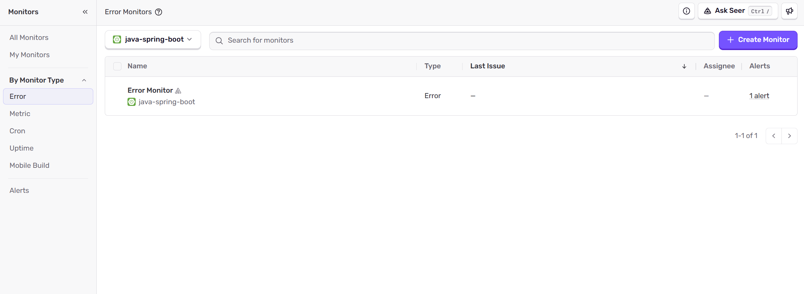

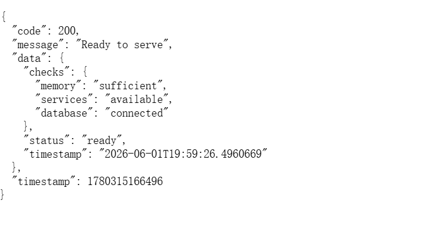

### 8.6 管理端监控面板

管理端 Web 的仪表盘页面集成了系统健康状态的实时展示，通过并行请求（`Promise.allSettled`）同时获取用户数、自习室数、订单数、公告数和健康检查状态，并以统计卡片的方式呈现。

---

## 附录：技术栈总览

| 层次 | 技术 | 版本 |
| --- | --- | --- |
| 后端框架 | Spring Boot | 3.1.2 |
| ORM | MyBatis | 3.0.2 |
| 数据库 | MySQL | 8.4 |
| 缓存 | Redis | 7 |
| 认证 | JWT (jjwt) | 0.11.5 |
| 数据库迁移 | Flyway | — |
| 监控 | Sentry | — |
| 测试 | JUnit 5 + Mockito | — |
| 覆盖率 | JaCoCo | — |
| Android 语言 | Kotlin | — |
| Android UI | Jetpack Compose | — |
| Android 网络 | Retrofit + OkHttp | — |
| 管理端框架 | React + Vite | 18 / 6 |
| 管理端 UI | Ant Design | 5 |
| 容器化 | Docker + Docker Compose | — |
| CI/CD | GitHub Actions | — |
| AI | DeepSeek API | — |
| 图片生成 | 火山引擎即梦AI | 3.0 |
| 小程序 UI | Vant Weapp | — |
| 小程序图表 | ECharts | — |
| 云服务器 | 阿里云 ECS | Ubuntu 24.04, 2核2G |
