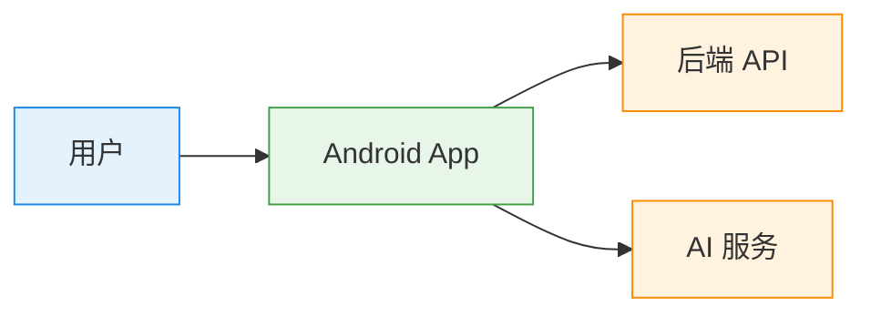
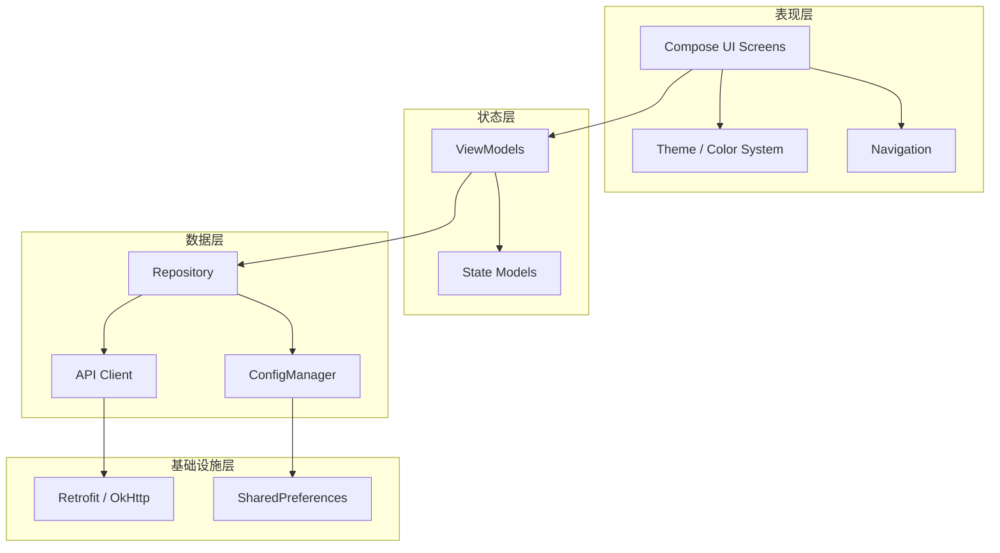
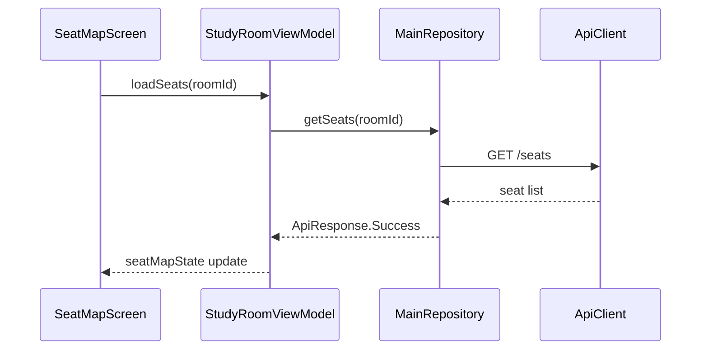
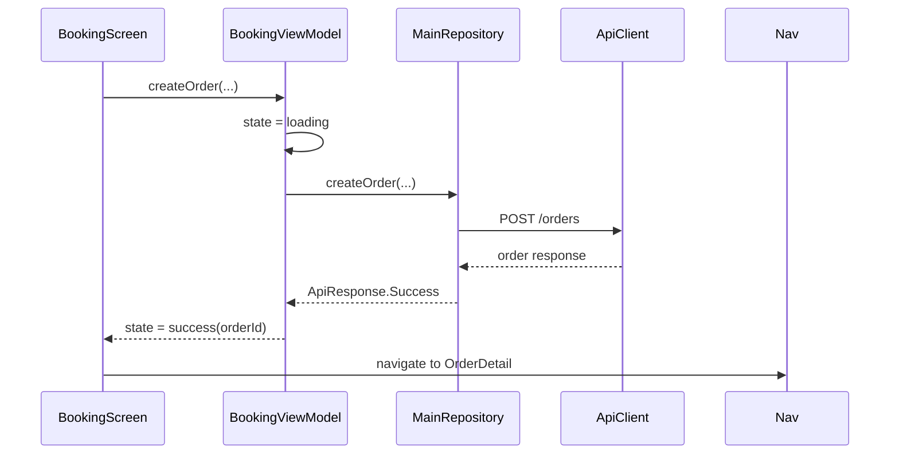
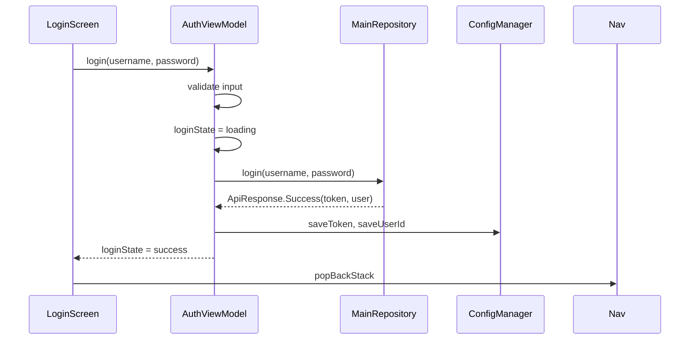
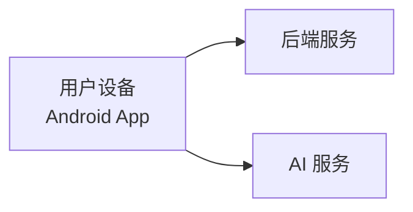

# iStudySpot Android 客户端架构文档

> 遵循 Arc42 架构文档标准

# 1. 引言与目标

## 1.1 需求概览

iStudySpot 是一个面向付费自习室的在线座位预订系统，主要服务学生、考研党、考证人群以及远程办公人群。

系统支持用户：

- 实时查看自习室座位图
- 按小时或天预约座位
- 在线支付并自动计算费用
- 到店签到并自动计时，离店结算
- AI 智能咨询助手
- 学习记录与成就系统

## 1.2 质量目标

| 优先级 | 质量目标 | 在客户端中的含义 | 为什么重要 |
|--------|----------|-----------------|-----------|
| P1 | 操作正确性 | 用户不能基于过期或错误状态完成非法操作 | 避免用户误操作，这是客户端体验的核心底线 |
| P2 | 状态新鲜度 | 页面进入、返回、关键操作前，座位状态应尽可能接近最新服务器状态 | 减少看到的和实际不一致导致的失败或冲突 |
| P3 | 用户体验流畅性 | 页面加载、切换、选择操作必须顺滑无明显卡顿 | 客户端核心体验，直接影响产品可用性 |
| P4 | 交互可靠性 | 网络失败、提交失败、重复点击等情况必须有合理处理 | 保证在不稳定网络下仍可使用 |
| P5 | 可维护性 | UI层、状态管理、数据层结构清晰，便于迭代功能 | 保证客户端长期开发效率 |

## 1.3 干系人

| 干系人 | 说明 | 对客户端模块的期望 |
|--------|------|-------------------|
| 学生/用户 | 使用 App 进行选座与预约的人 | 界面信息准确、操作简单、状态反馈及时 |
| 自习室运营方 | 管理座位与价格策略的人 | 客户端能正确展示座位状态与价格规则变化 |
| 后端服务 | 提供数据与业务能力的系统 | 客户端按契约正确调用 API、正确处理状态变化与错误码 |
| Android 开发团队 | 本模块的实现者 | 架构清晰、易维护、易扩展 |

# 2. 约束

## 2.1 平台与环境约束

- 最低支持 Android 7.0（API 24）及以上
- 目标编译 SDK 36
- 构建系统使用 Gradle 8.13 + Kotlin 2.0.21

## 2.2 技术栈约束

- 客户端使用 Kotlin 开发
- UI 层使用 Jetpack Compose + Material 3
- 网络层使用 Retrofit + OkHttp
- 异步处理使用 Kotlin Coroutines + Flow
- 序列化使用 kotlinx-serialization

## 2.3 架构约束

- 采用 MVVM 架构模式
- 单 Activity + Compose Navigation 架构
- 状态管理采用 StateFlow + Compose State

# 3. 上下文视图



# 4. 解决方案策略

采用 MVVM 架构模式，结合 Jetpack Compose 声明式 UI 框架，实现 UI 与业务逻辑解耦。

核心策略：

1. **声明式 UI**：使用 Compose 声明式范式，UI = f(State)
2. **单向数据流**：ViewModel 暴露 StateFlow，UI 订阅状态并渲染
3. **主题系统扩展**：通过 ExtendedColors 机制在 Material 3 之上扩展语义色
4. **统一反馈机制**：Snackbar 替代 Toast，确认对话框保护危险操作
5. **暗色模式优先**：所有 UI 组件均支持亮色/暗色模式自动切换

# 5. 构建块视图

## 5.1 系统分解



## 5.2 核心模块分解

### 5.2.1 UI 模块

```
ui/
├── screen/
│   ├── HomeScreen.kt          # 首页
│   ├── LoginScreen.kt         # 登录
│   ├── RegisterScreen.kt      # 注册
│   ├── StudyRoomScreen.kt     # 自习室列表
│   ├── SeatMapScreen.kt       # 座位图
│   ├── BookingScreen.kt       # 预约
│   ├── OrderListScreen.kt     # 订单列表
│   ├── OrderDetailScreen.kt   # 订单详情
│   ├── ProfileScreen.kt       # 个人中心
│   ├── MoreScreen.kt          # 更多功能
│   ├── AiChatScreen.kt        # AI 对话
│   ├── CharacterSelectScreen.kt # AI 角色选择
│   ├── SimpleScreens.kt       # 规则/通知/成就/积分/学习记录
│   └── ...
├── theme/
│   ├── Color.kt               # 颜色定义
│   ├── Theme.kt               # 主题配置
│   └── Type.kt                # 排版定义
└── navigation/
    ├── AppNavigation.kt       # 导航图
    └── NavRoutes.kt           # 路由定义
```

### 5.2.2 状态管理模块

```
viewmodel/
├── AuthViewModel.kt           # 认证状态
├── HomeViewModel.kt           # 首页状态
├── StudyRoomViewModel.kt      # 自习室状态
├── BookingViewModel.kt        # 预约状态
├── OrderViewModel.kt          # 订单状态
├── ProfileViewModel.kt        # 个人中心状态
├── AiChatViewModel.kt         # AI 对话状态
├── MoreViewModel.kt           # 更多功能状态
├── RulesViewModel.kt          # 规则状态
├── GuideViewModel.kt          # 导览状态
├── StudyRecordViewModel.kt    # 学习记录状态
└── NotificationViewModel.kt   # 通知状态
```

### 5.2.3 数据模块

```
repository/
└── MainRepository.kt          # 统一数据仓库

infra/network/
├── ApiClient.kt               # API 客户端
└── ErrorHandler.kt            # 错误处理

utils/
└── ConfigManager.kt           # 配置管理（Token/用户信息）
```

# 6. 运行时视图

## 6.1 场景一：座位图加载



## 6.2 场景二：选座与预约



## 6.3 场景三：登录流程



# 7. 部署视图



- 客户端通过 HTTPS API 与后端通信
- 数据格式采用 JSON
- 开发环境使用 10.0.2.2:8080 连接本地后端

# 8. 横切关注点

## 8.1 主题与颜色系统

### 设计动机

Material 3 的 ColorScheme 仅定义了 primary/secondary/tertiary/error 等核心语义色，但业务场景中大量使用 success/warning/info 等状态色。如果直接在各 Screen 中硬编码色值（如 `Color(0xFF22C55E)`），会导致：

- 暗色模式下颜色不可控（亮色绿在暗色背景上对比度不足）
- 修改品牌色时需要逐文件查找替换
- 同一语义的颜色在不同页面可能不一致

### 解决方案：ExtendedColors

在 Material 3 的 `ColorScheme` 之上，通过 `ExtendedColors` 数据类扩展语义色：

```
ExtendedColors
├── success / onSuccess / successContainer / onSuccessContainer
├── warning / onWarning / warningContainer / onWarningContainer
├── info / onInfo / infoContainer / onInfoContainer
├── gradientStart / gradientEnd  （渐变色）
└── onGradient / onGradientVariant  （渐变上的文字色）
```

通过 `CompositionLocal`（`LocalExtendedColors`）在 Composable 树中传递，自动根据亮色/暗色模式切换：

```kotlin
val extendedColors = LocalExtendedColors.current
// 使用：extendedColors.success, extendedColors.warning, etc.
```

### 为什么不用 Material Theme 的 customColors？

Material 3 的 `ColorScheme` 不支持自定义扩展属性。虽然可以通过 `dynamicColor` 使用 Material You 动态取色，但无法添加 success/warning 等语义色。`ExtendedColors` 是在 Material 3 之上的补充层，不替代 `ColorScheme`。

## 8.2 暗色模式策略

### 渐变区域处理

渐变头部区域（首页、个人中心、角色选择）在暗色模式下使用更深的渐变色（`DarkGradientStart`/`DarkGradientEnd`），文字颜色通过 `onGradient`/`onGradientVariant` 自动适配，确保在任何主题下都有足够对比度。

### 语义色暗色变体

所有语义色都有对应的暗色变体：

| 亮色 | 暗色 | 说明 |
|------|------|------|
| Success (#22C55E) | DarkSuccess (#86EFAC) | 提高暗色背景上的亮度 |
| Warning (#F59E0B) | DarkWarning (#FCD34D) | 提高暗色背景上的亮度 |
| Info (#3B82F6) | DarkInfo (#93C5FD) | 提高暗色背景上的亮度 |

Container 色在暗色模式下反转（深色背景 + 浅色文字），确保对比度符合 WCAG AA 标准。

## 8.3 交互反馈机制

### Snackbar 替代 Toast

所有用户反馈使用 Snackbar 而非 Toast，原因：

- Snackbar 可附带操作按钮（如"撤销"）
- Snackbar 不会遮挡重要内容（显示在底部）
- Snackbar 与 Scaffold 集成，生命周期可控
- Toast 在 Android 11+ 有限制，且无法自定义样式

### 确认对话框

危险操作（取消订单、退出登录）使用 `AlertDialog` 进行二次确认，防止误操作。

### 加载状态

所有异步操作按钮在请求中显示 `CircularProgressIndicator` 并 `enabled = false`，防止重复提交。

## 8.4 表单验证策略

### 客户端即时验证

登录/注册表单采用客户端即时验证 + 服务端错误展示双层策略：

1. **客户端验证**：空值检查、密码一致性检查，通过 `isError` + `supportingText` 在输入框下方实时显示
2. **服务端错误**：通过 `errorMessage` 参数在表单顶部展示，与客户端验证错误区分

### 为什么不在 ViewModel 中做客户端验证？

ViewModel 中的验证（如空值检查）仍然保留作为安全兜底，但 UI 层的即时验证提供更好的用户体验——用户不需要点击按钮就能看到错误提示。

## 8.5 页面导航与动画

### 导航架构

使用 Compose Navigation + 类型安全路由（`@Serializable`），底部导航 4 个 Tab（首页/规则/更多/我的），其他页面通过 `navigate()` 进入。

### 页面切换动画

- 底部 Tab 切换：淡入淡出（fadeIn/fadeOut, 300ms）
- 详情页进入：从右滑入（slideIntoContainer, 300ms）
- 详情页返回：向右滑出（slideOutOfContainer, 300ms）
- 登录/注册：从底部滑入（slideDirection.Up, 300ms）

### 为什么用滑动动画？

Material Design 3 推荐的页面转场是共享元素过渡，但在列表-详情场景中，简单的左右滑动更符合用户对"进入/返回"的心智模型，且实现成本低。

## 8.6 空状态设计

### 统一空状态模式

所有列表/数据页面的空状态遵循统一模式：

```
图标（72dp, onSurfaceVariant 50% alpha）
├── 主提示文字（bodyLarge, onSurfaceVariant）
├── 副提示文字（bodySmall, onSurfaceVariant 60% alpha）
└── [可选] 操作引导按钮
```

### 为什么不用独立空状态组件？

当前页面数量有限，各空状态的图标和文案不同，抽取通用组件的收益不大。如果后续页面增多，可以提取 `EmptyStateComposable`。

## 8.7 错误处理机制

### 分层错误处理

```
API Error → ErrorHandler → ViewModel State → UI 展示
```

- **网络错误**：Snackbar 提示 + 自动重试（后续可扩展）
- **业务错误**（座位被占等）：Snackbar 提示
- **认证错误**（401）：Snackbar 提示 + 跳转登录页（后续可扩展）
- **空数据**：空状态组件展示

# 9. 架构决策

## AD-1: 使用 Compose 而非传统 View 系统

**背景**：项目启动时需在传统 View 系统和 Compose 之间选择。

**决策**：使用 Jetpack Compose。

**原因**：
- 声明式 UI 更适合状态驱动的架构
- Compose 与 StateFlow/Flow 天然集成
- Material 3 Compose 组件库完善
- 减少模板代码（不需要 Adapter、ViewHolder 等）

**后果**：
- 正向：开发效率高，状态管理简洁
- 负向：部分自定义 View（如 SeatMapView.kt）无法直接复用，需要用 Compose 重写

## AD-2: ExtendedColors 扩展主题色

**背景**：Material 3 ColorScheme 不包含 success/warning/info 等业务常用语义色。

**决策**：通过 `ExtendedColors` + `CompositionLocal` 扩展。

**替代方案**：
1. 直接在各 Screen 中硬编码色值 → 维护困难，暗色模式不可控
2. 使用 Material Theme Builder 自定义扩展 → 不支持自定义属性
3. 每次使用时判断 `isSystemInDarkTheme()` → 代码重复，容易遗漏

**原因**：`CompositionLocal` 方案自动跟随主题切换，使用方式与 `MaterialTheme.colorScheme` 一致，学习成本低。

## AD-3: Snackbar 替代 Toast

**背景**：项目初期使用 Toast 进行所有用户反馈。

**决策**：全面替换为 Snackbar。

**替代方案**：
1. 继续使用 Toast → 无法自定义样式，Android 11+ 有限制
2. 自定义 Toast View → 兼容性问题
3. 使用内联错误提示 → 不适合全局操作反馈

**原因**：Snackbar 是 Material 3 推荐的反馈方式，与 Scaffold 集成，支持操作按钮，生命周期可控。

## AD-4: 客户端表单即时验证

**背景**：登录/注册表单的验证逻辑仅在 ViewModel 中，用户需要点击按钮后才能看到错误。

**决策**：在 UI 层添加即时验证，ViewModel 验证作为兜底。

**原因**：
- 即时验证提供更好的用户体验（输入时就能看到错误）
- 减少无效网络请求
- ViewModel 验证仍然保留，防止绕过 UI 直接调用 ViewModel 方法

## AD-5: 确认对话框保护危险操作

**背景**：取消订单、退出登录等操作一旦执行不可撤销，但之前无二次确认。

**决策**：所有不可逆操作使用 `AlertDialog` 二次确认。

**原因**：防止用户误触导致数据丢失或状态变更，符合 Material Design 的"宽容度"原则。

## AD-6: 页面切换动画策略

**背景**：Compose Navigation 默认无动画，页面切换体验生硬。

**决策**：为不同类型页面配置不同动画。

**原因**：
- 左右滑动符合用户对"层级导航"的心智模型
- 上下滑动适合模态页面（登录/注册）
- 淡入淡出适合 Tab 切换（避免方向歧义）

## AD-7: 可滚动表单布局

**背景**：登录/注册表单使用固定 `padding(top = 260.dp)` 定位，在小屏幕上可能溢出。

**决策**：使用 `verticalScroll` + 自适应偏移。

**原因**：
- 固定偏移在不同屏幕尺寸上表现不一致
- 可滚动布局确保所有内容始终可达
- 自适应偏移保持视觉层次

# 10. 质量要求

| 场景 | 质量属性 | 度量标准 | 当前状态 |
|------|----------|----------|----------|
| 座位选择 | 正确性 | 不可预订的座位不可点击 | ✅ 已实现 |
| 登录/注册 | 可用性 | 表单验证即时反馈 | ✅ 已实现 |
| 异步操作 | 可靠性 | 按钮加载态防止重复提交 | ✅ 已实现 |
| 暗色模式 | 一致性 | 所有页面暗色模式可用 | ✅ 已实现 |
| 危险操作 | 安全性 | 二次确认对话框 | ✅ 已实现 |
| 页面切换 | 流畅性 | 动画过渡无卡顿 | ✅ 已实现 |
| 错误反馈 | 可见性 | Snackbar 替代 Toast | ✅ 已实现 |

# 11. 风险与技术债务

| 编号 | 风险/债务 | 影响 | 缓解措施 |
|------|-----------|------|----------|
| TD-1 | Mock 数据与真实数据混杂 | 用户无法区分真实数据和假数据 | 逐步接入后端 API，Mock 数据标记 TODO |
| TD-2 | 主题偏好未持久化 | 应用重启后主题选择丢失 | 后续使用 DataStore 持久化 |
| TD-3 | ViewModel 直接实例化 | 同一 ViewModel 在不同页面分别创建，状态不共享 | 后续引入 Hilt DI |
| TD-4 | 字符串硬编码 | 不支持国际化 | 后续提取到 strings.xml |
| TD-5 | SeatMapView.kt 未使用 | 死代码增加维护负担 | 确认后删除 |
| TD-6 | contentDescription 缺失 | 无障碍支持不完整 | 逐步补充 |
| TD-7 | 部分页面缺少 TopAppBar | 导航路径不明确 | 逐步补充 |

# 12. 术语表

| 术语 | 含义 |
|------|------|
| Compose | Jetpack Compose，Android 声明式 UI 框架 |
| Material 3 | Material Design 3，Google 最新的设计系统 |
| MVVM | Model-View-ViewModel 架构模式 |
| StateFlow | Kotlin 协程中的状态流，用于 ViewModel 向 UI 暴露状态 |
| ExtendedColors | 本项目扩展的语义色系统，补充 Material 3 ColorScheme |
| CompositionLocal | Compose 的依赖注入机制，用于在树中传递数据 |
| Snackbar | Material 3 的底部提示条，替代 Toast |
| SSOT | Single Source of Truth，单一数据源原则 |
| WCAG AA | Web Content Accessibility Guidelines AA 级，对比度标准 |
