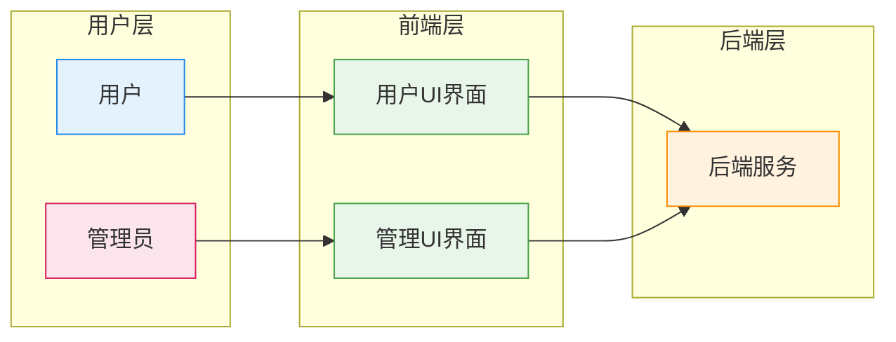
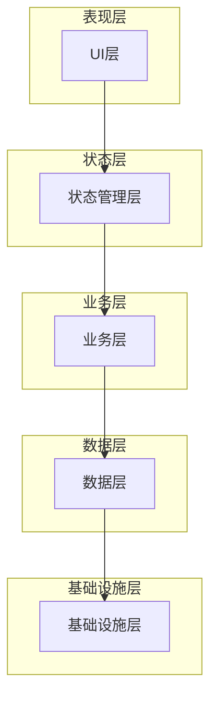
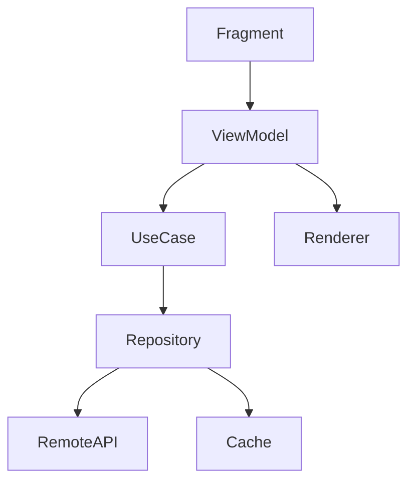
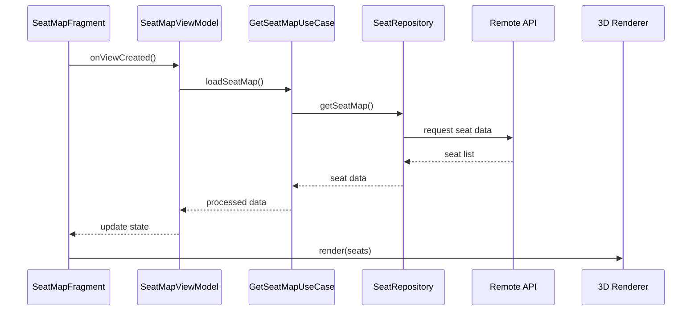
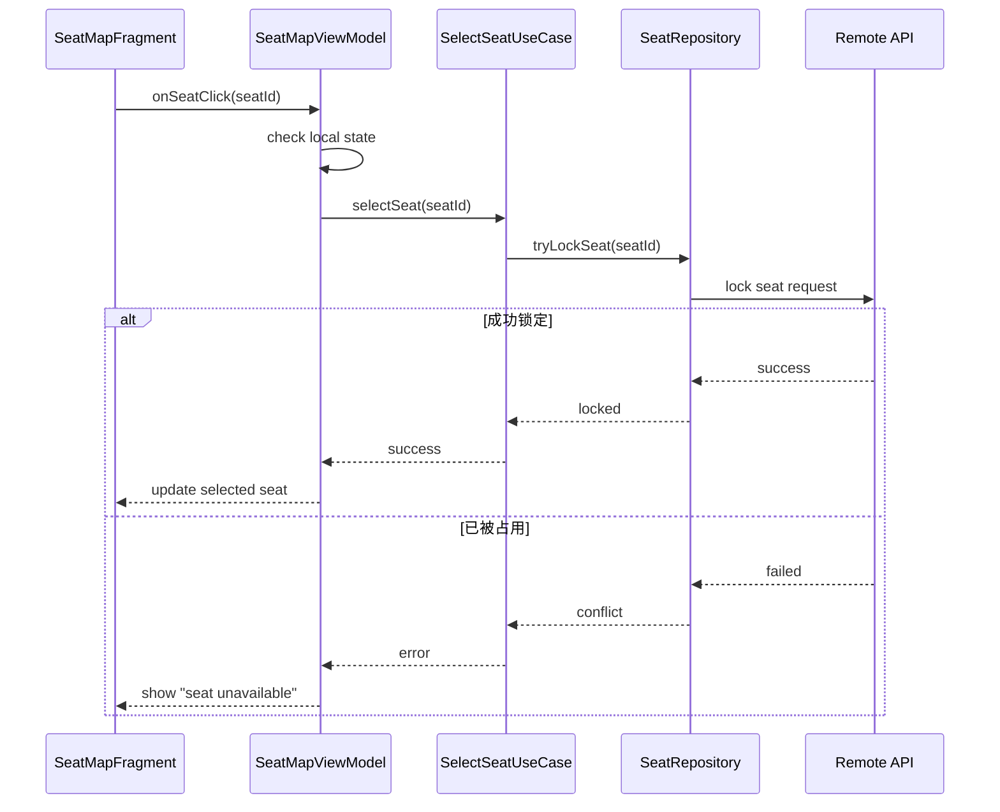
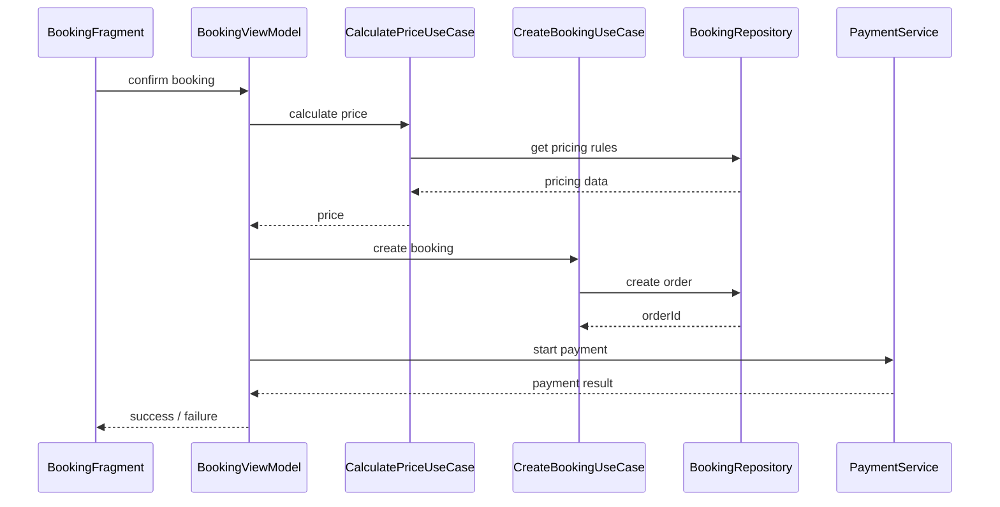
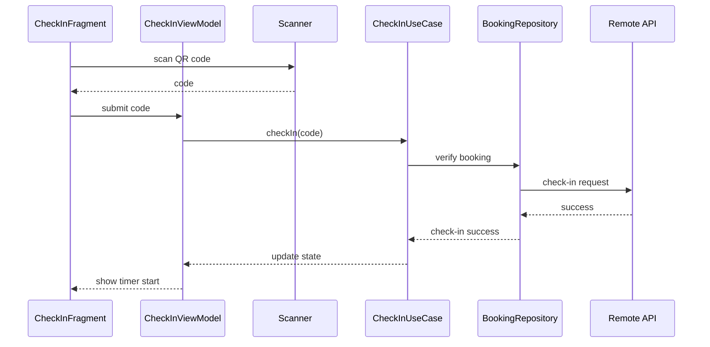
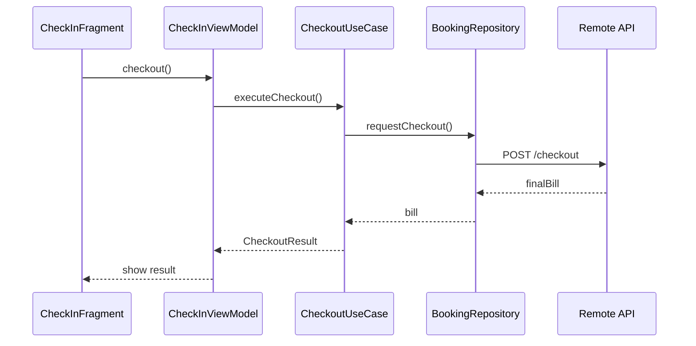
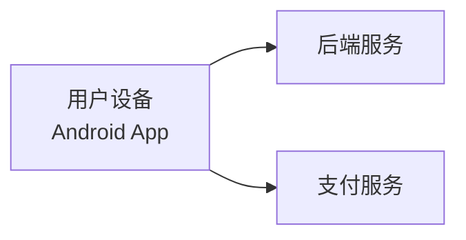

# 1.引言与目标

## 1.1 需求概览

iStudySpot 是一个面向付费自习室的在线座位预订系统，主要服务学生、考研党、考证人群以及远程办公人群。

系统支持用户：

- 实时查看自习室 3D 座位图
- 按小时或天预约座位
- 在线支付并自动计算费用
- 到店扫码签到并自动计时，离店结算

同时为自习室管理者提供：

- 座位布局配置能力
- 动态定价策略（高峰/低峰）
- 上座率统计分析
- 用户黑名单管理

## 1.2 驱动因素

线下自习室座位管理依赖人工或低效工具，效率较低

高峰期（如考试季）存在强烈的座位需求与竞争

用户希望能够提前锁定座位，避免到店无座的不确定性

运营方需要提升座位利用率与整体收益

在高并发抢座场景下，必须保证座位分配的一致性与公平性


## 1.3 质量目标

| 优先级 | 质量目标                              | 在客户端中的含义                                             | 为什么重要                                     |
| ------ | ------------------------------------- | ------------------------------------------------------------ | ---------------------------------------------- |
| P1     | 操作正确性（Interaction Correctness） | 用户不能基于过期或错误状态完成非法操作（如已被占座的座位仍可点击提交） | 避免用户“误操作成功”，这是客户端体验的核心底线 |
| P2     | 状态新鲜度（Data Freshness）          | 页面进入、返回、关键操作前，座位状态应尽可能接近最新服务器状态 | 减少“看到的和实际不一致”导致的失败或冲突       |
| P3     | 用户体验流畅性（Responsiveness）      | 3D座位图加载、切换、选择操作必须顺滑无明显卡顿               | 客户端核心体验，直接影响产品可用性             |
| P4     | 交互可靠性（Robust Interaction）      | 网络失败、提交失败、重复点击等情况必须有合理处理（重试/提示/防抖） | 保证在不稳定网络下仍可使用                     |
| P5     | 可维护性（Maintainability）           | UI层、状态管理、数据层结构清晰，便于迭代功能                 | 保证客户端长期开发效率                         |

## 1.4 干系人

| 干系人                 | 说明                        | 对客户端模块的期望                                           |
| ---------------------- | --------------------------- | ------------------------------------------------------------ |
| 学生/用户              | 使用 App 进行选座与预约的人 | 界面信息准确、操作简单、状态反馈及时（选座/支付/签到流程顺畅） |
| 自习室运营方           | 管理座位与价格策略的人      | 客户端能正确展示座位状态与价格规则变化（不误导用户）         |
| 后端服务               | 提供数据与业务能力的系统    | 客户端按契约正确调用 API、正确处理状态变化与错误码           |
| Android/客户端开发团队 | 本模块的实现者              | 架构清晰（UI/状态/数据分层）、易维护、易扩展                 |
| 产品/业务方            | 定义用户流程的人            | 客户端交互符合设计流程，支持业务实验与调整                   |
| QA 测试团队            | 测试客户端行为的人          | UI 状态可预测、流程可复现、异常场景可覆盖                    |


# 2.约束

### 2.1平台与环境约束

- 最低支持 Android 10（API 29）及以上
- 构建系统必须使用 Gradle

------

### 2.2技术栈约束

\- 客户端必须使用 Kotlin 开发
\- UI 层必须使用 View/XML（禁止使用 Jetpack Compose）
\- 必须使用 Jetpack Navigation 组件管理页面跳转
\- 必须使用 Hilt 进行依赖注入

------

### 2.3架构约束

- 必须采用 MVVM 架构模式
- 必须使用 Single Activity + Fragment 架构模式

------

### 2.4构建与发布约束

- Release APK 大小必须小于 20MB
- 必须使用 R8 进行代码混淆与压缩

------

### 2.5编程与实现约束

- 参考阿里巴巴 Java/Kotlin 规范

------

### 2.6合规与许可约束

暂无要求

# 3.上下文视图

WARN:这个上下文视图不一定足够完整/优秀/可靠



# 4.解决方案策略


采用 MVVM 架构模式，结合 Jetpack 组件（ViewModel, StateFlow），
实现 UI 与业务逻辑解耦。

\- View：负责 UI 展示（Activity / Fragment + XML）
\- ViewModel：管理 UI 状态（StateFlow）
\- Domain：封装业务逻辑（UseCase）
\- Repository：统一数据访问

\### 补充策略

\- 使用 Jetpack Navigation 管理 Fragment 跳转与回退栈
\- 使用 Hilt 实现依赖注入，降低模块耦合
\- 采用单向数据流（Unidirectional Data Flow）


# 5.构建块视图

## 5.1 系统分解

客户端整体采用分层架构，在 MVVM 模式约束下划分为五个核心构建块：




### **UI层（View）**

- 负责界面展示与用户交互（Activity / Fragment）
- 不包含业务逻辑
- 所有状态来自 ViewModel

### **状态管理层（ViewModel）**

- 管理 UI 状态（State）
- 将用户操作转化为 UseCase 调用
- 不包含核心业务规则

### **业务层（Domain）**

- 封装核心业务逻辑（选座、预约、计费等）
- 提供 UseCase 作为业务入口
- 与 UI 层解耦

### **数据层（Data）**

- 提供统一数据访问接口（Repository）
- 协调远程数据与本地缓存

### **基础设施层（Infrastructure）**

- 提供技术能力（网络、存储、扫码、渲染等）
- 不包含业务语义

## 5.2 核心模块分解

### 5.2.1 UI模块划分

```
ui/
 ├── seatmap/        # 座位选择（核心模块）
 ├── booking/        # 预约流程
 ├── payment/        # 支付流程
 ├── checkin/        # 扫码签到/离店
 └── profile/        # 用户信息
```

说明：

- `seatmap` 为系统核心模块，承载高频交互与复杂状态
- 各模块通过 Fragment 实现，符合 Single Activity 架构约束

### 5.2.2 状态管理模块

```
state/
 ├── SeatMapViewModel
 ├── BookingViewModel
 ├── PaymentViewModel
 └── CheckInViewModel
```

说明：

- \- 每个功能模块对应独立 ViewModel
  \- 状态采用单一数据源（Single Source of Truth）
  \- 使用 StateFlow 替代 LiveData（更适合协程）
  \- UI 仅通过 collect 状态更新界面

示例状态模型：

```
data class SeatMapState(
    val seats: List<Seat>,
    val selectedSeat: Seat?,
    val isLoading: Boolean,
    val error: String?
)
```

### 5.2.3 业务模块（UseCase）

```
domain/
 └── usecase/
      ├── GetSeatMapUseCase
      ├── SelectSeatUseCase
      ├── CreateBookingUseCase
      ├── CalculatePriceUseCase
      ├── CheckInUseCase
      └── CheckoutUseCase
```

### 5.2.4 数据模块（Repository）

```
data/
 ├── repository/
 │    ├── SeatRepository
 │    ├── BookingRepository
 │    └── PaymentRepository
 │
 └── datasource/
      ├── remote/
      └── local/
```

### 5.2.5 基础设施模块

```
infra/
 ├── network/     # 网络请求（Retrofit/Ktor）
 ├── storage/     # 本地存储（Room/DataStore）
 ├── scanner/     # 扫码能力
 └── renderer/    # 3D座位渲染
```

## 5.3 核心模块详细设计

### 5.3.1 座位选择模块（SeatMap）



#### 职责说明

**SeatMapFragment**

- 展示座位图
- 响应用户点击操作

**SeatMapViewModel**

- 维护座位状态
- 控制加载、选择、提交流程

**UseCase**

- 校验选座合法性
- 处理并发冲突逻辑

**SeatRepository**

- 获取座位数据
- 同步服务器状态

**Renderer**

- 负责 3D 座位图绘制与交互

  #### 并发与一致性补充

  \- 客户端不直接决定选座结果，必须依赖服务端锁定
  \- 所有选座请求必须携带唯一请求ID（requestId），用于幂等控制
  \- ViewModel 层保证：
    \- 防重复点击（Debounce）
    \- 同一座位请求串行化

## 5.4 关键设计决策

### 5.4.1 状态一致性策略

- 所有用户操作必须基于最新状态执行
- 选座操作需通过服务器确认后再更新 UI
- 禁止基于过期状态直接提交操作

### 5.4.2 数据新鲜度策略

- 页面进入时强制刷新座位数据
- 页面返回时根据时间戳判断是否需要刷新
- 可扩展为轮询或实时推送更新

### 5.4.3 高并发处理策略


客户端与服务端协同保证一致性：

客户端职责

\- 点击防抖（防止重复请求）
\- 显示“锁定中”状态
\- 请求携带唯一 requestId（幂等标识）
\- 请求失败后回滚 UI 状态

服务端职责（约定）

\- 使用分布式锁（如 Redis）控制座位并发
\- 基于 requestId 实现幂等控制
\- 提供锁超时自动释放机制

状态流转

```
Idle → Locking → Locked → Failed（回滚）
```


### 5.4.4 性能优化策略

- 3D 渲染模块独立封装
- UI 层仅消费状态，不直接参与渲染计算
- 避免主线程进行复杂计算

## 5.5 设计约束落实

本章节设计满足以下约束：

- 遵循 MVVM 架构模式
- 实现 Single Activity + Fragment 结构
- UI / 状态 / 业务 / 数据 分层清晰
- 支持后续功能扩展与维护


## 5.6 认证与会话管理

### 设计目标

保证用户身份一致性与接口安全。

### 方案

- 使用 Token（JWT 或 Session Token）进行认证
- Token 存储于 DataStore
- 所有请求通过 Interceptor 自动附带 Token

### 过期处理

- Token 过期 → 自动刷新或跳转登录
- 避免 UI 持有认证状态

### 分层职责

- Infra：Token 存储与拦截器
- Data：认证 Repository
- Domain：登录 UseCase
- UI：登录界面

## 5.7 管理端说明

TODO:暂未设计，后续将完成

# 6. 运行时视图（Runtime View）

本章节描述系统在关键业务场景下的运行时行为，重点关注：

- 各构建块之间的交互流程
- 状态流转与一致性保证
- 异常与并发情况下的处理方式

------

## 6.1 场景选择说明

选取以下典型场景：

1. 查看座位图（高频读）
2. 选座与预约（核心竞争场景，高并发）
3. 支付流程
4. 到店扫码签到 / 离店结算

------

## 6.2 场景一：座位图加载（Seat Map Loading）

### 场景描述

用户进入座位选择页面，需要获取最新座位状态并渲染 3D 座位图。

### 运行时流程



### 关键点

- **数据新鲜度（P2）**
  - 页面进入必须强制请求远程数据
- **UI 与数据解耦**
  - UI 不直接操作数据，仅响应状态
- **性能**
  - 渲染交给 Renderer，避免阻塞主线程

------

## 6.3 场景二：选座与预约（核心场景）

### 场景描述

用户点击座位 → 提交预约 → 系统需要保证：

- 不允许重复占座
- 不允许基于过期状态提交

------

### 运行时流程（含并发控制）




------

### 关键点

#### 1.状态正确性

- UI 点击后 **不能直接认为选座成功**

- 必须经过：

  ```
  Server Lock → 成功 → 更新UI
  ```

#### 2.高并发一致性

- 服务端负责最终一致性（seat lock）
- 客户端只做：
  - 防抖（防止重复点击）
  - 状态提示（“锁定中”）

#### 3.UI 状态流转

典型状态：

```
Idle → Loading → Locked / Error
```

------

## 6.4 场景三：预约 + 价格计算 + 支付

### 场景描述

用户确认座位后进入预约流程，系统需要：

- 动态计算价格（时段 + 策略）
- 发起支付
- 确认订单

------

### 运行时流程



------

### 关键点

- **价格计算在 Domain 层完成**
- **支付与业务解耦（独立 PaymentService）**
- 支持失败重试（P4）

------

## 6.5 场景四：扫码签到与离店结算

### 场景描述

用户到店扫码：

- 开始计时
- 离店自动结算费用

------

### 运行时流程



------

### 离店结算



------

### 关键点

- 扫码模块完全在 **Infra 层**
- 业务逻辑仍由 UseCase 控制
- 支持异常情况：
  - 无效二维码
  - 重复签到
  - 网络失败

------

## 6.6 横切机制（Cross-Cutting Runtime Behavior）

### 6.6.1 状态同步策略

- 页面进入：强制刷新
- 页面返回：基于时间戳判断
- 可扩展：
  - 轮询
  - WebSocket 推送

------

### 6.6.2 错误处理机制

统一流程：

```
Error → ViewModel → UI State → 用户提示
```

类型包括：

- 网络错误
- 业务错误（座位被占）
- 支付失败

------

### 6.6.3 防重复提交（Debounce）

在 ViewModel 层：

- 禁止短时间重复点击
- 使用 loading 状态锁 UI

### 6.6.4 状态单一数据源（SSOT）

- 所有 UI 状态必须来自 ViewModel
- 禁止 UI 自行维护关键业务状态

## 6.7 小结

本系统运行时具有以下特征：

- **严格的状态驱动 UI（State → UI）**
- **关键操作必须经过服务端确认（保证一致性）**
- **客户端负责体验与防护，服务端负责最终正确性**
- **分层调用清晰：UI → ViewModel → UseCase → Repository → Infra**


# 7. 部署视图（Deployment View）

## 7.1 概述

本系统客户端为 Android 应用，运行在用户移动设备上。
 部署结构相对简单，因此本节仅描述关键运行节点及其关系。

------

## 7.2 部署结构



------

## 7.3 节点说明

**用户设备（Android App）**

- 运行客户端应用
- 负责 UI 渲染、状态管理与业务交互
- 通过网络与后端通信

**后端服务**

- 提供座位管理、订单、用户等核心业务能力
- 保证数据一致性与并发控制

**支付服务**

- 提供第三方支付能力
- 客户端通过后端或 SDK 间接调用

------

## 7.4 通信方式

- 客户端与后端通过 HTTPS API 通信
- 数据格式采用 JSON
- 支付流程通过 SDK 或跳转方式完成

------

## 7.5 部署特性

- 客户端通过 APK 分发（应用商店或侧载）
- 不涉及客户端侧多节点部署
- 后端部署细节不在本系统范围内


# 8. 横切关注点（Cross-cutting Concepts）

本章节描述贯穿整个客户端架构的通用设计原则与机制，这些内容不属于单一模块，但对系统稳定性、一致性与可维护性至关重要。

------

## 8.1 状态管理模型（State Management）

系统采用 **单一数据源（SSOT, Single Source of Truth）** 思想：

- UI 不保存业务状态
- ViewModel 作为唯一状态持有者
- UI 仅负责渲染状态

### 状态流转原则

```
User Action → ViewModel → UseCase → Repository → State Update → UI Render
```

### 状态设计特点

- 状态不可直接修改（Immutable State）
- 通过 `copy()` 方式生成新状态
- 每个模块拥有独立 State Model

示例：

```
data class SeatMapState(
    val seats: List<Seat> = emptyList(),
    val selectedSeatId: String? = null,
    val loading: Boolean = false,
    val errorMessage: String? = null
)
```

------

## 8.2 错误处理机制（Error Handling）

系统采用统一错误表达模型：

### 错误分层

- 网络错误（IO / Timeout）
- 业务错误（座位已被占用 / 订单失效）
- 系统错误（解析失败 / 未知异常）

### 处理策略

- Repository 统一捕获异常并转换为 Result
- ViewModel 统一转换为 UI State
- UI 不直接处理异常逻辑

### 标准模式

```
sealed class Result<out T> {
    data class Success<T>(val data: T) : Result<T>()
    data class Failure(val error: AppError) : Result<Nothing>()
}
```

UI 展示策略：

- Success → 正常渲染
- Failure → 状态提示（SnackBar / Error View）

------

## 8.3 并发与一致性控制（Concurrency & Consistency）

核心业务（选座/预约）涉及强一致性要求。

### 设计原则

- 客户端不做最终决策
- 服务端负责“唯一真相”
- 客户端只做：
  - 状态提示
  - 防重复操作
  - 乐观 UI 更新（可回滚）

### 并发控制手段

#### 1. 防抖（Debounce）

防止重复点击：

```
if (state.loading) return
```

#### 2. 请求串行化

同一座位操作必须串行执行

#### 3. 状态锁定机制

```
Idle → Locking → Locked → Released
```

### 补充：幂等性保证

客户端：

- 每次关键请求生成唯一 requestId
- requestId 与操作绑定（选座 / 下单）

服务端（约定）：

- 同一 requestId 只允许成功一次
- 重复请求直接返回第一次结果

目的：

- 防止重复下单
- 防止网络重试导致异常

------

## 8.4 UI 状态驱动模型（State-driven UI）

UI 完全由状态驱动，不存在“手动修改 UI”的逻辑。

### 核心原则

- UI = f(State)
- 状态变化 → 自动 UI 更新
- 禁止 UI 层保存业务判断逻辑

### 优点

- 可预测性强
- 易测试（状态可复现）
- 降低 UI bug

------

## 8.5 数据一致性策略（Data Freshness）

针对座位系统的高频变化场景：

### 刷新策略

- 进入页面：强制刷新
- 返回页面：时间戳判断是否刷新
- 关键操作前：再次确认服务器状态

### 一致性级别

| 场景        | 一致性要求 |
| ----------- | ---------- |
| 座位展示    | 高         |
| UI 动画状态 | 中         |
| 本地缓存    | 弱         |

------

## 8.6 缓存策略（Caching Strategy）

客户端采用分层缓存：

### 1. 内存缓存

- ViewModel State
- 生命周期内有效

### 2. 本地缓存（Room / DataStore）

- 用户信息
- 非实时配置
- 最近访问数据

### 3. 网络数据优先级

```
Network > Cache > Default
```

------

## 8.7 性能优化机制（Performance）

### UI 层优化

- RecyclerView 复用
- DiffUtil 减少重绘
- 避免主线程计算

### 3D 渲染优化


\- 使用轻量级渲染方案（避免大型引擎）
\- 避免引入高体积资源（满足 APK < 20MB）
\- 渲染逻辑必须运行在子线程
\- UI 层仅接收渲染结果

可选方案：

\- OpenGL / Filament（需评估体积）
\- 轻量自定义 Canvas 渲染（优先推荐）

### 数据层优化

- 请求合并（batching）
- 延迟加载（lazy loading）

------

## 8.8 安全与可靠性（Security & Robustness）

### 安全原则

- 所有关键逻辑由后端校验
- 客户端不信任本地状态
- 所有请求必须带 token

### 可靠性机制

- 请求重试（retry with backoff）
- 网络异常降级提示
- 失败可恢复流程（resume flow）

------

## 8.9 可测试性设计（Testability）

系统设计支持分层测试：

### UI 测试

- Fragment + Mock ViewModel

### ViewModel 测试

- State 输入 → 输出验证

### UseCase 测试

- 纯业务逻辑单元测试

### Repository 测试

- Mock Remote / Local datasource

### 依赖注入支持测试

- 使用 Hilt 注入 Repository / UseCase
- 测试中可替换为 Fake / Mock 实现

示例：

- FakeSeatRepository
- MockPaymentService

------

## 8.10 可扩展性设计（Extensibility）

系统预留以下扩展能力：

- WebSocket 实时座位同步
- 动态定价策略插件化
- 多自习室多租户支持
- A/B 实验流量控制
- 新支付渠道接入

------

## 8.11 小结

## 本系统横切设计的核心思想：

- **状态驱动 UI**
- **服务端保证一致性**
- **客户端负责体验与防护**
- **分层职责严格隔离**
- **所有通用能力横切复用，不侵入业务模块**

这些机制共同支撑了系统在高并发选座场景下的稳定性与可维护性。


一些修改意见：

# 文档架构概览与关键决策

该设计文档采用了典型的 MVVM 分层架构：**UI层**（Activity/Fragment）负责渲染界面和用户交互，**ViewModel（状态层）**管理 UI 状态并调用业务逻辑，**业务层（Domain/UseCase）**封装核心业务规则，**数据层（Repository）**协调远程与本地数据，**基础设施层**提供网络、存储、扫码和3D渲染等技术能力。文档明确了单 Activity + Fragment 结构、使用 Kotlin 和 Jetpack 组件（如  LiveData/Flow）等核心决策。各功能模块（选座、预约、支付、签到、个人信息）通过独立的 Fragment + ViewModel  实现，状态以不可变数据类为载体，遵循单一数据源原则。从架构思路上看，整体设计与 Android  官方的分层架构和单向数据流原则是一致的（ViewModel 通过 StateFlow/LivaData 向 UI 提供状态，UI  仅根据状态渲染界面），也体现了推荐的使用领域层（UseCase）封装业务逻辑。

## 架构一致性与约束检查

- **Compose 使用矛盾**：文档在第2.2节“技术栈约束”明确禁止使用 Jetpack Compose，UI 层必须使用传统 View/XML；但在第4节解决方案策略中却提到“View  层(Activity/Fragment/Compose)负责展示界面”。这与自身约束矛盾。值得注意的是，Android 官方指南强烈推荐使用  Jetpack Compose 构建现代 UI。采用 Compose 虽然会略微增加 APK 大小，但带来开发效率提升；本方案既禁用又提及 Compose，需明确技术选型，否则与官方指导冲突且可能影响 APK 体积目标（官方示例项目加入 Compose 后 APK 增大约 782KB）。
- **单 Activity 架构挑战**：采用单 Activity + 多 Fragment 有其优点，但也带来复杂性。Fragment 事务管理和回退栈变得复杂，需要小心维护。文档中未提及 Jetpack Navigation 组件的使用，而官方建议对多屏应用使用 Navigation3 组件以便于屏幕间导航和深度链接。如果自定义 Fragment 逻辑，需要额外处理返回栈和深度链接（back stack）等问题，这可能导致调试难度增加。
- **缺少依赖注入（DI）**：文档未提及任何依赖注入框架或实践。Android 官方架构指南中“使用依赖注入”被列为强烈推荐项。实践中可使用 Hilt/Dagger 进行构造器注入，这样能自动提供 ViewModel、Repository 等依赖，降低模块耦合、提升可测试性。当前设计若缺少 DI，往往需要手动实例化对象（如 Repository 或 UseCase），不利于单元测试和后期维护。
- **与约束和目标的一致性**：文档在维护性（P5）、单一数据源、状态不可变性等方面与官方推荐原则吻合。例如，官方建议 ViewModel 向 UI 暴露单一 `uiState`（可用 StateFlow）以统一管理状态，文档中 SeatMapState 等数据类即体现此思路。但是在具体技术约束上存在冲突，如 Compose 的提及与禁止并存，需要澄清。

## 高并发场景与一致性风险

- **选座超卖与分布式锁**：在高并发选座场景下，仅依赖数据库行锁（如 `SELECT … FOR UPDATE`）极易成为瓶颈，两个用户可能“查询到座位空闲→同时下单”导致超卖问题。文档只提到“服务端负责锁定座位”，但没有说明具体机制。行业实践推荐使用 **分布式锁**（如 Redis）将锁逻辑从数据库抽离，快速过滤并发请求，避免数据库过载；结论指出，对于选座这种短时间锁定需求，Redis 分布式锁是更优选择。该文档若不明确后端锁实现，可能忽略性能瓶颈的风险。
- **重复提交与幂等性**：客户端采取了防抖去重（禁止快速多次点击），但这只能改善用户体验，而无法保证服务端幂等。正如实践所言，前端防抖“必要但不可靠”，用户可通过其他手段绕过（如直接调用 API），网络问题也可能造成重复请求。行业建议在服务器端引入**幂等令牌机制**：客户端在发起关键请求前获取唯一 Token，提交时携带该 Token，服务器验证并确保相同 Token 不被重复使用。当前架构未提及此类设计，缺少对后端幂等性的保障。
- **UI 状态与体验**：文档强调操作必须等服务端确认后再更新 UI （“禁止基于过期状态提交”），这是保证一致性的保守策略，但在实际应用中可能导致明显延迟。可考虑在 UI  端显示“锁定中”反馈（已有防抖）、并在等待服务器响应期间提供加载态。而一旦失败，则要回滚状态。文档并未明确 UI  回滚策略或用户通知流程，需确保在锁定失败时正确恢复界面。
- **其他并发场景**：预约、支付等流程若多人同时进行，也需考虑幂等和锁定。文档提到支持失败重试，但未明确如支付重复回调的处理。总体而言，并发控制主要依赖后端锁与客户端防抖，缺少更细粒度的**令牌或幂等设计**。

## 功能缺失与其他风险点

- **管理端功能缺失**：文档Stakeholder列出了自习室运营方及其期望（座位布局配置、定价策略调整、上座率统计、黑名单管理等），但在架构设计中未提及任何管理端模块。当前 UI 模块列表仅覆盖用户端场景，没有针对管理员的界面或接口说明。若业务要求在同一 App 中实现管理功能，则需要新增相关模块；若管理由后台  Web 端完成，应明确接口契约，否则会导致需求不一致。
- **用户认证与会话管理**：文档没有说明用户登录/注册流程，也未讨论鉴权方案。现实中客户端通常需维护用户身份（token），并在请求中携带，以满足安全要求。缺乏会话管理细节可能导致状态混淆或安全隐患。
- **离线和容错**：客户端缓存策略描述较泛泛（Room/DataStore  用于用户信息、配置等），但对离线使用场景无具体说明。考虑到学生可能随时网络中断，应设计离线模式（例如展示上次数据、允许稍后签到等）。文档仅提到“网络异常降级提示”，但未详细定义缓存刷新策略和离线交互流程。
- **性能与资源限制**：座位 3D 渲染是核心功能，但文档未深入说明技术选型（如使用 OpenGL、Sceneform、Filament 等）。3D  渲染开销大，必须谨慎设计与优化；同时，应用体积受限于 20MB，若引入大型渲染库或模型资源，可能无法满足 R8  压缩要求。需要评估组件的尺寸和性能代价。
- **测试覆盖不足**：虽然提及可测试性，但未给出测试策略。针对各层（UI、ViewModel、UseCase、Repository）应有相应的单元测试和集成测试方案。缺乏测试设计可能导致后期迭代风险增大。

## 行业最佳实践对比

- **UI 框架与导航**：官方架构指南建议新应用使用 Jetpack Compose 进行界面构建、并采用 Navigation 组件管理多屏导航和深度链接。本设计却禁止 Compose、未提 Navigation，偏离了现代 Android 推荐。
- **单向数据流 & 单一数据源**：文档遵循了单向数据流原则（ViewModel 只通过状态驱动 UI）和单一数据源的设计，与官方推荐一致。这种设计有助于可预测性和测试性。
- **分层和 UseCase**：对于复杂逻辑，建议使用领域层（UseCase）分离业务规则。文档确实为每个操作设计了 UseCase，但是否过度分层需要权衡（小项目若模块有限，UseCase 过多可能显得冗余）。
- **并发控制**：类似抢票系统的实践表明，需要后端分布式锁和幂等令牌。文档仅提到客户端防抖和 UI 提示，没有引入令牌或中间件锁等机制。
- **依赖注入**：官方建议在组件间使用构造器注入管理依赖。目前设计未体现 DI，可能导致耦合度高、不易测试。

## 改进建议与优先级

- **澄清 UI 技术选型**：解决 Compose 的矛盾。要么放开对 Compose 的限制，全面采用 Compose UI，以符合官方推荐；要么去掉方案中对 Compose 的提及，统一使用 View/XML。需评估开发成本与 APK 大小（引入 Compose 约增加近 0.8MB）。
- **引入导航组件**：使用 Jetpack Navigation 管理 Fragment 事务和深度链接。这将简化返回逻辑、参数传递和深度链接处理，减少手动管理 Fragment 的复杂度。
- **采用依赖注入框架**：在项目中集成 Hilt/Dagger，通过构造器注入提供 ViewModel、Repository、UseCase 等依赖。这会减少样板代码，提升可测试性和维护性。
- **增强并发安全**：在客户端保持防抖处理的同时，与后端协商引入幂等令牌机制（Token）或分布式锁方案。例如，在下单请求前先获取唯一 Token，提交时校验；或使用 Redis 等中间件做座位锁定，避免数据库竞争。同时需要定义座位锁定超时和释放策略，防止用户未完成操作导致锁长期占用。
- **补充遗漏功能**：根据业务需求明确管理员端的支持方案，如独立管理 App 或管理模块。增加登录/授权流程设计，确保用户身份与权限控制。完善离线缓存与容错策略，如关键操作失败时提供重试、数据回退机制，提升鲁棒性。
- **3D 渲染优化**：评估并选择轻量级的渲染引擎，尽量在后台线程执行重渲染任务，避免阻塞主线程。配合 RecyclerView+DiffUtil 等技术优化界面渲染，确保 P3 用户体验流畅性的目标。
- **加强测试**：制定测试方案，包括 ViewModel 的单元测试（输入状态输出状态）、UseCase 逻辑测试、Repository 与模拟数据源的集成测试，以及关键流程的 UI 测试。保持状态可复现、UI 反馈可校验是提高质量的保障。
